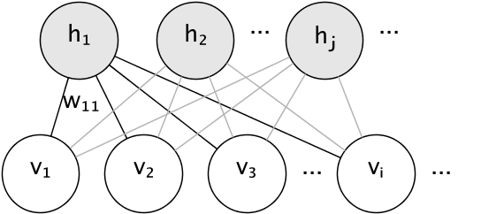

.. _neural_networks_unsupervised:

====================================
无监督神经网络模型(unsupervised Neural network models)
====================================

.. currentmodule:: sklearn.neural_network

.. _rbm:

限制玻尔兹曼机(RBM)
=============================

限制玻尔兹曼机(Restricted Boltzmann machines (RBM))是基于概率模型的无监督非线性特征学习器。
用 RBM 或 hierarchy RBMs 提取的特征在输入线性分类器（如线性支持向量机或感知机）时通常会获得很好的结果。

该模型对输入的分布作出假定。目前，scikit-learn 只提供了 :class:`BernoulliRBM`，
它假定输入是二值的，或者是 0 到 1 之间的值，每个值都编码特定特征被激活的概率。

RBM 尝试使用特定的图模型(a particular graphical model)最大化数据的似然性(the likelihood of the data)。
所使用的参数学习算法(随机极大似然(:ref:`Stochastic Maximum Likelihood <sml>`))
能够防止特征表示偏离输入数据，这使得它们能捕捉到有趣的规律(regularities)，但使得该模型对于小数据集不太有用且通常对于密度估计无效。

该方法随着 用独立RBM的权重来初始化深层神经网络 而受到广泛关注。这种方法被称为无监督的预训练(unsupervised pre-training)。

.. figure:: ../auto_examples/neural_networks/images/sphx_glr_plot_rbm_logistic_classification_001.png
   :target: ../auto_examples/neural_networks/plot_rbm_logistic_classification.html
   :align: center
   :scale: 100%

.. topic:: 案例:

   * :ref:`sphx_glr_auto_examples_neural_networks_plot_rbm_logistic_classification.py`

图模型与参数化
-----------------------------------

RBM 的图模型(graphical model)是一个全连接的二部图(fully-connected bipartite graph)。

节点代表随机变量，其状态取决于它连接到的其他节点的状态。 因此，模型被参数化为连接的权重以及每个可见隐藏单元和隐藏单元的一个截距项(或叫 偏置项)。
为了简单一点儿，上图中并没有画出截距项。 

用能量函数度量一个连接分配(a joint assignment)的质量:

.. math:: 

   E(\mathbf{v}, \mathbf{h}) = -\sum_i \sum_j w_{ij}v_ih_j - \sum_i b_iv_i
     - \sum_j c_jh_j

在上面的公式中, :math:`\mathbf{b}` 和 :math:`\mathbf{c}` 分别是可见层和隐藏层的截距向量(intercept vectors)。
模型的联合概率是用能量来定义的:

.. math::

   P(\mathbf{v}, \mathbf{h}) = \frac{e^{-E(\mathbf{v}, \mathbf{h})}}{Z}

“限制(*restricted*)”是指模型的二部图结构(bipartite structure)，它禁止隐藏单元相互之间或可见单元相互之间的直接交互。 
这意味着下面的条件独立性(conditional independencies)是成立的:

.. math::

   h_i \bot h_j | \mathbf{v} \\
   v_i \bot v_j | \mathbf{h}

二部图结构允许使用高效的块吉布斯采样(block Gibbs sampling)进行推断。

伯努利玻尔兹曼机
---------------------------------------

在 :class:`BernoulliRBM` 类中, 所有的单元是二值随机单元(binary stochastic units)。 
这意味着 输入数据或者是二值的(binary)或者是0到1之间的实数值(表示可见单元打开或关闭的概率)。
这是一个可以用于字符识别的很好的模型，其中的兴趣点在于哪些像素被激活了而哪些没有激活。
对于自然场景图像，因为背景,深度和相邻像素的同质性等这些原因导致该模型不再合适。

每个神经单元(unit)的条件概率分布由该unit接收到的输入的 logistic sigmoid 激活函数 给出:

.. math::

   P(v_i=1|\mathbf{h}) = \sigma(\sum_j w_{ij}h_j + b_i) \\
   P(h_i=1|\mathbf{v}) = \sigma(\sum_i w_{ij}v_i + c_j)

其中 :math:`\sigma` 是 logistic sigmoid 函数:

.. math::

   \sigma(x) = \frac{1}{1 + e^{-x}}

.. _sml:

随机极大似然学习
--------------------------------------

在 :class:`BernoulliRBM` 中实现的训练算法被称为随机极大似然(Stochastic Maximum Likelihood (SML))
或持久对比散度(Persistent Contrastive Divergence (PCD))。由于数据的似然函数的形式，直接优化最大似然是不可行的:

.. math::

   \log P(v) = \log \sum_h e^{-E(v, h)} - \log \sum_{x, y} e^{-E(x, y)}

为了简单起见，上面的等式是针对单个训练样本所写的。相对于权重的梯度由对应于上述的两个项构成。
根据它们的符号，它们通常被称为正梯度和负梯度。
在该算法的实现中，按照小批量样本(mini-batches of samples)对梯度进行估算。

在最大化对数似然度(maximizing the log-likelihood)时，正梯度使模型更倾向于与观察到的训练数据兼容的隐藏状态。
由于RBMs的二分体结构(bipartite structure)，正梯度可以有效地进行计算。然而，负梯度的计算是棘手的。
其目标是降低模型所偏好的联合状态的能量，从而使模型对数据保持真实。
可以通过马尔可夫链蒙特卡罗近似，使用块 Gibbs 采样，不断迭代一个交替采样过程: 
给定 :math:`v` 和 :math:`h` 中的其中一个，对另一个进行采样，直到Markov链混合。
以这种方式产生的样本有时被称为幻想粒子(fantasy particles)。这是低效的，很难确定Markov链是否混合。

PCD方法建议在经过少量迭代后停止链，:math:`k`, 通常甚至为 1。该方法快速且方差小，但样本远离模型分布。

PCD强调了这样一点：与其在每次需要梯度的时候重启一个新的chain，且仅仅执行一次吉布斯采样，还不如同时保有多个chains(幻想粒子),
在每次权重更新以后对这些chains执行 :math:`k` 个 Gibbs sampling steps去更新他们。这样可以让这些幻想粒子更好的探索整个空间。

.. topic:: 参考文献:

    * `"A fast learning algorithm for deep belief nets"
      <http://www.cs.toronto.edu/~hinton/absps/fastnc.pdf>`_
      G. Hinton, S. Osindero, Y.-W. Teh, 2006

    * `"Training Restricted Boltzmann Machines using Approximations to
      the Likelihood Gradient"
      <http://www.cs.toronto.edu/~tijmen/pcd/pcd.pdf>`_
      T. Tieleman, 2008
