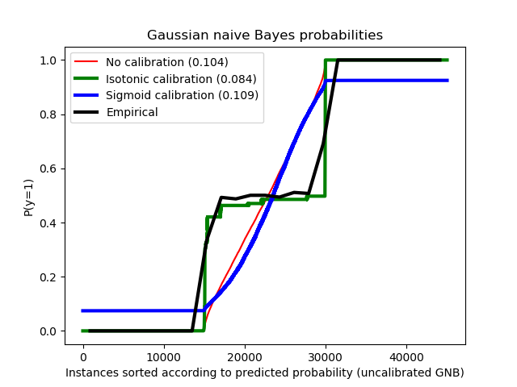

.. _calibration:

=======================================
概率校准(Probability calibration)
=======================================

.. currentmodule:: sklearn.calibration

在执行分类时，我们不仅想要预测类标签，而且还要获得相应标签的概率。这个概率给了我们一些关于预测的信心。
有些模型可以给出类概率(class probabilities)的糟糕估计，有些甚至不支持概率预测。
校准模块(calibration module)允许我们更好地校准给定模型的概率，或者添加对概率预测(probability prediction)的支持。

经过良好校准的分类器是概率化分类器(probabilistic classifiers)，它的 ``predict_proba`` 方法的输出可以直接解释为置信水平。
例如，经过良好校准的(二元)分类器应该对样本进行分类，以便在它给出的 predict_proba 值接近0.8的样本中，大约80%实际上属于正类。
下面的图比较了不同分类器的概率预测(probabilistic predictions)的校准效果:

.. figure:: ../auto_examples/calibration/images/sphx_glr_plot_compare_calibration_001.png
   :target: ../auto_examples/calibration/plot_compare_calibration.html
   :align: center

.. currentmodule:: sklearn.linear_model

:class:`LogisticRegression` 在默认情况下返回经过良好校准的预测，因为它直接优化对数损失(log-loss)。相反，其他方法返回有偏概率(biased probabilities)；
每种方法有不同的偏差:

.. currentmodule:: sklearn.naive_bayes

*  :class:`GaussianNB` 倾向于将概率推到0或1(注意直方图中的计数)。这主要是因为它假设 在给定某一类的情况下，
   特征分量相互之间是条件独立的(conditionally independent)，而在包含2个冗余特征的数据集中则假设不成立。

.. currentmodule:: sklearn.ensemble

*  :class:`RandomForestClassifier` 显示了相反的行为：直方图在概率约为0.2和0.9的地方出现峰值，而接近0或1的概率非常罕见。
   Niculescu-Mizil和Caruana对此作了解释 [4]_ ：“ 像bagging和random forests这样的通过对一组基本模型的预测取平均的方法很难在0和1附近做出预测，
   因为底层基本模型中的方差会使本应该接近0或1的预测偏离这些值。因为预测被仅限于区间[0，1]，由方差引起的误差往往是近0和1的单边误差。
   例如，如果一个模型应该对一个情况预测p=0，那么bagging可以实现的唯一方法就是袋子里的所有树(all bagged trees)都预测为零。如果我们给装在袋子里的树添加噪声
   则噪声会导致其中的某些树的预测值大于0，因此这就使得bagging的平均预测偏离了0。在随机森林模型中我们可以更加强烈的观察到这些现象，
   因为随机森林中的基本树估计器(都是在全部特征的一个子集上训练的)都具有相对较高的方差。” 。因此，校准曲线(calibration curve)有时候也称之为
   可靠性图(reliability graph, Wilks 1995 [5]_) 展示了一个 characteristic sigmoid shape，表明分类器更应该相信它们的直觉并返回更接近 0 或 1 的概率。

.. currentmodule:: sklearn.svm

* 线性支持向量分类 (:class:`LinearSVC`) 显示了比 RandomForestClassifier 更多的 Sigmoid 曲线, 
  这对于最大边距方法 (比较 Niculescu-Mizil 和 Caruana [4]_) 是很典型的, 
  其重点是聚焦在靠近决策边界的难分样本(hard samples)，也就是 支持向量(support vectors)。

.. currentmodule:: sklearn.calibration

scikit-learn提供了执行概率预测校准的两种方法: 基于Platt的Sigmoid模型的参数化方法和基于保序回归(isotonic regression)
的非参数方法 (:mod:`sklearn.isotonic`)。概率校准应该在新数据上进行而不是在训练数据上。
类 :class:`CalibratedClassifierCV` 使用交叉验证生成器, 对每个拆分，在训练样本上估计模型参数，在测试样本上进行校准。 
然后对所有拆分上预测的概率进行平均。 已经拟合过的分类器可以通过 :class:`CalibratedClassifierCV` 类传递参数 
``cv="prefit"`` 这种方式进行校准. 在这种情况下, 用户必须手动注意模型拟合的数据和校准的数据是不重叠的。

以下图像展示了概率校准的好处。 第一个图像显示一个具有2个类和3个数据块的数据集. 
中间的数据块包含每个类的随机样本. 此数据块中样本的概率应为 0.5.

以下图像使用没有校准的高斯朴素贝叶斯分类器, 
使用 sigmoid 校准和非参数的isotonic校准来显示上述估计概率的数据. 
可以观察到, 非参数模型为中间样本提供最准确的概率估计, 即 0.5。

.. currentmodule:: sklearn.metrics

在具有20个特征的100,000个样本（其中1,000个用于模型拟合）进行二元分类的人造数据集上进行以下实验.
在这20个特征中，只有2个是informative的, 10个是冗余的。
该图显示了使用logistic regression获得的估计概率, 线性支持向量分类器(SVC)
和具有 isotonic 校准和 sigmoid 校准的linear SVC。Brier score 是一个指标,它是 calibration loss 
和 refinement loss 的结合，函数 :func:`brier_score_loss` 来计算, 
请看下面的图例（越小越好）。 校正损失(Calibration loss)定义为从ROC段斜率导出的经验概率的均方偏差。
细化损失（Refinement loss）可以定义为在最优代价曲线下用面积测量的期望最优损失。

在这儿你可以看到logistic regression被很好的校准了因为它的曲线是近似对角线的。
Linear SVC 的校准曲线或可靠性图是一个sigmoid曲线，代表这是一个典型的欠信任的分类器。
在LinearSVC中, 这是由hinge loss的边界属性(margin property )所引起的，它使得模型聚焦在
与决策边界很近的难分样本(hard samples)上。这两种校准方法(isotonic和sigmoid)都可以解决这个问题，
并得到几乎相同的结果。下面的图片展示了在同样的数据上高斯朴素贝叶斯的校准曲线(包括 无校准，isotonic校准，sigmoid校准)。

.. figure:: ../auto_examples/calibration/images/sphx_glr_plot_calibration_curve_001.png
   :target: ../auto_examples/calibration/plot_calibration_curve.html
   :align: center

我们可以看到，高斯朴素贝叶斯的性能非常差，但却以不同于线性SVC的方式进行：线性SVC显示出一条Sigmoid校准曲线，
而高斯朴素贝叶斯的校准曲线具有transposed-sigmoid形状。这是典型的过度自信(over-confident)的分类器。
在这种情况下，分类器的过度置信度是由于冗余的特征违反了朴素贝叶斯假设的特征独立性。

用isotonic regression校正高斯朴素贝叶斯的概率可以解决这一问题，从近似对角的校准曲线可以看出这一点。
Sigmoid 校准也稍微提高了brier评分，但是不如无参数的isotonic校准方法那么强大。 
这是sigmoid校准的固有限制，其参数形式被假定是sigmoid，而不是transposed-sigmoid。
然而，非参数 isotonic 校准模型并没有作出这样强有力的假设，只要有足够的校准数据，就可以处理任何形状。
通常，在校准曲线为sigmoid和校准数据有限的情况下，sigmoid校准更可取，而non-sigmoid校准曲线和大量数据可供校准的情况下，
isotonic校准更可取。

.. currentmodule:: sklearn.calibration

如果基本估计器能够处理多分类任务，那么 :class:`CalibratedClassifierCV` 类还可以处理涉及两个以上类的分类任务。
在这种情况下，首先以一种one-vs-rest的方式分别对每个类对应的二元分类器进行校准。
在预测未见数据的概率时，对每类数据的校准概率分别进行预测。由于这些概率加起来不一定等于1，
所以执行一个后处理(normalization)使它们加起来等于1。

下一张图像展示了sigmoid校准是如何修改三类分类问题的预测概率的。
举的例子的是标准的2-单纯形(2-simplex)，其中三个角对应于三个类别。
箭头指向由未标定的分类器预测的概率向量到同一分类器在预留验证集上进行sigmoid校准后预测的概率向量。
颜色代表了每个点的真实类别：(red: class 1, green: class 2, blue: class 3).

本例中使用的基本分类器是由25棵树构成的随机森林分类器。 如果该分类器在所有800个训练数据点上进行训练，
则 它的预测会过度自信，因此导致了比较大的对数损失(log-loss)。对一个同样的分类器(还是25棵树的随机森林)，
但是这个分类器这次只在600个数据点上训练，另外200个数据点用于method='sigmoid'的校准，最后得到的分类器的预测置信度被降低了，
也就是 把概率向量从simplex的边上移到了中间:

经过校准以后的结果有比较低的对数损失(log-loss)。注意另一种可选方案是增加森林中base estimators的数量也会带来类似的对数损失的降低。

.. topic:: 参考文献:

    * Obtaining calibrated probability estimates from decision trees
      and naive Bayesian classifiers, B. Zadrozny & C. Elkan, ICML 2001

    * Transforming Classifier Scores into Accurate Multiclass
      Probability Estimates, B. Zadrozny & C. Elkan, (KDD 2002)

    * Probabilistic Outputs for Support Vector Machines and Comparisons to
      Regularized Likelihood Methods, J. Platt, (1999)

    .. [4] Predicting Good Probabilities with Supervised Learning,
           A. Niculescu-Mizil & R. Caruana, ICML 2005

    .. [5] On the combination of forecast probabilities for
           consecutive precipitation periods. Wea. Forecasting, 5, 640–650.,
           Wilks, D. S., 1990a
