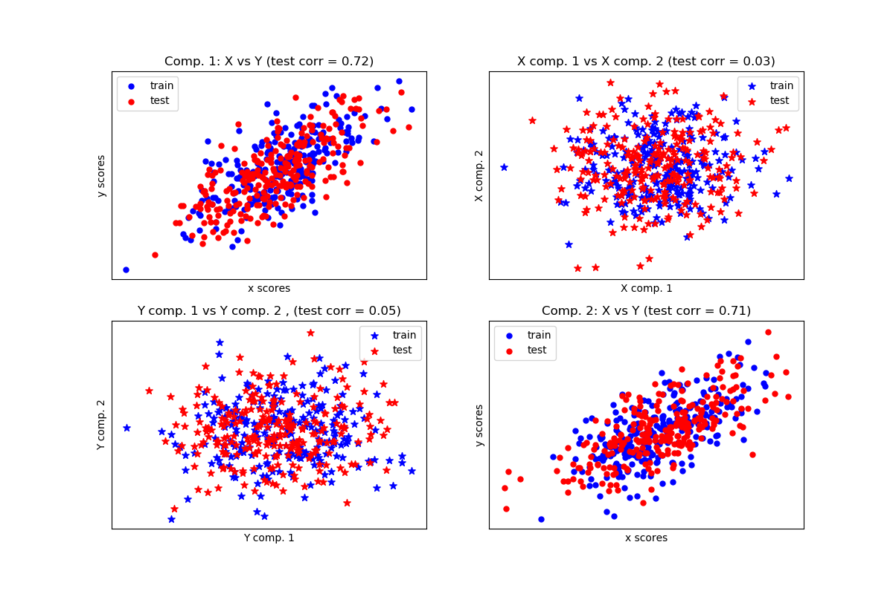

.. _cross_decomposition:

===============================
交叉分解(Cross decomposition)
===============================

.. currentmodule:: sklearn.cross_decomposition

交叉分解(cross decomposition)模块包括了两个算法家族: 偏最小二乘法(the partial least squares(PLS)) 和 
典型相关分析(the canonical correlation analysis (CCA)).

这些算法对于寻找两个多元数据集(multivariate dataset,也叫多变量数据集)之间的线性关系是非常有用的: 
用于 ``fit`` 方法 的 ``X`` 和 ``Y`` 参数都是 2D arrays.

交叉分解算法找到两个矩阵(X and Y)之间的基本关系。它们是建模这两个空间中协方差结构的隐变量方法(latent variable approaches)。
他们将试图在 X 空间中找到多维方向(multidimensional direction)，从而解释 Y 空间中的最大多维方差方向。
PLS-regression 尤其适用于当预测因子的矩阵(matrix of predictors)比观测值(observations)有更多的变量时 和 
当X的值之间存在多重共线性(multicollinearity)时 的情况。作为对比，标准回归算法在这些问题上将会失败。

这个模块中包括的类有 :class:`PLSRegression` :class:`PLSCanonical`, :class:`CCA` 和 :class:`PLSSVD`。

.. topic:: 参考文献:

   * JA Wegelin
     `A survey of Partial Least Squares (PLS) methods, with emphasis on the two-block case <https://www.stat.washington.edu/research/reports/2000/tr371.pdf>`_

.. topic:: 案例:

    * :ref:`sphx_glr_auto_examples_cross_decomposition_plot_compare_cross_decomposition.py`
