.. _decompositions:

=================================================================
信号分量分解(矩阵因子分解问题)
=================================================================

.. currentmodule:: sklearn.decomposition

.. _PCA:

主成分分析 (PCA)
==================================

准确的PCA及其概率性解释
------------------------------------------

PCA 被用来把多元数据集分解成一组连续正交分量的表示，这些正交分量可以用来解释方差的最大量。
在 scikit-learn 中, :class:`PCA` 类被实现为一个变换器对象(*transformer* object), 可以
在它的 ``fit`` 方法中学习 :math:`n` 个分量(components)，并且可以把新的数据投影到学习到的这些分量上。

可选参数 ``whiten=True`` 使得它可以将数据投影到奇异空间(singular space),同时将每一个分量缩放到单位方差。
如果pipeline中下游模型对信号的各向同性(isotropy)作了强有力的假设(例如 带有RBF核的支持向量机和K-means聚类算法就做了这个假定)，
这样的变换通常是有用的。

下面是iris dataset上的例子，鸢尾花数据集有四个特征分量组成，将其投影到方差最大的2个纬度上:

.. figure:: ../auto_examples/decomposition/images/sphx_glr_plot_pca_vs_lda_001.png
    :target: ../auto_examples/decomposition/plot_pca_vs_lda.html
    :align: center
    :scale: 75%

:class:`PCA` 类的对象也提供PCA的概率性解释(probabilistic interpretation)，
可以基于它所解释的方差的量给出数据的似然性(likelihood)。
它也实现了一个评分函数: `score` ，还可以被用于交叉验证:

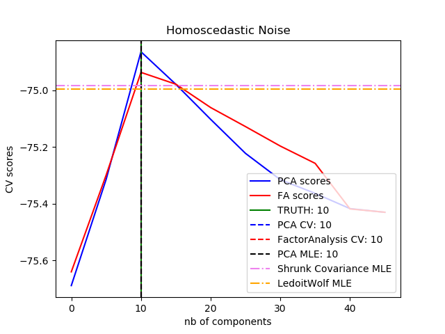

.. topic:: 案例:

    * :ref:`sphx_glr_auto_examples_decomposition_plot_pca_vs_lda.py`
    * :ref:`sphx_glr_auto_examples_decomposition_plot_pca_vs_fa_model_selection.py`

.. _IncrementalPCA:

增量主成分分析
---------------

:class:`PCA` 类非常有用,但是在大数据集上会有某些限制。最大的限制是 :class:`PCA` 类仅支持批量处理，
这意味着所有要被处理的数据都必须在主内存中进行拟合。 :class:`IncrementalPCA` 类使用不同的处理形式并且
允许进行部分数据计算(minibatch computation)而且其结果几乎与 :class:`PCA` 的结果一样。
:class:`IncrementalPCA` 类使得实现核外(out-of-core)主分量分析成为可能：(通过以下方式)

 * 使用其 ``partial_fit`` 方法在从硬盘或网络上顺序取来的数据块上拟合

 * 调用它的 fit 方法在使用``numpy.memmap``的内存映射文件上

:class:`IncrementalPCA` 类为了增量式的更新 ``explained_variance_ratio_`` ，仅需要存储估计出的分量和噪声方差。
这就是为啥内存使用量依赖于每个批次的样本数量，而不是数据集中需要处理的样本总量。

.. figure:: ../auto_examples/decomposition/images/sphx_glr_plot_incremental_pca_001.png
    :target: ../auto_examples/decomposition/plot_incremental_pca.html
    :align: center
    :scale: 75%

.. figure:: ../auto_examples/decomposition/images/sphx_glr_plot_incremental_pca_002.png
    :target: ../auto_examples/decomposition/plot_incremental_pca.html
    :align: center
    :scale: 75%

.. topic:: 案例:

    * :ref:`sphx_glr_auto_examples_decomposition_plot_incremental_pca.py`

.. _RandomizedPCA:

使用随机SVD的PCA
------------------------

通过丢弃具有较低奇异值的奇异向量成分，将数据投影到低维空间并保留大部分方差是非常有趣的。

例如，如果我们使用64x64像素的灰度级图像进行人脸识别，数据的维数为4096， 
在这样大的数据上训练含RBF内核的支持向量机是很慢的。 此外我们知道数据本质上的维度远低于4096，
因为人脸的所有照片都看起来有点相似。 样本位于许多的很低维度（例如约200维）。
PCA算法可以用于线性变换数据，同时降低维数并同时保留大部分解释方差(explained variance)。

使用可选参数 ``svd_solver='randomized'`` 的 :class:`PCA` 是非常有用的, 在这种情况下: 
因为我们将要丢弃大部分奇异向量(singular vectors)，所以对我们将保留并实际执行变换的奇异向量进行近似估计的有限的计算更有效。

例如：以下显示了来自 Olivetti 数据集的 16 个样本肖像（以 0.0 为中心）。 右侧是把前16个奇异向量重新改变shape使其成为肖像。
因为我们只需要使用大小为 :math:`n_{samples} = 400` 和 :math:`n_{features} = 64 \times 64 = 4096` 的数据集的前 16 个奇异向量, 
使得计算时间小于 1 秒。

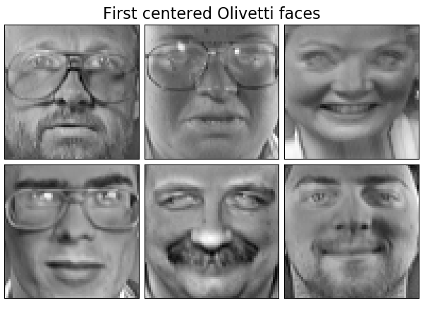

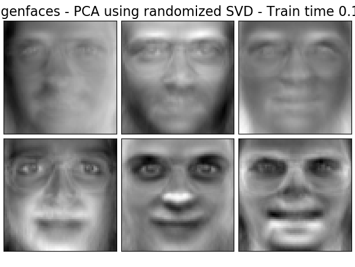

.. centered:: |orig_img| |pca_img|

注意：使用可选参数 ``svd_solver='randomized'`` ，我们还需要在 :class:`PCA` 中给出低维空间的大小 ``n_components`` 作为强制输入参数。

如果我们记： :math:`n_{\max} = \max(n_{\mathrm{samples}}, n_{\mathrm{features}})`
和 :math:`n_{\min} = \min(n_{\mathrm{samples}}, n_{\mathrm{features}})` , 那么 randomized :class:`PCA` 的时间复杂度为
:math:`O(n_{\max}^2 \cdot n_{\mathrm{components}})` ,而不是在 :class:`PCA` 类中实现的精确方法的时间复杂度: :math:`O(n_{\max}^2 \cdot n_{\min})`。

randomized :class:`PCA` 的内存足迹也是与 :math:`2 \cdot n_{\max} \cdot n_{\mathrm{components}}` 成比例的，
而不是 精确实现中的 :math:`n_{\max}\cdot n_{\min}` 。

注意: 参数为 ``svd_solver='randomized'`` 的 :class:`PCA` ，其 ``inverse_transform`` 方法的实现
并不是 ``transform`` 的确切的逆变换，即使当 ``whiten=False`` (default)。 

.. topic:: 案例:

    * :ref:`sphx_glr_auto_examples_applications_plot_face_recognition.py`
    * :ref:`sphx_glr_auto_examples_decomposition_plot_faces_decomposition.py`

.. topic:: 参考文献:

    * `"Finding structure with randomness: Stochastic algorithms for
      constructing approximate matrix decompositions"
      <https://arxiv.org/abs/0909.4061>`_
      Halko, et al., 2009

.. _kernel_PCA:

核 PCA
----------

:class:`KernelPCA` 类是PCA的扩展，通过使用 kernel (请看 :ref:`metrics`) 来达到非线性降维 的目的。
它有很多应用，包括 去噪声(denoising),压缩和结构化预测(kernel dependency estimation)。
:class:`KernelPCA` 支持 ``transform`` 和 ``inverse_transform``。

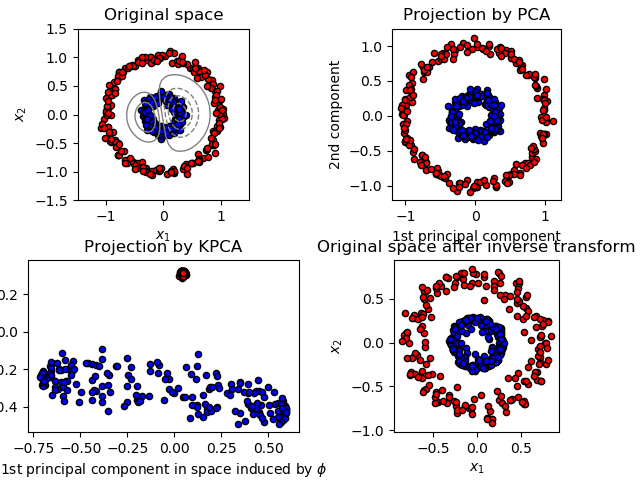

.. topic:: 案例:

    * :ref:`sphx_glr_auto_examples_decomposition_plot_kernel_pca.py`

.. _SparsePCA:

稀疏主成分分析 (SparsePCA 和 MiniBatchSparsePCA)
-----------------------------------------------------------------------

:class:`SparsePCA` 是PCA的一个变体, 目的是抽取一组能够最好的重构数据的稀疏分量。

小批量稀疏PCA (:class:`MiniBatchSparsePCA`) 是 :class:`SparsePCA` 的一个更快速但准确率稍差的变体。
计算速度的提升主要是通过在 特征集的一小部分 上不断迭代直到达到给定的迭代次数。

主成分分析(Principal component analysis,PCA)的缺点在于：通过该方法提取的成分具有唯一的稠密表达式，
即当表示为原始变量的线性组合时，它们具有非零系数，这使得对结果的解释性变的困难。
在许多情况下，真正的底层分量可以更自然地想象为稀疏向量; 例如在面部识别中，每个分量可能自然地映射到面部的某个部分。

稀疏的主成分产生更简洁、可解释的表达，明确强调了样本之间的差异性来自哪些原始特征。

以下示例展示了使用 sparse PCA 提取 Olivetti 人脸数据集中的 16 个components。可以看出正则化项是如何产生许多零的。
此外，数据的自然结构导致了非零系数的垂直相邻(vertically adjacent)。
该模型并没有在数学上强制执行这一点: 每个分量(component)都是一个向量 :math:`h \in \mathbf{R}^{4096}`, 没有垂直相邻性(vertical adjacency)的概念
除非人性化地的可视化为 64x64 像素的图像。 
下面显示的components看起来局部化(appear local)是数据的内在结构的影响，这种局部模式使重建误差最小化。
存在几种将邻接性和不同结构类型都考虑进去的稀疏诱导范数(sparsity-inducing norms),参见 [Jen09]_ 对这种方法进行了解。 
有关如何使用 Sparse PCA 的更多详细信息，请参阅下面的示例部分。 

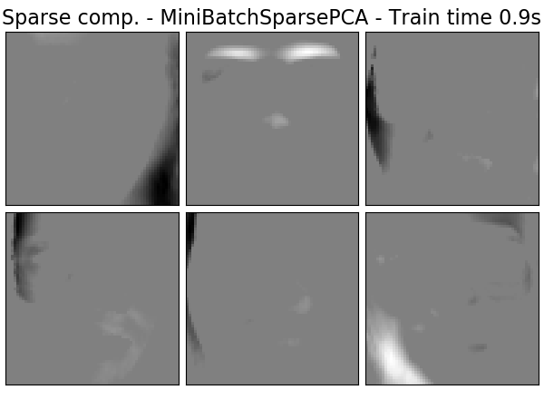

.. centered:: |pca_img| |spca_img|

注意到 Sparse PCA 问题有很多种不同的表述形式。 这里的实现基于 [Mrl09]_  。 待求解的优化问题是一个
带有对components的 :math:`\ell_1` 惩罚项的PCA问题(字典学习,dictionary learning):

.. math::
   (U^*, V^*) = \underset{U, V}{\operatorname{arg\,min\,}} & \frac{1}{2}
                ||X-UV||_2^2+\alpha||V||_1 \\
                \text{subject to } & ||U_k||_2 = 1 \text{ for all }
                0 \leq k < n_{components}

当训练样本比较少的时候，稀疏诱导的 :math:`\ell_1` 范数还可以防止从噪声中学习components。
惩罚的程度(以及由此导致的稀疏性)可以通过参数 ``alpha`` 进行调节。
较小的值会导致轻微的正则化因子分解，而较大的值会将多个系数收缩为零。

.. note::

  根据在线算法的精神，:class:`MiniBatchSparsePCA` 类不实现 ``partial_fit`` ，因为该算法是沿着特征方向在线，而不是样本方向。

.. topic:: 案例:

   * :ref:`sphx_glr_auto_examples_decomposition_plot_faces_decomposition.py`

.. topic:: 参考文献:

  .. [Mrl09] `"Online Dictionary Learning for Sparse Coding"
     <http://www.di.ens.fr/sierra/pdfs/icml09.pdf>`_
     J. Mairal, F. Bach, J. Ponce, G. Sapiro, 2009
  .. [Jen09] `"Structured Sparse Principal Component Analysis"
     <www.di.ens.fr/~fbach/sspca_AISTATS2010.pdf>`_
     R. Jenatton, G. Obozinski, F. Bach, 2009

.. _LSA:

截断奇异值分解和隐语义分析
===================================================================

:class:`TruncatedSVD` 实现了一个奇异值分解（singular value decomposition,SVD）的变体，
它只计算 :math:`k` 个最大的奇异值，其中 :math:`k` 是用户指定的参数。

当截断SVD被应用于term-document矩阵（由 ``CountVectorizer`` 或 ``TfidfVectorizer`` 返回）时，
这种变换被称为隐语义分析(`latent semantic analysis <http://nlp.stanford.edu/IR-book/pdf/18lsi.pdf>`_ , LSA), 
因为它将term-document矩阵变换为低纬度的 “语义空间(semantic space)” 。 
特别地是 LSA 能够抵抗同义词(synonymy)和多义词(polysemy)的影响（两者大致意味着每个单词有多重含义），
这导致term-document矩阵过度稀疏，并且在诸如余弦相似度的度量下表现出较差的相似性。

.. note::
    LSA 也被称为隐语义索引(latent semantic indexing,LSI)，尽管严格地说它是指在持久索引(persistent indexes)中
    用于信息检索(information retrieval)的目的。

从数学上讲, 应用在训练集 :math:`X` 上的 truncated SVD 产生一个低秩近似(low-rank approximation) :math:`X`:

.. math::
    X \approx X_k = U_k \Sigma_k V_k^\top

经过这个操作以后, :math:`U_k \Sigma_k^\top` 是具有 :math:`k` (在API中称之为 ``n_components``)个特征的变换训练集。.

为了再对测试集 :math:`X` 也进行变换, 我们用 :math:`V_k` 乘以它:

.. math::
    X' = X V_k

.. note::
    自然语言处理(NLP)和信息检索(IR)文献中的 LSA 的大多数处理方式是交换 矩阵 :math:`X` 的坐标轴,
    使其具有 ``n_features`` × ``n_samples`` 的shape。 我们以不同方式呈现LSA,使其与scikit-learn API 
    相匹配，但是找到的奇异值(singular values)是相同的。

:class:`TruncatedSVD` 非常类似于 :class:`PCA`, 但不同之处在于它工作在样本矩阵 :math:`X` 上而不是它们的协方差矩阵。 
当从特征数值中减去 :math:`X` 的每列（每一列对应一个特征）的均值时，在得到的矩阵上应用 truncated SVD 等价于 PCA 。 
实际上，这意味着 :class:`TruncatedSVD` 变换器（transformer）接受 ``scipy.sparse`` 矩阵，而不需要把它们变稠密(density)，
因为即使密集化(densifying)中型大小文档的集合也可能填满内存。

虽然 :class:`TruncatedSVD` 变换器可以在任何(稀疏的)特征矩阵上工作，
但在LSA/document 处理的原始频率计数任务中 还是建议把它用在tf–idf矩阵上。 
特别地，应该打开 子线性缩放(sublinear scaling)和逆文档频率(inverse document frequency),即 (``sublinear_tf=True, use_idf=True``)
以使特征数值更接近于高斯分布，补偿 LSA 对文本数据的错误假设。

.. topic:: 案例:

   * :ref:`sphx_glr_auto_examples_text_plot_document_clustering.py`

.. topic:: 参考文献:

  * Christopher D. Manning, Prabhakar Raghavan and Hinrich Schütze (2008),
    *Introduction to Information Retrieval*, Cambridge University Press,
    chapter 18: `Matrix decompositions & latent semantic indexing
    <http://nlp.stanford.edu/IR-book/pdf/18lsi.pdf>`_

.. _DictionaryLearning:

词典学习(Dictionary Learning)
==================================

.. _SparseCoder:

用预先计算好的字典进行稀疏编码
-------------------------------------------

:class:`SparseCoder` 对象是一个估计器(estimator)，可以用来将信号变换成很多原子(atoms)的稀疏线性组合，
如离散小波基。而这些原子(atoms)来自于一个固定的预先计算好的字典(dictionary)中。 
因此，该对象不实现 ``fit`` 方法。该变换相当于一个稀疏编码问题: 将数据表示为尽可能少的词典原子(dictionary atoms)的线性组合。 
词典学习的所有变体实现以下变换方法，可以通过 ``transform_method`` 初始化参数进行控制:

* Orthogonal matching pursuit (:ref:`omp`)

* Least-angle regression (:ref:`least_angle_regression`)

* Lasso computed by least-angle regression

* Lasso using coordinate descent (:ref:`lasso`)

* Thresholding

阈值方法速度非常快，但是不能产生精确的重建。 它们在分类任务的文献中已被证明是有用的。
对于图像重建任务，正交匹配追踪(orthogonal matching pursuit)可以产生最精确、无偏的重建。

词典学习对象通过 ``split_code`` 参数提供将稀疏编码结果中的正值和负值分离的可能性。
当使用词典学习来提取用于监督学习的特征时，这是有用的，
因为它允许学习算法将不同的权重从正加载(positive loading)分配给相应的负加载(negative loadings)的特定原子。

单个样本的分割编码具有长度 ``2 * n_components`` ，并使用以下规则构造: 首先，计算长度为 ``n_components`` 的常规编码。
然后，``split_code`` 的第一个``n_components``条目将用正常编码向量的正部分填充。
分割编码的第二部分用编码向量的负部分填充，只有一个正号。
因此， split_code 是非负的。

.. topic:: 案例:

    * :ref:`sphx_glr_auto_examples_decomposition_plot_sparse_coding.py`

通用词典学习
---------------------------

词典学习(:class:`DictionaryLearning`)是一个矩阵因子分解(matrix factorization)问题，
相当于找到一个在拟合过的数据的稀疏编码中表现良好的（通常是过完备的）词典。

将数据表示为 来自过完备词典的原子的稀疏组合 被认为是哺乳动物初级视觉皮层的工作方式。 
因此，应用于图像块的词典学习已被证明在诸如图像完成、修复和去噪，以及有监督识别图像处理任务中表现出狠好的结果。

词典学习是一个优化问题，通过交替更新稀疏编码来求解。作为解决多个 Lasso 问题的一个解决方案，
考虑到字典的固定性，然后更新字典以最好地适合于稀疏编码。

.. math::
   (U^*, V^*) = \underset{U, V}{\operatorname{arg\,min\,}} & \frac{1}{2}
                ||X-UV||_2^2+\alpha||U||_1 \\
                \text{subject to } & ||V_k||_2 = 1 \text{ for all }
                0 \leq k < n_{\mathrm{atoms}}

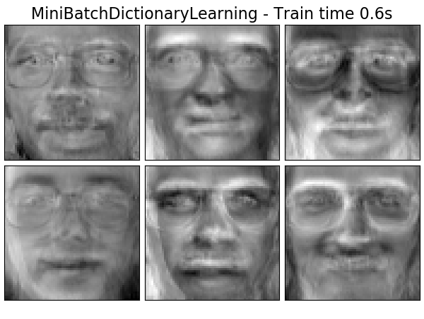

.. centered:: |pca_img2| |dict_img2|

在使用这样一个过程来拟合词典之后，变换只是一个稀疏编码的步骤，
与所有的词典学习对象共享相同的实现。(参见 :ref:`SparseCoder`)。

还可以将 字典 和/或 编码 约束为正，以匹配数据中可能存在的约束。
下面是应用不同正性约束(positivity constraints)的人脸。红色表示负值，蓝色表示正值，白色表示零。

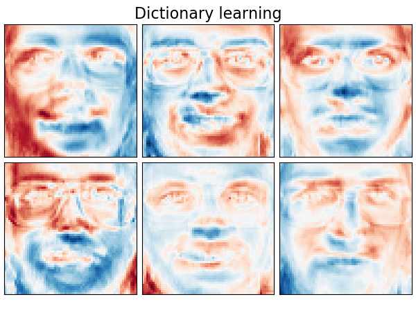

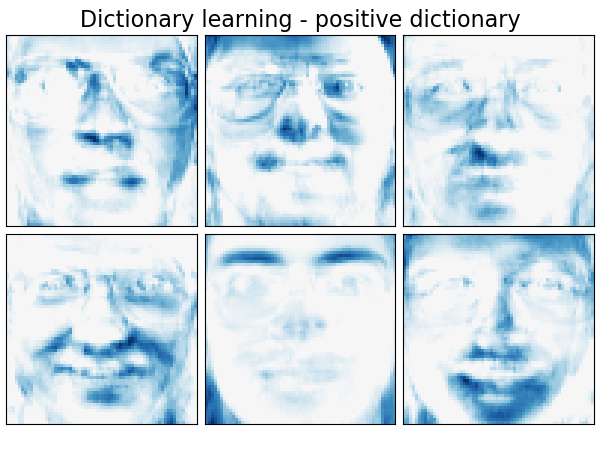

.. |dict_img_pos3| image:: ../auto_examples/decomposition/images/sphx_glr_plot_faces_decomposition_013.png
    :target: ../auto_examples/decomposition/plot_image_denoising.html
    :scale: 60%

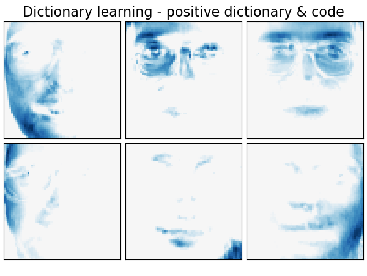

.. centered:: |dict_img_pos1| |dict_img_pos2|
.. centered:: |dict_img_pos3| |dict_img_pos4|

以下图像显示了 从浣熊脸部的部分图像中提取的4x4像素图像块中进行字典学习得到的字典看起来长啥样儿。

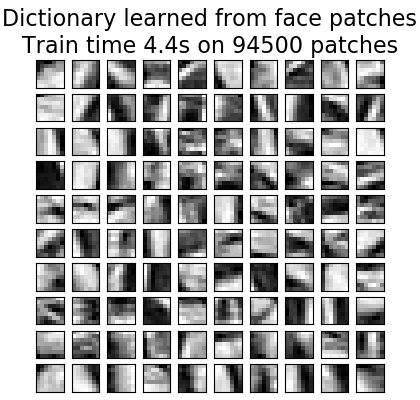

.. topic:: 案例:

  * :ref:`sphx_glr_auto_examples_decomposition_plot_image_denoising.py`

.. topic:: 参考文献:

  * `"Online dictionary learning for sparse coding"
    <http://www.di.ens.fr/sierra/pdfs/icml09.pdf>`_
    J. Mairal, F. Bach, J. Ponce, G. Sapiro, 2009

.. _MiniBatchDictionaryLearning:

小批量词典学习
------------------------------

:class:`MiniBatchDictionaryLearning` 类实现了一个更快、但不太准确的字典学习算法版本，该算法更适合于大型数据集。

默认情况下，:class:`MiniBatchDictionaryLearning` 将数据划分为小批量(mini-batches)，并以在线方式通过指定次数的迭代循环对数据进行优化。
但是，目前该类还没有实现停止条件。

这个估计器也实现了 ``partial_fit``, 只通过在一个mini-batch上迭代一次来更新字典。
当数据从一开始就不容易获得时，或者当数据不适合全部放在内存时，这可以用于在线学习。

.. currentmodule:: sklearn.cluster

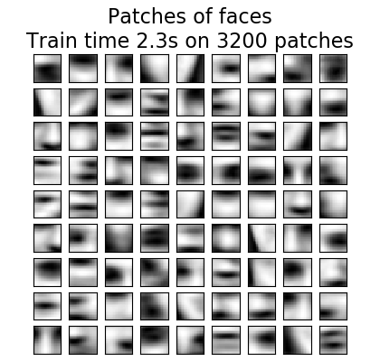

.. topic:: **用于字典学习的聚类**

   注意，当使用字典学习来提取表示（例如，用于稀疏编码）时，聚类可以是学习字典的良好中间方法。 
   例如，:class:`MiniBatchKMeans` 估计器能高效计算并使用 ``partial_fit`` 方法实现在线学习。

    案例: :ref:`sphx_glr_auto_examples_cluster_plot_dict_face_patches.py`

.. currentmodule:: sklearn.decomposition

.. _FA:

因子分析(Factor Analysis)
=============================

在非监督学习中，我们只需要一个数据集 :math:`X = \{x_1, x_2, \dots, x_n \}`。
这个数据集如何用数学的方式来描述呢？ 一个用于描述 :math:`X` 的非常简单的 `连续隐变量(continuous latent variable)` 模型 如下所示：

.. math:: x_i = W h_i + \mu + \epsilon

向量 :math:`h_i` 被称为 "隐变量(latent variable)" 是因为它无法被观测。:math:`\epsilon` 被看做是一个服从 0 均值协方差为 :math:`\Psi` 的高斯分布的噪声项
，即 :math:`\epsilon \sim \mathcal{N}(0, \Psi)` 。 :math:`\mu` 是一个任意的实数偏移向量。
这样的模型被称之为 "生成式(generative)" 模型, 因为它描述了 :math:`x_i` 是如何从 :math:`h_i` 产生的。 
如果我们使用所有的 :math:`x_i` 作为列来形成一个矩阵  :math:`\mathbf{X}` 并且 所有的 :math:`h_i` 作为列来形成一个矩阵 :math:`\mathbf{H}` ，
那么我们可以得到下面的式子(with suitably defined :math:`\mathbf{M}` 和 :math:`\mathbf{E}`):

.. math::
    \mathbf{X} = W \mathbf{H} + \mathbf{M} + \mathbf{E}

换而言之, 我们分解(*decomposed*)了矩阵 :math:`\mathbf{X}` 。

如果给定了 :math:`h_i`, 则上面的等式自动的隐含了下面的概率性解释(probabilistic interpretation):

.. math:: p(x_i|h_i) = \mathcal{N}(Wh_i + \mu, \Psi)

对于一个完备的概率模型，我们还需要一个关于隐变量 :math:`h` 的先验分布，最简单直接的假设(基于高斯分布的优良性质)是 :math:`h \sim \mathcal{N}(0,\mathbf{I})`。
这就产生了一个高斯分布，将其作为 :math:`x` 的边缘分布 :

.. math:: p(x) = \mathcal{N}(\mu, WW^T + \Psi)

现在，没有任何进一步的假设，用一个隐变量 :math:`h` 的想法是多余的--- :math:`x` 完全可以用均值和协方差来建模。
我们需要强加一些更特殊的结构(more specific structure)在这两个参数中的其中一个上。 
一个关于 误差协方差 :math:`\Psi` 的结构的简单附加假设 如下:

* :math:`\Psi = \sigma^2 \mathbf{I}`: 这个假设导致了一个 :class:`PCA` 的概率性模型(probabilistic model)。

* :math:`\Psi = \mathrm{diag}(\psi_1, \psi_2, \dots, \psi_n)`: 此模型被称为 :class:`FactorAnalysis`, 一个经典的统计模型。
  矩阵 W 有时被称为 "factor loading matrix"。

这两种模型本质上都是用低秩协方差矩阵估计一个高斯分布。因为这两个模型都是概率性的，所以它们可以集成到更复杂的模型中，
e.g. 因子分析的混合模型(Mixture of Factor Analysers)。 如果在隐变量上做了非高斯先验的假定，你会得到非常不一样的模型(e.g. :class:`FastICA`)。

因子分析(Factor analysis)可以产生与 :class:`PCA` 类似的components(the columns of its loading
matrix)。然而，你不能做出任何关于这些components的general statements(e.g. 它们是否正交):

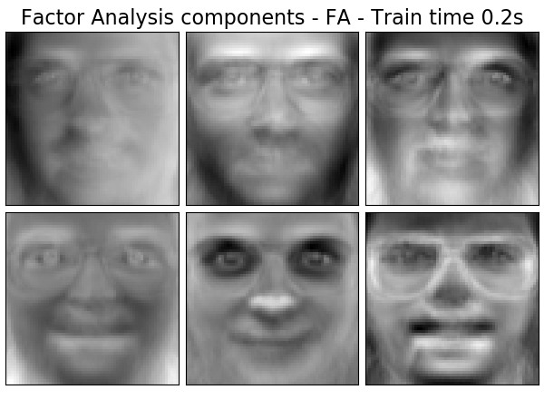

.. centered:: |pca_img3| |fa_img3|

因子分析相对于 :class:`PCA` 的主要优势是 它可以在输入空间的每一个方向上独立的对方差进行建模
(heteroscedastic noise):

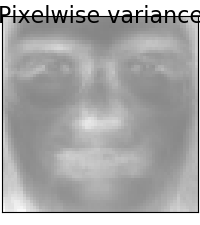

在有heteroscedastic noise出现的情况下，它比 probabilistic PCA 允许有更好的模型选择 :

.. figure:: ../auto_examples/decomposition/images/sphx_glr_plot_pca_vs_fa_model_selection_002.png
    :target: ../auto_examples/decomposition/plot_pca_vs_fa_model_selection.html
    :align: center
    :scale: 75%

.. topic:: 案例:

    * :ref:`sphx_glr_auto_examples_decomposition_plot_pca_vs_fa_model_selection.py`

.. _ICA:

独立分量分析(ICA)
====================================

独立分量分析(Independent component analysis)将多变量信号分解为独立性最强的加性子分量。 
在 scikit-learn 中实现了ICA，使用 :class:`Fast ICA <FastICA>` 算法。 
ICA 通常不用于降低维度，而是用于分离叠加信号(superimposed signals)。 
由于 ICA 模型不包括噪声项，因此要使模型正确，必须使用白化(whitening)。 
这可以在内部调节白化参数或手动使用 PCA 的一种变体。

它通常用于分离混合信号(一个称为盲源分离(*blind source separation*)的问题)，如下例所示：

.. figure:: ../auto_examples/decomposition/images/sphx_glr_plot_ica_blind_source_separation_001.png
    :target: ../auto_examples/decomposition/plot_ica_blind_source_separation.html
    :align: center
    :scale: 60%

ICA 还可以用于另一个非线性分解：寻找稀疏分量 :

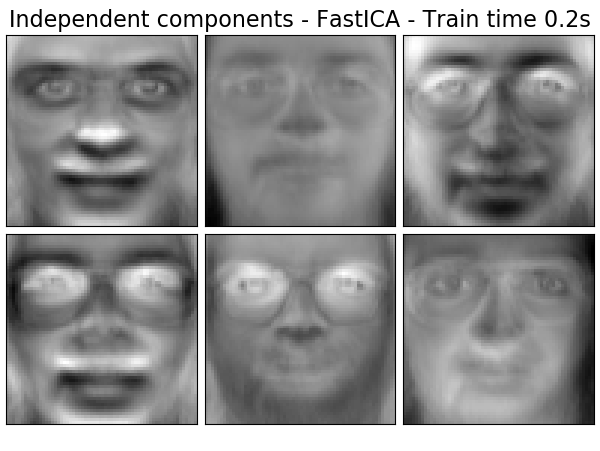

.. centered:: |pca_img4| |ica_img4|

.. topic:: 案列:

    * :ref:`sphx_glr_auto_examples_decomposition_plot_ica_blind_source_separation.py`
    * :ref:`sphx_glr_auto_examples_decomposition_plot_ica_vs_pca.py`
    * :ref:`sphx_glr_auto_examples_decomposition_plot_faces_decomposition.py`

.. _NMF:

非负矩阵分解(NMF or NNMF)
===============================================

带有Frobenius范数的NMF
---------------------------

:class:`NMF` [1]_ 是另一种分解(decomposition)方法,它要求数据和分量都是非负的(non-negative)。 
在数据矩阵不包含负值的情况下， :class:`NMF` 可以直接插入对 :class:`PCA` 或其变体进行替换。 
通过优化 :math:`X` 与矩阵乘积 :math:`WH` 之间的距离 :math:`d` ，
可以将样本 :math:`X` 分解为两个非负矩阵 :math:`W` 和 :math:`H` 。 
最广泛使用的距离函数是 squared Frobenius norm，它是欧几里德范数到矩阵的推广:

.. math::
    d_{\mathrm{Fro}}(X, Y) = \frac{1}{2} ||X - Y||_{\mathrm{Fro}}^2 = \frac{1}{2} \sum_{i,j} (X_{ij} - {Y}_{ij})^2

与 :class:`PCA` 不一样, 向量的表示(representation of a vector)是以加性方式(an additive fashion)获得的, 通过叠加分量，不做减法。
这样的加性模型(additive models) 用于表达图像和文本是很高效的。

在 [Hoyer, 2004] [2]_ 中已经观察到， 当被小心约束时，:class:`NMF` 可以产生数据集的基于部分的表式(parts-based representation of the dataset),
能够产生可解释的模型(interpretable models)。 
下面的例子展示了 :class:`NMF` 从Olivetti面部数据集中找到的16个稀疏分量，拿它与PCA eigenfaces对比一下下。

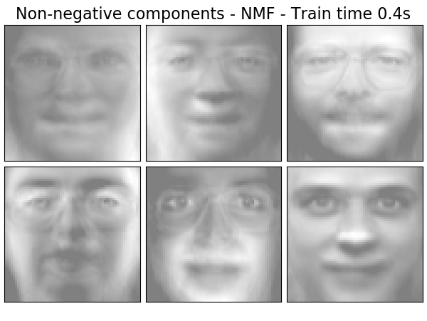

.. centered:: |pca_img5| |nmf_img5|

:attr:`init` 属性确定了应用的初始化方法，这对方法的性能有很大的影响。 :class:`NMF` 实现了非负双奇异值分解方法(Nonnegative Double Singular Value Decomposition)。
NNDSVD [4]_ 基于两个 SVD 过程，一个逼近数据矩阵， 另一个逼近 由此产生的部分SVD因子的正部分。而部分SVD因子(partial SVD factors)的正部分是使用单位秩矩阵的代数性质得到的。
基本的 NNDSVD 算法更适合稀疏因子分解。其变体 NNDSVDa（全部零值替换为所有元素的平均值）和 NNDSVDar（零值替换为比数据平均值除以100小的随机扰动）
在稠密情况时推荐使用。

请注意，乘法更新 (‘mu’) 求解器无法更新在初始化中出现的零，因此当与引入大量零的基本 NNDSVD 算法联合使用时， 会导致较差的结果; 
在这种情况下，应优先使用 NNDSVDa 或 NNDSVDar。

也可以通过设置属性 :attr:`init="random"` ，使用正确缩放的随机非负矩阵初始化 :class:`NMF` 。 
整数种子或 ``RandomState`` 也可以传递给属性 :attr:`random_state`  以控制可重现性(reproducibility)。

在 :class:`NMF` 中，L1 和 L2 先验可以被添加到损失函数中以正规化模型。 L2先验使用 Frobenius 范数，而L1先验使用按元素的(elementwise) L1范数。
与 :class:`ElasticNet` 一样，我们通过 :attr:`l1_ratio` (:math:`\rho`) 参数和正则化强度参数 :attr:`alpha` (:math:`\alpha`) 来控制L1和L2的组合。
那么先验项(priors terms)是:

.. math::
    \alpha \rho ||W||_1 + \alpha \rho ||H||_1
    + \frac{\alpha(1-\rho)}{2} ||W||_{\mathrm{Fro}} ^ 2
    + \frac{\alpha(1-\rho)}{2} ||H||_{\mathrm{Fro}} ^ 2

被正则化的目标函数是:

.. math::
    d_{\mathrm{Fro}}(X, WH)
    + \alpha \rho ||W||_1 + \alpha \rho ||H||_1
    + \frac{\alpha(1-\rho)}{2} ||W||_{\mathrm{Fro}} ^ 2
    + \frac{\alpha(1-\rho)}{2} ||H||_{\mathrm{Fro}} ^ 2

:class:`NMF` 类对 W 和 H 都进行正则化。 该类的公开函数(public function)
:func:`non_negative_factorization` 允许通过属性 :attr:`regularization` 进行更精细的控制，可以选择只对W,或只对H,或W,H一起 进行正则化。

带有beta-divergence的NMF 
--------------------------

如前所述，最广泛使用的距离函数是 squared Frobenius 范数，这是欧几里得范数到矩阵的推广:

.. math::
    d_{\mathrm{Fro}}(X, Y) = \frac{1}{2} ||X - Y||_{Fro}^2 = \frac{1}{2} \sum_{i,j} (X_{ij} - {Y}_{ij})^2

其他距离函数可用于 NMF，例如（广义） Kullback-Leibler(KL)散度，也称为 I-divergence:

.. math::
    d_{KL}(X, Y) = \sum_{i,j} (X_{ij} \log(\frac{X_{ij}}{Y_{ij}}) - X_{ij} + Y_{ij})

或者, the Itakura-Saito (IS) divergence:

.. math::
    d_{IS}(X, Y) = \sum_{i,j} (\frac{X_{ij}}{Y_{ij}} - \log(\frac{X_{ij}}{Y_{ij}}) - 1)

这三个距离函数是 beta-divergence 函数族的特殊情况，其参数分别为 :math:`\beta = 2, 1, 0` [6]_。 The beta-divergence 定义如下:

.. math::
    d_{\beta}(X, Y) = \sum_{i,j} \frac{1}{\beta(\beta - 1)}(X_{ij}^\beta + (\beta-1)Y_{ij}^\beta - \beta X_{ij} Y_{ij}^{\beta - 1})

.. figure:: ../auto_examples/decomposition/images/sphx_glr_plot_beta_divergence_001.png
    :target: ../auto_examples/decomposition/plot_beta_divergence.html
    :align: center
    :scale: 75%

请注意，如果 :math:`\beta \in (0; 1)` ，此定义无效，仅仅在 :math:`d_{KL}` 和 :math:`d_{IS}` 上可以分别连续扩展。

:class:`NMF` 类使用坐标下降法(Coordinate Descent ('cd')) [5]_ 和乘法更新(Multiplicative Update ('mu')) [6]_ 来实现两个求解器(solvers)。
'mu' 求解器可以优化每个 beta-divergence，包括 Frobenius 范数(:math:`\beta=2`) ，(广义)KL散度(:math:`\beta=1`)和Itakura-Saito 散度 (:math:`\beta=0`)。 
请注意，对于 :math:`\beta \in (1; 2)`, 'mu'求解器明显快于 :math:`\beta` 的其他值。 
还要注意，使用小于0的(或0，即 ‘itakura-saito’ ) :math:`\beta` ，输入矩阵不能包含零值。 

'cd' solver 只能优化 Frobenius 范数。由于 NMF 的潜在非凸性，即使优化相同的距离函数， 不同的求解器也可能会收敛到不同的最小值。

NMF最适用于 ``fit_transform`` 方法，该方法返回矩阵 W。矩阵H被存储到拟合后的模型的 ``components_`` 属性中中; 
方法 ``transform`` 将基于这些存储的components去分解新的矩阵 X_new::

    >>> import numpy as np
    >>> X = np.array([[1, 1], [2, 1], [3, 1.2], [4, 1], [5, 0.8], [6, 1]])
    >>> from sklearn.decomposition import NMF
    >>> model = NMF(n_components=2, init='random', random_state=0)
    >>> W = model.fit_transform(X)
    >>> H = model.components_
    >>> X_new = np.array([[1, 0], [1, 6.1], [1, 0], [1, 4], [3.2, 1], [0, 4]])
    >>> W_new = model.transform(X_new)

.. topic:: 案例:

    * :ref:`sphx_glr_auto_examples_decomposition_plot_faces_decomposition.py`
    * :ref:`sphx_glr_auto_examples_applications_plot_topics_extraction_with_nmf_lda.py`
    * :ref:`sphx_glr_auto_examples_decomposition_plot_beta_divergence.py`

.. topic:: 参考文献:

    .. [1] `"Learning the parts of objects by non-negative matrix factorization"
      <http://www.columbia.edu/~jwp2128/Teaching/E4903/papers/nmf_nature.pdf>`_
      D. Lee, S. Seung, 1999

    .. [2] `"Non-negative Matrix Factorization with Sparseness Constraints"
      <http://www.jmlr.org/papers/volume5/hoyer04a/hoyer04a.pdf>`_
      P. Hoyer, 2004

    .. [4] `"SVD based initialization: A head start for nonnegative
      matrix factorization"
      <http://scgroup.hpclab.ceid.upatras.gr/faculty/stratis/Papers/HPCLAB020107.pdf>`_
      C. Boutsidis, E. Gallopoulos, 2008

    .. [5] `"Fast local algorithms for large scale nonnegative matrix and tensor
      factorizations."
      <http://www.bsp.brain.riken.jp/publications/2009/Cichocki-Phan-IEICE_col.pdf>`_
      A. Cichocki, A. Phan, 2009

    .. [6] `"Algorithms for nonnegative matrix factorization with the beta-divergence"
      <https://arxiv.org/pdf/1010.1763.pdf>`_
      C. Fevotte, J. Idier, 2011

.. _LatentDirichletAllocation:

隐Dirichlet分配 (LDA)
=================================

隐 Dirichlet 分配是用于离散数据集（如文本语料库）的集合的生成概率模型(generative probabilistic model)。 
它也是一个主题模型(topic model)，用于从文档集合中发现抽象主题(abstract topics)。

LDA的图形模型(graphical model)是一个三级生成模型( three-level generative model): 

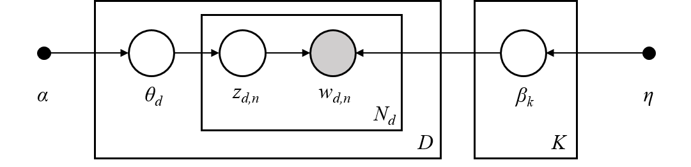

关于上述图形模型中的符号的注意事项，可在Hoffman等人中找到(Hoffman et al. (2013)):

  * 语料库(corpus)是 :math:`D` 个文档(documents)的集合。
  * 一个文档(document)是 :math:`N` 个单词(words)的序列。
  * 一个语料库有 :math:`K` 个主题(topics)。
  * 图中的boxes代表了重复采样。 

在上述图形模型中, 每个节点是个随机变量并且在生成过程里面有个角色。
阴影节点表示观察到的变量(observed variable)，无阴影节点表示隐藏(潜在)变量(hidden (latent) variable)。
在这种情况下，语料库中的单词是我们观察到的唯一数据。潜在变量决定了语料库中主题的随机混合和文档中单词的分布。
LDA的目的是利用观察到的词来推断隐藏的主题结构(topic structure)。

当建模文本语料库时，对具有 :math:`D` 个文档和 :math:`K` 个主题的语料库，该模型假设了以下生成过程。
其中，:math:`K` 对应于API中的 :attr:`n_components` :

  1. 对每个主题 :math:`k \in K`, draw :math:`\beta_k \sim \mathrm{Dirichlet}(\eta)`。 这可以为单词提供一个分布, 
     i.e. 某个单词出现在主题 :math:`k` 中的概率。 
     :math:`\eta` 对应于 :attr:`topic_word_prior` 。 

  2. 对每一个文档 :math:`d \in D`, draw the topic proportions :math:`\theta_d \sim \mathrm{Dirichlet}(\alpha)` 。 
    :math:`\alpha` 对应于 :attr:`doc_topic_prior` 。 

  3. 对文档 :math:`d` 中的每一个单词 :math:`i` :

    a. Draw the topic assignment :math:`z_{di} \sim \mathrm{Multinomial}(\theta_d)`
    b. Draw the observed word :math:`w_{ij} \sim \mathrm{Multinomial}(\beta_{z_{di}})`

对于参数估计, 后验分布如下:

.. math::
  p(z, \theta, \beta |w, \alpha, \eta) =
    \frac{p(z, \theta, \beta|\alpha, \eta)}{p(w|\alpha, \eta)}

由于后验是难以处理的，所以变分贝叶斯方法使用了一种更简单的分布 :math:`q(z,\theta,\beta | \lambda, \phi, \gamma)`
来近似它, 然后优化这些变分参数 :math:`\lambda`, :math:`\phi`, :math:`\gamma` 使得 Evidence Lower Bound (ELBO) 达到最大化:

.. math::
  \log\: P(w | \alpha, \eta) \geq L(w,\phi,\gamma,\lambda) \overset{\triangle}{=}
    E_{q}[\log\:p(w,z,\theta,\beta|\alpha,\eta)] - E_{q}[\log\:q(z, \theta, \beta)]

最大化 ELBO 等价于最小化 :math:`q(z,\theta,\beta)` 和 真实的后验分布 :math:`p(z, \theta, \beta |w, \alpha, \eta)` 之间的 KL散度。

:class:`LatentDirichletAllocation` 类实现了在线变分贝叶斯算法并且支持在线及批量更新方法。
批处理方法在每次完全遍历数据后更新变分变量(variational variables)，而，在线方法则处理小批量数据(mini-batch data)后更新变分变量。

.. note::

  虽然在线方法可以保证收敛到局部最优点，但最优点的质量和收敛速度可能取决于小批量的大小和与学习速率设置有关的属性。

当 :class:`LatentDirichletAllocation` 应用于"document-term"矩阵时，该矩阵将被分解为"topic-term"矩阵和"document-topic"矩阵。
当"topic-term"矩阵作为 :attr:`components_` 存储在模型中时，可以通过 ``transform`` 方法计算"document-topic"矩阵。

:class:`LatentDirichletAllocation` 类也实现了 ``partial_fit`` 方法。 该方法是在数据可以按顺序获取时使用的。

.. topic:: 案例:

    * :ref:`sphx_glr_auto_examples_applications_plot_topics_extraction_with_nmf_lda.py`

.. topic:: 参考文献:

    * `"Latent Dirichlet Allocation"
      <http://www.jmlr.org/papers/volume3/blei03a/blei03a.pdf>`_
      D. Blei, A. Ng, M. Jordan, 2003

    * `"Online Learning for Latent Dirichlet Allocation”
      <https://papers.nips.cc/paper/3902-online-learning-for-latent-dirichlet-allocation.pdf>`_
      M. Hoffman, D. Blei, F. Bach, 2010

    * `"Stochastic Variational Inference"
      <http://www.columbia.edu/~jwp2128/Papers/HoffmanBleiWangPaisley2013.pdf>`_
      M. Hoffman, D. Blei, C. Wang, J. Paisley, 2013
