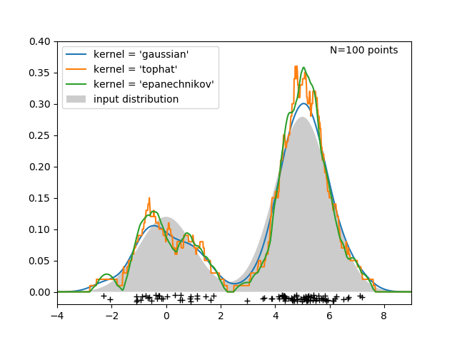

.. _density_estimation:

====================================
概率密度估计(Density Estimation)
====================================
.. sectionauthor:: Jake Vanderplas <vanderplas@astro.washington.edu>

密度估计介于无监督学习、特征工程和数据建模之间。一些最流行和最有用的密度估计技术是混合模型，
比如高斯混合(:class:`sklearn.mixture.GaussianMixture`), 和 基于neighbors的方法，
比如 核密度估计(:class:`sklearn.neighbors.KernelDensity`)。
高斯混合在 :ref:`clustering <clustering>` 中已经充分讨论过啦，因为该技术作为一个无监督聚类机制也非常有用。

密度估计是一个非常简单的概念，大多数人已经熟悉了一种常用的密度估计技术：直方图(the histogram)。

密度估计: 直方图法
==============================
直方图是数据的简单可视化，其中定义了累计箱(bins)，并对每个bin内的数据点数进行了统计。
直方图的一个例子可以在下图的左上角看到：

.. |hist_to_kde| image:: ../auto_examples/neighbors/images/sphx_glr_plot_kde_1d_001.png
   :target: ../auto_examples/neighbors/plot_kde_1d.html
   :scale: 80

.. centered:: |hist_to_kde|

然而，直方图的一个主要问题是，选择 binning 可能会对由此产生的可视化带来不成比例的影响。
考虑上图的右上面板.它显示了同一数据的直方图，只是bins向右移动了。
这两种可视化的结果看起来完全不同，并可能导致对数据的不同解释。

直观地说，还可以将直方图看作是块的堆栈(a stack of blocks)，每个点一个块(one block per point)。
通过在合适的网格空间中叠加块，我们就可以恢复直方图。
但是，如果我们不把这些块堆在一个规则的网格上，而是把每个块集中在它所代表的点上，然后把每个位置的总高度相加，那又将如何呢？
这个想法催生了左下角的可视化。它可能没有直方图那么清晰，但是由数据驱动块位置这一事实意味着它是底层数据的更好的表示。

这个可视化是一个核密度估计(*kernel density estimation*)的例子，在本例中是带顶帽核的(i.e. a square block at each point)。

我们可以通过使用更平滑的内核来恢复更平滑的分布。右下角图显示了一个高斯核密度估计，其中每个点都贡献了一个高斯曲线。
所得结果是由数据导出的光滑密度估计，作为数据点的分布的强大的非参数模型。

.. _kernel_density:

核密度估计
=========================
scikit-learn 中 核密度估计(Kernel density estimation) 是在 :class:`sklearn.neighbors.KernelDensity` 
estimator 中实现的，该实现使用了 Ball Tree 或 KD Tree 以获得高效的查询(请查看 :ref:`neighbors` 里面的关于加速查询搜索的讨论)。  
虽然上面的例子使用一维数据集来简化说明，但是核密度估计可以在任意数量的维度上进行，尽管在实践中，维数灾难会导致其在高维下的性能下降。

在下图中，从双峰分布(bimodal distribution)中抽取了100个点，并显示了选择三种不同的内核进行的核密度估计产生的结果：

.. centered:: |kde_1d_distribution|

在这个例子中，内核形状(kernel shape)如何影响由其产生的分布的平滑性已经很明显了。scikit-Learn 提供的 核密度估计器 的用法如下::

   >>> from sklearn.neighbors.kde import KernelDensity
   >>> import numpy as np
   >>> X = np.array([[-1, -1], [-2, -1], [-3, -2], [1, 1], [2, 1], [3, 2]])
   >>> kde = KernelDensity(kernel='gaussian', bandwidth=0.2).fit(X)
   >>> kde.score_samples(X)
   array([-0.41075698, -0.41075698, -0.41076071, -0.41075698, -0.41075698,
          -0.41076071])

这里，我们使用 ``kernel='gaussian'``, 正如你上面看到的那样。
数学上, 核(kernel) 是一个被带宽(bandwidth)参数 :math:`h` 控制的正定函数(positive function) :math:`K(x;h)` 。
给定了核的形式，一组点 :math:`x_i; i=1\cdots N` 中的 某个点 :math:`y` 处的 密度估计 由下面的公式给出:

.. math::
    \rho_K(y) = \sum_{i=1}^{N} K((y - x_i) / h)

带宽(bandwidth)在这里扮演了一个平滑参数的角色, 控制着密度估计结果中的偏差和方差的折中(tradeoff between bias and variance)。 
一个大的 bandwidth 会导致一个非常平滑(i.e. high-bias)的密度分布。一个小的bandwidth导致一个不平滑(i.e. high-variance)的密度分布。

:class:`sklearn.neighbors.KernelDensity` 类实现了若干个常见的 kernel, 已经为你展示在下图中啦 :

.. |kde_kernels| image:: ../auto_examples/neighbors/images/sphx_glr_plot_kde_1d_002.png
   :target: ../auto_examples/neighbors/plot_kde_1d.html
   :scale: 80

.. centered:: |kde_kernels|

The form of these kernels is as follows:

* Gaussian kernel (``kernel = 'gaussian'``)

  :math:`K(x; h) \propto \exp(- \frac{x^2}{2h^2} )`

* Tophat kernel (``kernel = 'tophat'``)

  :math:`K(x; h) \propto 1` if :math:`x < h`

* Epanechnikov kernel (``kernel = 'epanechnikov'``)

  :math:`K(x; h) \propto 1 - \frac{x^2}{h^2}`

* Exponential kernel (``kernel = 'exponential'``)

  :math:`K(x; h) \propto \exp(-x/h)`

* Linear kernel (``kernel = 'linear'``)

  :math:`K(x; h) \propto 1 - x/h` if :math:`x < h`

* Cosine kernel (``kernel = 'cosine'``)

  :math:`K(x; h) \propto \cos(\frac{\pi x}{2h})` if :math:`x < h`

核密度估计器可以与任何有效距离度量(distance metric)一起使用，(请看 :class:`sklearn.neighbors.DistanceMetric` 里面的可用的距离度量),
虽然这些结果仅对欧氏度量进行了适当的归一化。
一个特别有用的 metric 是 `Haversine distance <https://en.wikipedia.org/wiki/Haversine_formula>`_ ，
它度量球上各点之间的角距离(angular distance)。
下面是一个使用核密度估计来可视化地理空间数据的例子，在这个案例中，是南美洲大陆上两种不同物种的观测分布情况:

.. centered:: |species_kde|

核密度估计的另一个有用的应用是学习数据集的非参数生成模型，以便有效地从该生成模型中提取新的样本。
下面是一个使用此过程创建一组新的手写数字的示例，使用从PCA投影中学到的高斯核：

.. |digits_kde| image:: ../auto_examples/neighbors/images/sphx_glr_plot_digits_kde_sampling_001.png
   :target: ../auto_examples/neighbors/plot_digits_kde_sampling.html
   :scale: 80

.. centered:: |digits_kde|

"新"的数据是输入数据的线性组合，而组合所用的权重是从给定的KDE模型中依概率抽取的。

.. topic:: 案例:

  * :ref:`sphx_glr_auto_examples_neighbors_plot_kde_1d.py`: computation of simple kernel
    density estimates in one dimension.

  * :ref:`sphx_glr_auto_examples_neighbors_plot_digits_kde_sampling.py`: an example of using
    Kernel Density estimation to learn a generative model of the hand-written
    digits data, and drawing new samples from this model.

  * :ref:`sphx_glr_auto_examples_neighbors_plot_species_kde.py`: an example of Kernel Density
    estimation using the Haversine distance metric to visualize geospatial data
