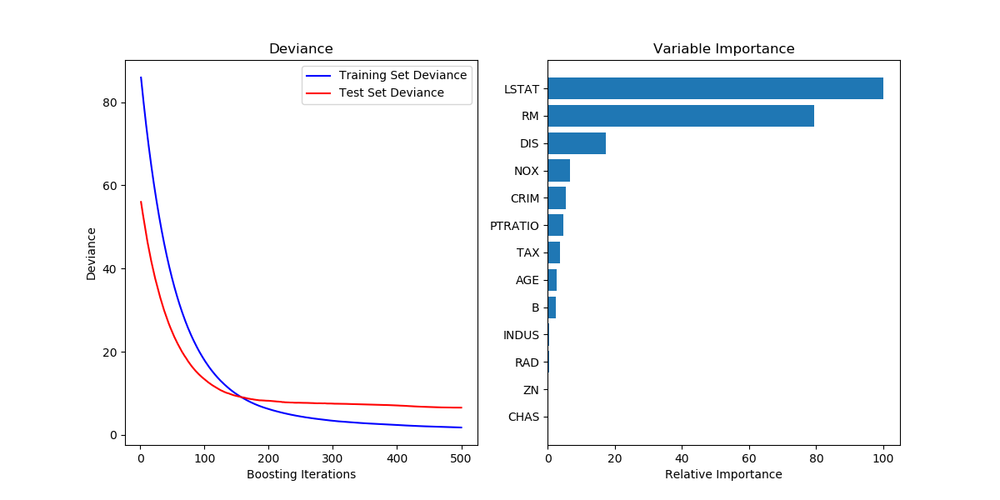
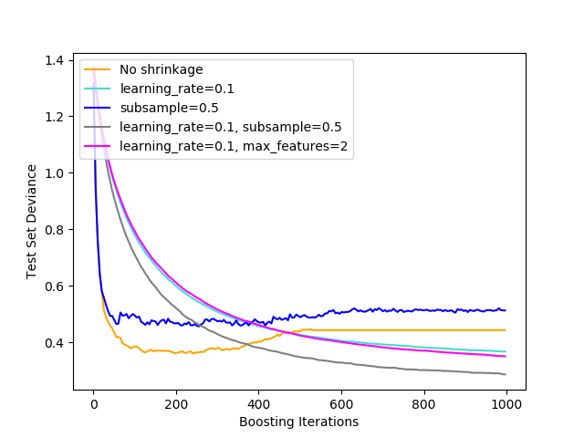
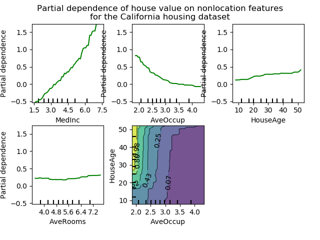
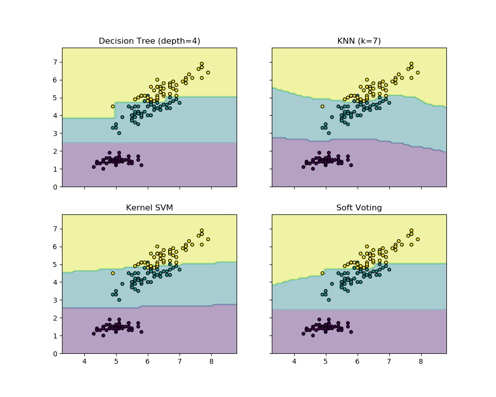

.. _ensemble:

=================================
集成学习方法(Ensemble methods)
=================================

.. currentmodule:: sklearn.ensemble

集成方法(**ensemble methods**)的目标是把多个使用给定学习算法构建的基本估计器(base estimator)的预测结果结合起来，
从而获得比单个基本估计器更好的泛化能力/鲁棒性。

集成方法通常被分为两大家族:

- 在取平均的方法(**averaging methods**)中， 驱动原则是首先独立地构建若干个估计器，然后对它们的预测结果取平均。
  在平均意义上，组合得到的估计器通常优于任意一个基本估计器，因为它的方差(variance)被减小了。

  **代表算法:** :ref:`Bagging methods <bagging>`, :ref:`Forests of randomized trees <forest>`, ...

- 作为对比, 在推举式方法(**boosting methods**)中, 基本估计器是被顺序的构建的,其中的每一个base estimator都致力于减小组合估计器的偏差(bias)。
  这种方法的动机是通过组合若干个弱模型(weak model)来产生一个强大的集成模型。

  **代表算法:** :ref:`AdaBoost <adaboost>`, :ref:`Gradient Tree Boosting <gradient_boosting>`, ...

.. _bagging:

Bagging meta-estimator
=========================

(译者注：bagging 在此处属于名词动用，有 “装袋,打包” 的意思，后面就不翻译这个单词了)

在集成算法中，bagging 方法会在原始训练集的随机子集上构建一类黑盒估计器(black-box estimator)的多个实例，
然后把这些估计器的预测结果结合起来形成最终的预测结果。 该方法通过在构建模型的过程中引入随机性，
来减少基本估计器的方差(例如，减小决策树的方差)。 在多数情况下，bagging 方法提供了一种非常简单的方式来对单一模型进行改进，
而无需修改背后的算法。 因为 bagging 方法可以减小过拟合，所以通常在强分类器和复杂模型上使用时表现的很好
（例如，完全决策树，fully developed decision trees），相比之下 boosting 方法则在弱模型上表现更好
（例如，浅层决策树，shallow decision trees）。

bagging 方法有很多种，其主要区别在于随机抽取训练子集的方法不同：

  * 如果抽取的数据集的随机子集是样本的随机子集，我们叫做粘贴 (Pasting) [B1999]_ 。

  * 如果样本抽取是有放回的，我们称为 Bagging [B1996]_.

  * 如果抽取的数据集的随机子集是特征的随机子集，我们叫做随机子空间 (Random Subspaces) [H1998]_。

  * 最后，如果基本估计器构建在对于样本和特征抽取的子集之上时，我们叫做随机补丁(Random Patches) [LG2012]_.

在 scikit-learn 中，bagging 方法使用统一的 :class:`BaggingClassifier` 元估计器（或者 :class:`BaggingRegressor` ），
基本估计器的种类及其参数和随机子集抽取策略都可以由用户指定。特别需要指出的是，``max_samples`` 和 ``max_features`` 
控制着子集的大小（对于样本和特征）， 而 ``bootstrap`` 和 ``bootstrap_features`` 控制着样本和特征的抽取是有放回还是无放回的。 
当使用样本子集时，通过设置 ``oob_score=True`` 可以使用袋外(out-of-bag)样本来评估泛化精度。
下面的代码片段说明了如何构造一个 :class:`KNeighborsClassifier` 估计器的 bagging 集成实例，
每一个base estimator都建立在 50% 的样本随机子集和 50% 的特征随机子集上。

    >>> from sklearn.ensemble import BaggingClassifier
    >>> from sklearn.neighbors import KNeighborsClassifier
    >>> bagging = BaggingClassifier(KNeighborsClassifier(),
    ...                             max_samples=0.5, max_features=0.5)

.. topic:: 案例:

 * :ref:`sphx_glr_auto_examples_ensemble_plot_bias_variance.py`

.. topic:: 参考文献

  .. [B1999] L. Breiman, "Pasting small votes for classification in large
         databases and on-line", Machine Learning, 36(1), 85-103, 1999.

  .. [B1996] L. Breiman, "Bagging predictors", Machine Learning, 24(2),
         123-140, 1996.

  .. [H1998] T. Ho, "The random subspace method for constructing decision
         forests", Pattern Analysis and Machine Intelligence, 20(8), 832-844,
         1998.

  .. [LG2012] G. Louppe and P. Geurts, "Ensembles on Random Patches",
         Machine Learning and Knowledge Discovery in Databases, 346-361, 2012.

.. _forest:

由随机树组成的森林
===========================

:mod:`sklearn.ensemble`模块包含两个基于 随机决策树 (randomized :ref:`decision trees <tree>`) 的平均算法： 
RandomForest 算法和 Extra-Trees 算法。这两种算法都是专门为树而设计的扰动和组合技术(perturb-and-combine techniques) [B1998]_ 。 
这种技术通过在分类器构造过程中引入随机性来创建一组差异性很大的分类器。集成分类器的预测结果就是所有单个分类器预测结果的平均值。

就像其他分类器一样, 森林分类器(forest classifiers)必须要在两个数组上进行拟合：一个是用于持有训练样本的shape为 ``[n_samples, n_features]`` 
的或稠密或稀疏的 X 数组，另一个是持有与训练数据对应的目标变量(如 类标签)的shape为 ``[n_samples]`` 的 Y 数组 ::

    >>> from sklearn.ensemble import RandomForestClassifier
    >>> X = [[0, 0], [1, 1]]
    >>> Y = [0, 1]
    >>> clf = RandomForestClassifier(n_estimators=10)
    >>> clf = clf.fit(X, Y)

像 :ref:`decision trees <tree>` 一样, 由树组成的森林(forests of trees)也扩展到了可以支持多输出问题 
:ref:`multi-output problems <tree_multioutput>`  (如果 Y 是一个 size 为 ``[n_samples, n_outputs]`` 的数组)。

随机森林
--------------

在随机森林(random forests)中（参见 :class:`RandomForestClassifier` 和 :class:`RandomForestRegressor` 类），
集成模型中的每棵树构建时的样本都是由训练集经过有放回抽样得来的（例如，自助采样法-bootstrap sample）。 
另外，在构建树的过程中进行结点分割时，选择的分割点不再是所有特征中最佳分割点，而是特征的一个随机子集中的最佳分割点。 
由于这种随机性，森林的偏差(bias)通常会有略微的增大（相对于单个非随机树的偏差），但是由于取了平均，其方差也会减小(variance)，
通常能够补偿偏差的增加，从而产生一个总体上更好的模型。

与原始文献 [B2001]_ 不同的是，scikit-learn 的实现是取每个分类器预测出的概率的平均，而不是让每个分类器对单个类别进行投票。

极大随机树
--------------------------

(译者注："Extremely" 有 "极致的,非常的" 意思，因此 "Extremely Randomized Trees" 就是指 "随机的不能再随机的树" 也就是 “极大随机树” 啦！)

在极大随机树方法(:class:`ExtraTreesClassifier` 和 :class:`ExtraTreesRegressor`)中，随机性更进一步的体现在划分的计算方式上。
极大随机树也和随机森林一样，使用了候选特征的随机子集，但是不同之处在于：随机森林为每个特征寻找最具分辨性的阈值(looking for the most discriminative thresholds)，
而在极大随机树里面 每个特征的阈值也是随机抽取的，并且这些随机生成的阈值里面最好的阈值会被用来分割节点。
这种更随机的做法通常能够使得模型的方差减小一点但是会使得模型的偏差稍微的增加一点::

    >>> from sklearn.model_selection import cross_val_score
    >>> from sklearn.datasets import make_blobs
    >>> from sklearn.ensemble import RandomForestClassifier
    >>> from sklearn.ensemble import ExtraTreesClassifier
    >>> from sklearn.tree import DecisionTreeClassifier

    >>> X, y = make_blobs(n_samples=10000, n_features=10, centers=100,
    ...     random_state=0)

    >>> clf = DecisionTreeClassifier(max_depth=None, min_samples_split=2,
    ...     random_state=0)
    >>> scores = cross_val_score(clf, X, y, cv=5)
    >>> scores.mean()                               # doctest: +ELLIPSIS
    0.98...

    >>> clf = RandomForestClassifier(n_estimators=10, max_depth=None,
    ...     min_samples_split=2, random_state=0)
    >>> scores = cross_val_score(clf, X, y, cv=5)
    >>> scores.mean()                               # doctest: +ELLIPSIS
    0.999...

    >>> clf = ExtraTreesClassifier(n_estimators=10, max_depth=None,
    ...     min_samples_split=2, random_state=0)
    >>> scores = cross_val_score(clf, X, y, cv=5)
    >>> scores.mean() > 0.999
    True

.. figure:: ../auto_examples/ensemble/images/sphx_glr_plot_forest_iris_001.png
    :target: ../auto_examples/ensemble/plot_forest_iris.html
    :align: center
    :scale: 75%

参数
----------

使用上述这些方法时要调整的参数主要是 ``n_estimators`` 和 ``max_features`` 。 ``n_estimators`` 是森林里树的数量，通常数量越大，效果越好，
但是计算时间也会随之增加。 此外要注意，当树的数量超过一个临界值之后，算法的效果并不会很显著地变好。 
``max_features`` 是分割节点时特征的随机子集的大小。 这个值越低，方差减小得越多，但是偏差的增加也越多。 
根据经验，回归问题中使用 ``max_features=n_features`` ， 分类问题使用  ``max_features=sqrt(n_features)`` (``n_features`` 是特征的个数)
是比较好的默认值。 ``max_depth=None`` 和 ``min_samples_split=2`` 的参数组合通常会有不错的效果（即生成完全的树）。 
请记住，这些（默认）值通常不是最佳的，同时还可能消耗大量的内存，最佳参数值应由交叉验证获得。 
另外，请注意，在随机森林中，默认使用自助采样法（``bootstrap=True``）， 然而 极大随机树(extra-trees) 的默认策略是使用整个数据集（``bootstrap=False``）。 
当使用自助采样法方法抽样时，泛化精度是可以通过剩余的或者袋外的样本来估算的，设置 ``oob_score=True`` 即可实现。

.. note::

    默认参数下模型复杂度是：:math:`O( M * N * log (N) )` ， 其中 :math:`M`  是树的数目， :math:`N` 是样本数。 
    可以通过设置以下参数来降低模型复杂度： ``min_samples_split``, ``max_leaf_nodes``, ``max_depth`` 和 ``min_samples_leaf`` 。

并行化
---------------

最后，这个模块还支持树的并行构建和预测结果的并行计算，这可以通过 ``n_jobs`` 参数实现。 
如果设置 ``n_jobs=k`` ，则计算被划分为 ``k`` 个作业，并运行在机器的 ``k`` 个核上。 如果设置 ``n_jobs = -1`` ，则使用机器的所有核。 
注意由于进程间通信具有一定的开销，这里的提速并不是线性的（即，使用 ``k`` 个作业不会快 ``k`` 倍）。 
当然，在建立大量的树，或者构建单个树需要相当长的时间（例如，在大数据集上）时，（通过并行化）仍然可以实现显著的加速。

.. topic:: 案例:

 * :ref:`sphx_glr_auto_examples_ensemble_plot_forest_iris.py`
 * :ref:`sphx_glr_auto_examples_ensemble_plot_forest_importances_faces.py`
 * :ref:`sphx_glr_auto_examples_plot_multioutput_face_completion.py`

.. topic:: 参考文献

 .. [B2001] L. Breiman, "Random Forests", Machine Learning, 45(1), 5-32, 2001.

 .. [B1998] L. Breiman, "Arcing Classifiers", Annals of Statistics 1998.

 * P. Geurts, D. Ernst., and L. Wehenkel, "Extremely randomized
   trees", Machine Learning, 63(1), 3-42, 2006.

.. _random_forest_feature_importance:

特征重要性评估
-----------------------------

特征对目标变量预测的相对重要性可以通过（树中的决策节点的）特征使用的相对顺序（即深度）来进行评估。 
决策树顶部使用的特征对更大一部分输入样本的最终预测决策做出贡献；
因此，树顶部的那些特征所贡献的期望样本比例(**expected fraction of the samples**) 可以作为 
特征的相对重要性(**relative importance of the features**) 的一个估计 。
在scikit-learn中，一个特征所贡献的样本的比例与分解它们所产生的不纯度的减少相结合，从而创建了对该特征的预测能力的归一化估计。

通过对多个随机树的预测能力的估计进行平均化(**averaging** )，可以**减小该估计的方差**，并将其用于特征选择。
这种方法被称为 不纯度平均减小(mean decrease in impurity), 或 MDI。
请参考 [L2014]_ 获得更多关于 MDI 和 用随机森林进行特征重要行评估 的信息。

下面的例子展示了一个面部识别任务中每个像素的相对重要性，其中重要性由颜色（的深浅）来表示，使用的模型是 
:class:`ExtraTreesClassifier` 模型.

.. figure:: ../auto_examples/ensemble/images/sphx_glr_plot_forest_importances_faces_001.png
   :target: ../auto_examples/ensemble/plot_forest_importances_faces.html
   :align: center
   :scale: 75

实际上，对于训练完成的模型这些估计值存储在 ``feature_importances_`` 属性中。 
这是一个大小为 ``(n_features,)`` 的数组，其每个元素值为正，并且总和为 1.0。
一个元素的值越高，其对应的特征对预测函数的贡献越大。

.. topic:: 案例:

 * :ref:`sphx_glr_auto_examples_ensemble_plot_forest_importances_faces.py`
 * :ref:`sphx_glr_auto_examples_ensemble_plot_forest_importances.py`

.. _random_trees_embedding:

.. topic:: 参考文献

 .. [L2014] G. Louppe,
         "Understanding Random Forests: From Theory to Practice",
         PhD Thesis, U. of Liege, 2014.

完全随机树嵌入
------------------------------

:class:`RandomTreesEmbedding` implements an unsupervised transformation of the
data.  Using a forest of completely random trees, :class:`RandomTreesEmbedding`
encodes the data by the indices of the leaves a data point ends up in.  This
index is then encoded in a one-of-K manner, leading to a high dimensional,
sparse binary coding.
This coding can be computed very efficiently and can then be used as a basis
for other learning tasks.
The size and sparsity of the code can be influenced by choosing the number of
trees and the maximum depth per tree. For each tree in the ensemble, the coding
contains one entry of one. The size of the coding is at most ``n_estimators * 2
** max_depth``, the maximum number of leaves in the forest.

As neighboring data points are more likely to lie within the same leaf of a tree,
the transformation performs an implicit, non-parametric density estimation.

.. topic:: 案例:

 * :ref:`sphx_glr_auto_examples_ensemble_plot_random_forest_embedding.py`

 * :ref:`sphx_glr_auto_examples_manifold_plot_lle_digits.py` compares non-linear
   dimensionality reduction techniques on handwritten digits.

 * :ref:`sphx_glr_auto_examples_ensemble_plot_feature_transformation.py` compares
   supervised and unsupervised tree based feature transformations.

.. seealso::

   :ref:`manifold` techniques can also be useful to derive non-linear
   representations of feature space, also these approaches focus also on
   dimensionality reduction.

.. _adaboost:

自适应推举算法(AdaBoost)
===========================

:mod:`sklearn.ensemble` 模块 包括了一种推举算法(boosting algorithm)，叫 **AdaBoost**, 它是1995年由 Freund 和 Schapire [FS1995]_ 引入的。

AdaBoost 的主要原则是 在被重复采样的数据上拟合一个弱学习器序列。(weak learner: 指的是那些比随机猜测稍好一点的模型，比如 小决策树)。
这些弱学习器的预测结果随后会通过加权投票的方式被组合起来产生最终的预测。
在每一次称之为 推举迭代(boosting iteration) 中，数据修改(data modifications)就是把权重 :math:`w_1`, :math:`w_2`, ..., :math:`w_N` 
分配给每一个训练样本。在迭代开始的时候，所有的样本权重都被设置为 :math:`w_i = 1/N`，这样第一步迭代就是在原始数据上简单的训练一个弱分类器 。
在后续的迭代步骤中，样本权重会被单独修改，然后学习算法被重新用到被重新加权的样本数据上。在某个给定的迭代步，那些没有被上一步得到的boosted model
正确预测的训练样本的权重就会增加，而那些已经被上一步得到的模型(boosted model)正确预测的样本的权重会被降低。
随着迭代过程的推进，那些比较难预测的样本会获得不断增加的权重。每一个后继的弱学习器就会被强制聚焦到这些被以前的学习器序列错分的权重较高的难分样本上[HTF]_。

.. figure:: ../auto_examples/ensemble/images/sphx_glr_plot_adaboost_hastie_10_2_001.png
   :target: ../auto_examples/ensemble/plot_adaboost_hastie_10_2.html
   :align: center
   :scale: 75

AdaBoost 既可以用于分类问题也可以用于回归问题:

  - 对于多类分类问题, :class:`AdaBoostClassifier` 类实现了两个变体版本：AdaBoost-SAMME 和 AdaBoost-SAMME.R [ZZRH2009]_。

  - 对于回归问题, :class:`AdaBoostRegressor` 类实现了 AdaBoost.R2 [D1997]_.

用法
-----

下面的例子展示了如何拟合一个用100个弱学习器构建的 AdaBoost 分类器::

    >>> from sklearn.model_selection import cross_val_score
    >>> from sklearn.datasets import load_iris
    >>> from sklearn.ensemble import AdaBoostClassifier

    >>> iris = load_iris()
    >>> clf = AdaBoostClassifier(n_estimators=100)
    >>> scores = cross_val_score(clf, iris.data, iris.target, cv=5)
    >>> scores.mean()                             # doctest: +ELLIPSIS
    0.9...

弱学习器的数量由参数 ``n_estimators`` 控制。 参数 ``learning_rate`` 控制着在最终的集成学习器中每个弱学习器的贡献量。
默认情况下，弱学习器都是 决策树桩(decision stumps)。弱学习器可以通过参数 ``base_estimator`` 指定。为了获得好的结果需要调节的主要参数
有 ``n_estimators`` 和 基本学习器的复杂度参数(比如 树的最大深度 ``max_depth`` 和 单个划分上需要的最小样本量 ``min_samples_split``)。

.. topic:: 案例:

 * :ref:`sphx_glr_auto_examples_ensemble_plot_adaboost_hastie_10_2.py` compares the
   classification error of a decision stump, decision tree, and a boosted
   decision stump using AdaBoost-SAMME and AdaBoost-SAMME.R.

 * :ref:`sphx_glr_auto_examples_ensemble_plot_adaboost_multiclass.py` shows the performance
   of AdaBoost-SAMME and AdaBoost-SAMME.R on a multi-class problem.

 * :ref:`sphx_glr_auto_examples_ensemble_plot_adaboost_twoclass.py` shows the decision boundary
   and decision function values for a non-linearly separable two-class problem
   using AdaBoost-SAMME.

 * :ref:`sphx_glr_auto_examples_ensemble_plot_adaboost_regression.py` demonstrates regression
   with the AdaBoost.R2 algorithm.

.. topic:: 参考文献

 .. [FS1995] Y. Freund, and R. Schapire, "A Decision-Theoretic Generalization of
             On-Line Learning and an Application to Boosting", 1997.

 .. [ZZRH2009] J. Zhu, H. Zou, S. Rosset, T. Hastie. "Multi-class AdaBoost",
               2009.

 .. [D1997] H. Drucker. "Improving Regressors using Boosting Techniques", 1997.

 .. [HTF] T. Hastie, R. Tibshirani and J. Friedman, "Elements of
              Statistical Learning Ed. 2", Springer, 2009.

.. _gradient_boosting:

Gradient Tree Boosting
=================================

`Gradient Tree Boosting <https://en.wikipedia.org/wiki/Gradient_boosting>`_
或者叫 Gradient Boosted Regression Trees (GBRT) 是 boosting 在任意可微损失函数上的推广。
GBRT 是一个准确高效的现成的程序(procedure)，可被用于回归和分类问题。
Gradient Tree Boosting 模型被广泛用于各个领域包括网站搜索排序和生态学。

GBRT 的优点是:

  + 混合数据类型的自然操作 (= 各种各样的异质特征 heterogeneous features)

  + 预测能力(Predictive power)

  + 对输出空间中离群点的鲁棒性 (通过鲁棒的损失函数做到这一点)

GBRT的缺点:

  + 可伸缩性(Scalability), 由于 boosting 方法的序列化特性， 很难被并行化。

:mod:`sklearn.ensemble` 模块 提供了使用 gradient boosted regression trees 的 分类和回归算法。

分类
---------------

类 :class:`GradientBoostingClassifier` 支持 二分类和多分类任务。

下面的例子展示了如何拟合一个 带有100个决策树桩(decision stumps)作为弱学习器的 gradient boosting classifier ::

    >>> from sklearn.datasets import make_hastie_10_2
    >>> from sklearn.ensemble import GradientBoostingClassifier

    >>> X, y = make_hastie_10_2(random_state=0)
    >>> X_train, X_test = X[:2000], X[2000:]
    >>> y_train, y_test = y[:2000], y[2000:]

    >>> clf = GradientBoostingClassifier(n_estimators=100, learning_rate=1.0,
    ...     max_depth=1, random_state=0).fit(X_train, y_train)
    >>> clf.score(X_test, y_test)                 # doctest: +ELLIPSIS
    0.913...

弱学习器的数量 (i.e. regression trees) 通过参数 ``n_estimators`` 设置; 
:ref:`The size of each tree <gradient_boosting_tree_size>` 可以通过设置树深度 ``max_depth`` 或者 
通过 ``max_leaf_nodes`` 设置叶节点的数量。 学习率(``learning_rate``)是一个介于(0.0, 1.0]之间的超参数，
它通过 :ref:`shrinkage <gradient_boosting_shrinkage>` 控制着过拟合 .

.. note::

   
   超过两类的分类问题在每一次迭代时需要归纳 ``n_classes`` 个回归树。因此，所有的需要归纳的树数量等于 ``n_classes * n_estimators`` 。
   对于拥有大量类别的数据集我们强烈推荐使用 :class:`RandomForestClassifier` 来代替 :class:`GradientBoostingClassifier`  。
   
回归
----------

:class:`GradientBoostingRegressor` 支持一系列 ref:`不同的损失函数 <gradient_boosting_loss>`
用于回归，可以用参数 ``loss`` 来设置; 用于回归的默认损失函数是： least squares (``'ls'``).

::

    >>> import numpy as np
    >>> from sklearn.metrics import mean_squared_error
    >>> from sklearn.datasets import make_friedman1
    >>> from sklearn.ensemble import GradientBoostingRegressor

    >>> X, y = make_friedman1(n_samples=1200, random_state=0, noise=1.0)
    >>> X_train, X_test = X[:200], X[200:]
    >>> y_train, y_test = y[:200], y[200:]
    >>> est = GradientBoostingRegressor(n_estimators=100, learning_rate=0.1,
    ...     max_depth=1, random_state=0, loss='ls').fit(X_train, y_train)
    >>> mean_squared_error(y_test, est.predict(X_test))    # doctest: +ELLIPSIS
    5.00...

下图展示了应用损失函数为最小二乘损失，基学习器个数为 500 的 :class:`GradientBoostingRegressor` 来处理 
波士顿房价数据集 (:func:`sklearn.datasets.load_boston`) 的结果。左图表示每一次迭代的训练误差和测试误差。
每一次迭代的训练误差保存在 gradient boosting model 的 :attr:`~GradientBoostingRegressor.train_score_` 属性中，
每一次迭代的测试误差能够通过 :meth:`~GradientBoostingRegressor.staged_predict` 方法获取，该方法返回一个生成器，
用来产生每一步迭代的预测结果。类似下面这样的图表， 可以用于决定最优的树的数量，从而进行提前停止。右图表示每个特征的重要性，
它 可以通过 ``feature_importances_`` 属性来获取.

.. topic:: 案例:

 * :ref:`sphx_glr_auto_examples_ensemble_plot_gradient_boosting_regression.py`
 * :ref:`sphx_glr_auto_examples_ensemble_plot_gradient_boosting_oob.py`

.. _gradient_boosting_warm_start:

拟合附加的弱学习器
--------------------------------

:class:`GradientBoostingRegressor` 和 :class:`GradientBoostingClassifier` 都支持 ``warm_start=True`` ，
它允许你添加更多的估计器到一个已经训练好的模型上。

::

  >>> _ = est.set_params(n_estimators=200, warm_start=True)  # set warm_start and new nr of trees
  >>> _ = est.fit(X_train, y_train) # fit additional 100 trees to est
  >>> mean_squared_error(y_test, est.predict(X_test))    # doctest: +ELLIPSIS
  3.84...

.. _gradient_boosting_tree_size:

控制Tree的size
-------------------------

回归树基学习器的大小定义了能够被  gradient boosting model 捕捉的变量（即特征）相互作用（即多个特征共同对预测产生影响）的程度。
总的来讲, 一棵深度为 ``h`` 的树能够捕捉 ``h`` 阶的相互作用(interactions)。有两种方法用来控制单个回归树的大小：

如果你指定 ``max_depth=h`` ，那么将会产生一个深度为 ``h`` 的完全二叉树。这棵树将会有（至多） ``2**h`` 个叶子节点(leaf nodes)和
``2**h - 1`` 个切分节点(split nodes)。

另外，你能通过参数 ``max_leaf_nodes`` 指定叶子节点的数量来控制树的大小。在这种情况下，
树将会使用最优优先搜索(best-first search)来生成，这种搜索方式是通过每次选取对不纯度提升最大的节点来展开。
一棵 ``max_leaf_nodes=k`` 的树拥有 ``k - 1`` 个切分节点，因此可以建模阶数最高达到 ``max_leaf_nodes - 1`` 阶
的相互作用（即 max_leaf_nodes - 1 个特征共同决定预测值）。

我们发现 ``max_leaf_nodes=k`` 可以给出与  ``max_depth=k-1`` 品质相当的结果，但是其训练速度明显更快，
同时也会以多一点的训练误差作为代价。
参数 ``max_leaf_nodes`` 对应于文章 [F2001]_ 中gradient boosting章节中的变量 ``J`` ，同时与 R 语言的 gbm 包的参数 
``interaction.depth`` 相关， 两者间的关系是 ``max_leaf_nodes == interaction.depth + 1`` 。

数学表达式
-------------------------

GBRT 是一种具有以下形式的加性模型(additive models):

  .. math::

    F(x) = \sum_{m=1}^{M} \gamma_m h_m(x)

其中 :math:`h_m(x)` 是基本函数，在 Boosting 算法家族中通常被称为 弱学习器 (*weak learners* )。
Gradient Tree Boosting 使用固定大小的 :ref:`decision trees <tree>` 作为弱学习器。
决策树具有许多有价值的提升能力，即处理混合类型数据的能力和建立复杂函数模型的能力。

与其他的boosting算法类似, GBRT以贪心(greedy)的方式构建加性模型:

  .. math::

    F_m(x) = F_{m-1}(x) + \gamma_m h_m(x),

当给定上一步产生的集成模型(previous ensemble) :math:`F_{m-1}` 时， 新添加的树 :math:`h_m` 尝试最小化损失 :math:`L` :

  .. math::

    h_m =  \arg\min_{h} \sum_{i=1}^{n} L(y_i,
    F_{m-1}(x_i) + h(x_i)).

初始模型 :math:`F_{0}` 是问题相关(problem specific)的，对于最小二乘回归，通常选择目标值的均值。

.. note:: 初始化模型 :math:`F_{0}` 也可以通过参数 ``init`` 来指定。
          传入的对象必须实现 ``fit`` 和 ``predict`` 方法。

Gradient Boosting 尝试通过最陡下降(steepest descent)方法来数值化地求解上述最小化问题: 
最陡下降方向是在当前模型 :math:`F_{m-1}` 上计算出的损失函数的负梯度方向，这可以为任何可微损失函数计算:

  .. math::

    F_m(x) = F_{m-1}(x) - \gamma_m \sum_{i=1}^{n} \nabla_F L(y_i,
    F_{m-1}(x_i))

其中 步长 :math:`\gamma_m` 是使用线性搜索(line search)选择的:

  .. math::

    \gamma_m = \arg\min_{\gamma} \sum_{i=1}^{n} L(y_i, F_{m-1}(x_i)
    - \gamma \frac{\partial L(y_i, F_{m-1}(x_i))}{\partial F_{m-1}(x_i)})

用于回归的GBRT算法和用于分类的GBRT算法的区别仅在于具体的损失函数的使用上。

.. _gradient_boosting_loss:

损失函数
...............

GBRT支持以下损失函数，可以通过参数 ``loss`` 指定 :

  * 用于回归的损失函数

    * Least squares (``'ls'``): 由于其优越的计算性能，是回归问题的自然选择。初始模型 :math:`F_{0}` 由 目标变量的平均值 给出。
    * Least absolute deviation (``'lad'``): 一个用于回归的鲁棒的损失函数。初始模型 :math:`F_{0}` 由 目标变量的中值 给出。
    * Huber (``'huber'``): 另一个用于回归的鲁棒的损失函数，它组合了least squares 和 least absolute deviation; 
      使用 ``alpha`` 参数来控制损失函数对离群点(outliers)的敏感度(sensitivity)，(请看 [F2001]_ 获得更多详情)。
    * Quantile (``'quantile'``): 一个用于分位数回归(quantile regression)的损失函数。
      使用 ``0 < alpha < 1`` 来指定分位数。 这个损失函数可以用来创造预测区间(prediction intervals)
      (请看案例 :ref:`sphx_glr_auto_examples_ensemble_plot_gradient_boosting_quantile.py`)。

  * 用于分类的损失函数

    * Binomial deviance (``'deviance'``): 用于二元分类的负二项式对数似然损失函数(提供概率估计(probability estimates))。初始模型 :math:`F_{0}` 由
      log odds-ratio 给出。
    * Multinomial deviance (``'deviance'``): 用于多元分类(有 ``n_classes`` 个互斥类)的负多项式对数似然损失函数(也提供概率估计(probability estimates))。
      初始模型 :math:`F_{0}` 由每个类的先验概率给出。在每一次迭代中必须构建 ``n_classes`` 棵回归树使得 GBRT 在具有大量类的数据集上相当低效。
    * Exponential loss (``'exponential'``): 与 :class:`AdaBoostClassifier` 的损失函数一样。 与 ``'deviance'`` 相比，对于误标记的样本的鲁棒性较差。
      只能用于二元分类问题。

正则化
----------------

.. _gradient_boosting_shrinkage:

Shrinkage
..........

[F2001]_ 提出了一种简单的正则化策略，通过因子 :math:`\nu` 来衡量(scale)每个弱学习器的贡献：

.. math::

    F_m(x) = F_{m-1}(x) + \nu \gamma_m h_m(x)

参数 :math:`\nu` 被称之为 **learning rate**， 因为它可以控制梯度下降的步长, 并且可以通过 ``learning_rate`` 参数来设置。

参数 ``learning_rate`` 和参数 ``n_estimators`` 之间有很强的制约关系。 
较小的 ``learning_rate`` 需要大量的弱分类器才能维持训练误差的稳定。经验表明数值较小的 ``learning_rate`` 将会得到更好的测试误差。 
[HTF2009]_ 推荐把 ``learning_rate`` 设置为一个较小的常数 (例如: ``learning_rate <= 0.1`` )同时通过提前停止策略来选择合适的 ``n_estimators``。 
有关 ``learning_rate`` 和 ``n_estimators`` 更详细的讨论可以参考 [R2007]_.

Subsampling
............

[F1999]_ 提出了一种将梯度增强(gradient boosting)和自举平均(bootstrap averaging (bagging))相结合的随机梯度增强方法。
在每次迭代中，基分类器在可用训练数据的一部分子样本 ``subsample`` 上被训练。子采样(subsample)是通过无放回采样获得的(drawn without replacement)。
``subsample`` 的典型值为0.5。

下图展示了收缩和子采样对于模型拟合好坏的影响。我们可以明显看到指定收缩率比没有收缩拥有更好的表现。
而将子采样和收缩率相结合能进一步的提高模型的准确率。相反，使用子采样而不使用收缩的结果十分糟糕。

另一个减少方差的策略是特征子采样,这种方法类似于 :class:`RandomForestClassifier` 中的随机分割。子采样的特征数量可以通过参数 ``max_features`` 来控制。

.. note:: 使用一个小的 ``max_features`` 值能够显著降低计算时间。

随机梯度提升(Stochastic gradient boosting)允许计算测试偏差的袋外估计值（Out-of-bag），方法是计算那些不在自助采样之内的样本偏差的改进
(i.e. the out-of-bag examples)。
这个改进保存在属性 :attr:`~GradientBoostingRegressor.oob_improvement_` 中。
``oob_improvement_[i]`` holds the improvement in terms of the loss on the OOB samples if you add the i-th stage
to the current predictions. 
袋外估计可以用于模型选择中，例如决定最优迭代次数。 OOB 估计通常都很悲观(pessimistic), 因此我们推荐使用交叉验证来代替它，
而当交叉验证太耗时时我们就只能使用 OOB 了。

.. topic:: 案例:

 * :ref:`sphx_glr_auto_examples_ensemble_plot_gradient_boosting_regularization.py`
 * :ref:`sphx_glr_auto_examples_ensemble_plot_gradient_boosting_oob.py`
 * :ref:`sphx_glr_auto_examples_ensemble_plot_ensemble_oob.py`

对结果的解释
--------------

通过简单地可视化树结构可以很容易地解释单个决策树,然而对于梯度提升模型来说,一般拥有数百棵/种回归树，
将每一棵树都可视化来解释整个模型是很困难的。
幸运的是，有很多关于总结和解释梯度提升模型的技术。

特征重要性
..................

通常，各个特征分量对目标响应的预测所做的贡献是不一样的。在很多情形中，大多数特征分量之间是不相关的。
当我们要解释一个模型的时候, 遇到的第一个问题通常是：最重要的特征是哪些？它们对目标响应的预测做了怎样的贡献？

单个决策树本质上就是通过选择适当的分割点来进行特征选择的一种模型。这些信息可以用来度量每个特征的重要性，
其基本的思想是：如果一个特征在树的分割节点中用的越频繁，则这个特征的重要性就越高。 这种特征重要性的概念可以
通过简单的平均一下每棵树上的特征重要性扩展到决策树集合，(请看 :ref:`random_forest_feature_importance` 获得更多详情)。

一个经过拟合得的gradient boosting model的特征重要性得分可以通过参数 ``feature_importances_`` 获得::

    >>> from sklearn.datasets import make_hastie_10_2
    >>> from sklearn.ensemble import GradientBoostingClassifier

    >>> X, y = make_hastie_10_2(random_state=0)
    >>> clf = GradientBoostingClassifier(n_estimators=100, learning_rate=1.0,
    ...     max_depth=1, random_state=0).fit(X, y)
    >>> clf.feature_importances_  # doctest: +ELLIPSIS
    array([0.10..., 0.10..., 0.11..., ...

.. topic:: 案例:

 * :ref:`sphx_glr_auto_examples_ensemble_plot_gradient_boosting_regression.py`

.. currentmodule:: sklearn.ensemble.partial_dependence

.. _partial_dependence:

部分依赖性
..................

部分依赖图（Partial dependence plots (PDP)）展示了目标响应和一系列目标特征的依赖关系，
同时边缘化了其他所有特征的取值（候选补充特征）。 
直觉上，我们可以将 部分依赖 解释为作为目标特征函数 [2]_ 的预期目标响应 [1]_  。

由于人类感知能力的限制，目标特征的设置必须小一点(通常是1到2)，因此目标特征通常在最重要的特征中选择。

下图展示了加州住房数据集的四个单向和一个双向c部分依赖图(four one-way PDP 和 one two-way PDP):

单向PDPs (One-way PDPs) 告诉我们目标响应和目标特征的相互影响(例如：线性或者非线性)。
上面的左上图展示了一个地区的中等收入对中等房价的影响。我们可以清楚的看到两者之间是线性相关的。

具有两个目标特征的 PDPs 显示这两个特征之间的相互影响。例如：上图中两个变量的 PDP 展示了房价中位数与房屋年龄和
每户平均入住人数之间的依赖关系。我们能清楚的看到这两个特征之间的影响：对于每户入住均值而言,当其值大于 2 时，
房价与房屋年龄几乎是相对独立的，而其值小于 2 的时，房价对房屋年龄的依赖性就会很强。

模块 :mod:`partial_dependence` 提供了一个方便的函数 :func:`~sklearn.ensemble.partial_dependence.plot_partial_dependence`
创建 one-way and two-way partial dependence plots。 在下面的例子中，我们展示了如何创建一个PDPs网格 : 
two one-way PDPs for the features ``0`` and ``1`` 以及 a two-way PDP between the two features::

    >>> from sklearn.datasets import make_hastie_10_2
    >>> from sklearn.ensemble import GradientBoostingClassifier
    >>> from sklearn.ensemble.partial_dependence import plot_partial_dependence

    >>> X, y = make_hastie_10_2(random_state=0)
    >>> clf = GradientBoostingClassifier(n_estimators=100, learning_rate=1.0,
    ...     max_depth=1, random_state=0).fit(X, y)
    >>> features = [0, 1, (0, 1)]
    >>> fig, axs = plot_partial_dependence(clf, X, features) #doctest: +SKIP

对于多类别的模型，你需要通过 ``label`` 参数设置类别标签来创建 PDPs::

    >>> from sklearn.datasets import load_iris
    >>> iris = load_iris()
    >>> mc_clf = GradientBoostingClassifier(n_estimators=10,
    ...     max_depth=1).fit(iris.data, iris.target)
    >>> features = [3, 2, (3, 2)]
    >>> fig, axs = plot_partial_dependence(mc_clf, X, features, label=0) #doctest: +SKIP

如果你需要部分依赖函数的原始值而不是图，你可以调用 :func:`~sklearn.ensemble.partial_dependence.partial_dependence` 函数 ::

    >>> from sklearn.ensemble.partial_dependence import partial_dependence

    >>> pdp, axes = partial_dependence(clf, [0], X=X)
    >>> pdp  # doctest: +ELLIPSIS
    array([[ 2.46643157,  2.46643157, ...
    >>> axes  # doctest: +ELLIPSIS
    [array([-1.62497054, -1.59201391, ...

该函数需要 通过 ``grid`` 参数指定应该被评估的部分依赖函数的目标特征值 或 可以
十分便利地通过设置 ``X`` 参数从而在训练数据中自动创建 ``grid`` 。
如果 ``X`` 被给出，函数返回的 ``axes`` 为每个目标特征提供轴(axis)。

对于 ``grid`` 中的每一个 ‘目标’ 特征值，部分依赖函数需要边缘化一棵树中所有候选特征('complement' features)的可能值的预测。 
在决策树中，这个函数可以在不参考训练数据的情况下被高效的评估，对于每一网格点执行加权遍历: 
如果切分点包含 ‘目标’ 特征，遍历其相关的左分支或相关的右分支,否则就遍历两个分支。
每一个分支将被通过进入该分支的训练样本的占比加权， 最后，部分依赖通过所有访问的叶节点的权重的平均值给出。
组合树（tree ensembles）的整体结果，需要对每棵树的结果再次平均得到。

.. rubric:: Footnotes

.. [1] For classification with ``loss='deviance'``  the target
   response is logit(p).

.. [2] More precisely its the expectation of the target response after
   accounting for the initial model; partial dependence plots
   do not include the ``init`` model.

.. topic:: 案例:

 * :ref:`sphx_glr_auto_examples_ensemble_plot_partial_dependence.py`

.. topic:: 参考文献

 .. [F2001] J. Friedman, "Greedy Function Approximation: A Gradient Boosting Machine",
   The Annals of Statistics, Vol. 29, No. 5, 2001.

 .. [F1999] J. Friedman, "Stochastic Gradient Boosting", 1999

 .. [HTF2009] T. Hastie, R. Tibshirani and J. Friedman, "Elements of Statistical Learning Ed. 2", Springer, 2009.

 .. [R2007] G. Ridgeway, "Generalized Boosted Models: A guide to the gbm package", 2007

 .. _voting_classifier:

投票分类器(Voting Classifier)
==================================

投票分类器(:class:`VotingClassifier`)背后的思想是组合概念上不同的分类器然后使用多数表决法(majority vote) 
或 使用对预测概率取平均的方法 来预测类标签。 这种投票分类器在组合一些性能不相上下的模型的时候比较有用，因为这样可以平衡每个单独分类器的弱点。

多数/硬投票(majority voting)
--------------------------------------------

在majority voting中，对一个特定样本的预测类标签是所有由每个单独分类器预测出的类标签中出现次数最多的那个类标签。
(译者注：其实就是 票多者胜出 的意思，所以叫 "硬投票" )

举个栗子,对一个给定的样本，有三个分类器都给出他们的预测结果：

- classifier 1 -> class 1
- classifier 2 -> class 1
- classifier 3 -> class 2

VotingClassifier (with ``voting='hard'``) 将会把这个样本分为 "class 1" 类，因为"class 1" 类得了两票而"class 2" 类只有一票。

在得票数势均力敌的情况下，`VotingClassifier` 将会基于升序来选择类标签。
举个栗子, 在下面的场景中，

- classifier 1 -> class 2
- classifier 2 -> class 1

class label 1 将会被分配给样本。

用法
.....

下面的例子展示了怎样去拟合硬投票规则的分类器 ::

   >>> from sklearn import datasets
   >>> from sklearn.model_selection import cross_val_score
   >>> from sklearn.linear_model import LogisticRegression
   >>> from sklearn.naive_bayes import GaussianNB
   >>> from sklearn.ensemble import RandomForestClassifier
   >>> from sklearn.ensemble import VotingClassifier

   >>> iris = datasets.load_iris()
   >>> X, y = iris.data[:, 1:3], iris.target

   >>> clf1 = LogisticRegression(solver='lbfgs', multi_class='multinomial',
   ...                           random_state=1)
   >>> clf2 = RandomForestClassifier(n_estimators=50, random_state=1)
   >>> clf3 = GaussianNB()

   >>> eclf = VotingClassifier(estimators=[('lr', clf1), ('rf', clf2), ('gnb', clf3)], voting='hard')

   >>> for clf, label in zip([clf1, clf2, clf3, eclf], ['Logistic Regression', 'Random Forest', 'naive Bayes', 'Ensemble']):
   ...     scores = cross_val_score(clf, X, y, cv=5, scoring='accuracy')
   ...     print("Accuracy: %0.2f (+/- %0.2f) [%s]" % (scores.mean(), scores.std(), label))
   Accuracy: 0.95 (+/- 0.04) [Logistic Regression]
   Accuracy: 0.94 (+/- 0.04) [Random Forest]
   Accuracy: 0.91 (+/- 0.04) [naive Bayes]
   Accuracy: 0.95 (+/- 0.04) [Ensemble]

加权平均概率(软投票)
--------------------------------------------

相比于多数(硬)投票法(hard voting), 软投票法(soft voting) 返回预测概率的和的最大值所对应的那个标签作为最终的预测类标签。

可以通过参数 ``weights`` 给每个分类器分配特定的权重。如果提供了权重，每个分类器预测出的类概率分布都会收集起来并乘以对应的权重然后再取平均。
最终的类标签就是取平均以后的概率分布中最大概率值所对应的那个类标签。

为了用一个简单的例子说明其用法, 假定我们有3个分类器和一个3个类的分类问题，我们给每个分类器分配相同的权重: w1=1, w2=1, w3=1.

对一个给定样本， 其加权平均概率的计算如下所示：

================  ==========    ==========      ==========
classifier        class 1       class 2         class 3
================  ==========    ==========      ==========
classifier 1	  w1 * 0.2      w1 * 0.5        w1 * 0.3
classifier 2	  w2 * 0.6      w2 * 0.3        w2 * 0.1
classifier 3      w3 * 0.3      w3 * 0.4        w3 * 0.3
weighted average  0.37	        0.4             0.23
================  ==========    ==========      ==========

在这里, 预测出的类标签是 2, 因为它有最高的平均概率值。

下面的这个例子展示的是用线性SVM, 决策树, 和 K-最近邻 作为基本分类器构建一个soft `VotingClassifier`。 
我们要观察当使用这样一个 soft `VotingClassifier` 时决策区域将会如何变化::

   >>> from sklearn import datasets
   >>> from sklearn.tree import DecisionTreeClassifier
   >>> from sklearn.neighbors import KNeighborsClassifier
   >>> from sklearn.svm import SVC
   >>> from itertools import product
   >>> from sklearn.ensemble import VotingClassifier

   >>> # Loading some example data
   >>> iris = datasets.load_iris()
   >>> X = iris.data[:, [0, 2]]
   >>> y = iris.target

   >>> # Training classifiers
   >>> clf1 = DecisionTreeClassifier(max_depth=4)
   >>> clf2 = KNeighborsClassifier(n_neighbors=7)
   >>> clf3 = SVC(gamma='scale', kernel='rbf', probability=True)
   >>> eclf = VotingClassifier(estimators=[('dt', clf1), ('knn', clf2), ('svc', clf3)],
   ...                         voting='soft', weights=[2, 1, 2])

   >>> clf1 = clf1.fit(X, y)
   >>> clf2 = clf2.fit(X, y)
   >>> clf3 = clf3.fit(X, y)
   >>> eclf = eclf.fit(X, y)

投票分类器在网格搜索中应用
----------------------------------------------

投票分类器 (`VotingClassifier`)也可以与网格搜索(`GridSearch`)共同使用来调节每个单独的estimator的超参数 ::

   >>> from sklearn.model_selection import GridSearchCV
   >>> clf1 = LogisticRegression(solver='lbfgs', multi_class='multinomial',
   ...                           random_state=1)
   >>> clf2 = RandomForestClassifier(random_state=1)
   >>> clf3 = GaussianNB()
   >>> eclf = VotingClassifier(estimators=[('lr', clf1), ('rf', clf2), ('gnb', clf3)], voting='soft')

   >>> params = {'lr__C': [1.0, 100.0], 'rf__n_estimators': [20, 200]}

   >>> grid = GridSearchCV(estimator=eclf, param_grid=params, cv=5)
   >>> grid = grid.fit(iris.data, iris.target)

用法
.....

为了基于预测出的类概率分布预测类标签(VotingClassifier 中的 estimator必须支持 ``predict_proba`` 方法) ::

   >>> eclf = VotingClassifier(estimators=[('lr', clf1), ('rf', clf2), ('gnb', clf3)], voting='soft')

可选的, 权重可以被提供给每个单独的分类器 ::

   >>> eclf = VotingClassifier(estimators=[('lr', clf1), ('rf', clf2), ('gnb', clf3)],
   ...                         voting='soft', weights=[2, 5, 1])
