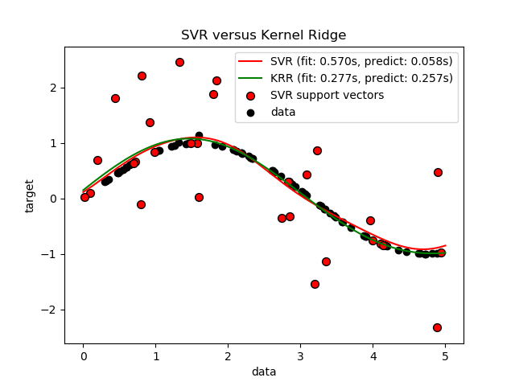
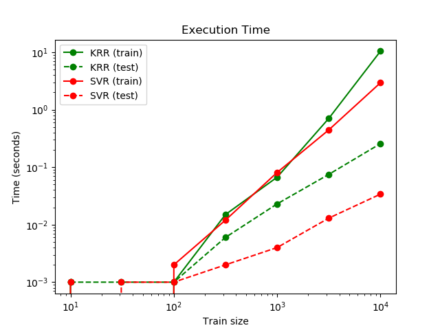

.. _kernel_ridge:

=====================================
核岭回归(Kernel ridge regression)
=====================================

.. currentmodule:: sklearn.kernel_ridge

核岭回归(KRR)[M 2012]结合了 :ref:`ridge_regression` (L2正则化的线性最小二乘) 和 核技巧(kernel trick)。
因此，它在相应的核和数据诱导出的空间中学习一个线性函数。对于非线性核，这对应于原始空间中的非线性函数。

:class:`KernelRidge` 学习到的模型的形式与支持向量回归(SVR)是一致的。然而，它使用了不同的损失函数：
KRR使用了平方误差损失而SVR使用了 :math:`\epsilon` -insensitive loss。他们都用了L2正则化。
与 :class:`SVR` 相比， :class:`KernelRidge` 模型的拟合可以以解析解(closed-form)的形式完成,因此在中型规模的数据集上更快。
另一方面，:class:`KernelRidge` 学习到的模型是非稀疏的，而 :class:`SVR` 学习到的模型是稀疏的(因为 :math:`\epsilon > 0` )。
所以在预测阶段，SVR要比KRR更快。

下图对人工数据集上的 :class:`KernelRidge` 和 :class:`SVR` 进行了比较，该数据集由一个正弦目标函数和每五个数据点中添加的强噪声组成。
学习到的 :class:`KernelRidge` 模型 和 :class:`SVR` 模型 被画在了图上。 在两种模型的学习过程中，都采用网格搜索方法对复杂度、正则化
和RBF核的带宽进行了优化。学习到的曲线非常相似，但是 :class:`KernelRidge` 的拟合比 :class:`SVR` 的拟合 快 7倍(两者都用了网格搜索)。
然而，在对100000个目标值的预测上SVR要快三倍，因为SVR学习到的是一个稀疏模型，它仅仅使用了大约1/3的训练数据点作为支撑向量。

下一个图比较了不同大小的训练集上 :class:`KernelRidge` 和 :class:`SVR` 的拟合时间和预测时间。
对于中型训练集(小于1000个样本)，拟合 :class:`KernelRidge` 比 :class:`SVR` 快；然而，对于较大的训练集，SVR更快。
在预测时间方面，由于学习到的稀疏解，在所有不同大小的训练集上 :class:`SVR` 比 :class:`KernelRidge` 更快。
请注意，稀疏度和预测时间取决于 :class:`SVR` 的参数 :math:`\epsilon` 和 :math:`C` ；:math:`\epsilon = 0` 将对应于稠密模型。

.. topic:: 参考文献:

    .. [M2012] "Machine Learning: A Probabilistic Perspective"
      Murphy, K. P. - chapter 14.4.3, pp. 492-493, The MIT Press, 2012
