.. _linear_model:

=========================================
广义线性模型(Generalized Linear Models)
=========================================

.. currentmodule:: sklearn.linear_model

以下是一组用于回归的方法，其中目标值(target value)被希望(认为)是输入变量的线性组合(input
variables)。 用数学语言来描述是这样的： 假设 :math:`\hat{y}` 是目标值的预测值，则有

.. math::    \hat{y}(w, x) = w_0 + w_1 x_1 + ... + w_p x_p

在整个模块中, 我们把向量 :math:`w = (w_1,..., w_p)` 记作 ``coef_`` (系数)，并把 :math:`w_0` 记作 ``intercept_`` (截距).

如果你想用正则化线性模型求解分类问题, 请参考 :ref:`Logistic_regression`。

.. _ordinary_least_squares:

普通最小二乘法
=======================

:class:`LinearRegression` 拟合一个带有系数 :math:`w = (w_1, ..., w_p)` 的线性模型使得数据集实际观测数据和预测数据（估计值）之间的残差平方和最小。
其数学表达式为:

.. math:: \min_{w} {|| X w - y||_2}^2

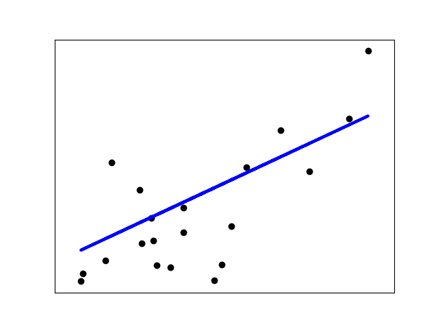

:class:`LinearRegression` 会调用 ``fit`` 方法来拟合数组 X， y，并且将线性模型的系数 :math:`w` 存储在其成员变量 ``coef_`` 中::

    >>> from sklearn import linear_model
    >>> reg = linear_model.LinearRegression()
    >>> reg.fit([[0, 0], [1, 1], [2, 2]], [0, 1, 2])
    ...                                       # doctest: +NORMALIZE_WHITESPACE
    LinearRegression(copy_X=True, fit_intercept=True, n_jobs=None,
                     normalize=False)
    >>> reg.coef_
    array([0.5, 0.5])

然而，对于普通最小二乘的系数估计问题，其依赖于模型各项的相互独立性。
当各项是相关的，且设计矩阵(design matrix) :math:`X` 的各列近似线性相关，
那么，设计矩阵会趋向于奇异矩阵，这会导致最小二乘估计对于随机误差非常敏感，产生很大的方差。
例如，在没有实验设计的情况下收集到的数据，这种多重共线性（multicollinearity）的情况可能真的会出现。

.. topic:: 案例:

   * :ref:`sphx_glr_auto_examples_linear_model_plot_ols.py`

普通最小二乘法的复杂度
---------------------------------

该方法使用 X 的奇异值分解来计算最小二乘解。如果 X 是一个 size 为 (n, p) 的矩阵，设 :math:`n \geq p` ，则该方法的复杂度为 :math:`O(n p^2)`.

.. _ridge_regression:

岭回归(Ridge Regression)
==============================

:class:`Ridge` regression 通过对系数的大小施加惩罚来解决 :ref:`ordinary_least_squares` 的一些问题。 
岭系数最小化的是带惩罚项的残差平方和，数学形式如下

.. math::

   \min_{w} {{|| X w - y||_2}^2 + \alpha {||w||_2}^2}

其中, :math:`\alpha \geq 0` 是一个控制缩减量(amount of shrinkage)的复杂度参数:
:math:`\alpha` 的值越大, 缩减量就越大，故而线性模型的系数对共线性(collinearity)就越鲁棒.

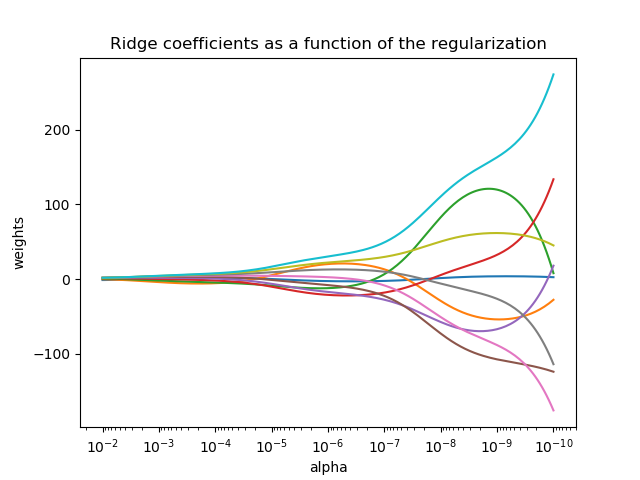

与其他线性模型一样, :class:`Ridge` 会调用 ``fit`` 方法来拟合数组 X， y，并且将线性模型的系数 :math:`w` 存储在其成员变量 ``coef_`` 中::

    >>> from sklearn import linear_model
    >>> reg = linear_model.Ridge(alpha=.5)
    >>> reg.fit([[0, 0], [0, 0], [1, 1]], [0, .1, 1]) # doctest: +NORMALIZE_WHITESPACE
    Ridge(alpha=0.5, copy_X=True, fit_intercept=True, max_iter=None,
          normalize=False, random_state=None, solver='auto', tol=0.001)
    >>> reg.coef_
    array([0.34545455, 0.34545455])
    >>> reg.intercept_ #doctest: +ELLIPSIS
    0.13636...

.. topic:: 案例:

   * :ref:`sphx_glr_auto_examples_linear_model_plot_ridge_path.py`
   * :ref:`sphx_glr_auto_examples_text_plot_document_classification_20newsgroups.py`

岭回归的复杂度
----------------

这种方法的复杂度与 :ref:`ordinary_least_squares` 的复杂度是相同的.

.. FIXME:
.. Not completely true: OLS is solved by an SVD, while Ridge is solved by
.. the method of normal equations (Cholesky), there is a big flop difference
.. between these

设置正则化参数: 广义交叉验证
------------------------------------------------------------------

:class:`RidgeCV` 通过内置的 alpha 参数的交叉验证来实现岭回归。 该对象与 GridSearchCV 的使用方法相同，
只是它默认为 Generalized Cross-Validation(广义交叉验证 GCV)，这是一种有效的留一验证方法（LOO-CV）::

    >>> from sklearn import linear_model
    >>> reg = linear_model.RidgeCV(alphas=[0.1, 1.0, 10.0], cv=3)
    >>> reg.fit([[0, 0], [0, 0], [1, 1]], [0, .1, 1])       # doctest: +SKIP
    RidgeCV(alphas=[0.1, 1.0, 10.0], cv=3, fit_intercept=True, scoring=None,
        normalize=False)
    >>> reg.alpha_                                      # doctest: +SKIP
    0.1

.. topic:: 参考文献

    * "Notes on Regularized Least Squares", Rifkin & Lippert (`technical report
      <http://cbcl.mit.edu/publications/ps/MIT-CSAIL-TR-2007-025.pdf>`_,
      `course slides
      <https://www.mit.edu/~9.520/spring07/Classes/rlsslides.pdf>`_).

.. _lasso:

Lasso
=====

:class:`Lasso` 是一个线性模型，它给出的模型具有稀疏的系数(sparse coefficients)。
它在一些场景中是狠有用的，因为它倾向于使用具有较少参数值的情况，能够有效地减少给定解决方案所依赖变量的数量。 
因此，Lasso 及其变体是压缩感知(compressed sensing)领域的基础。在某些特定条件下, 它能够恢复非零权重的精确解。
(请参见 :ref:`sphx_glr_auto_examples_applications_plot_tomography_l1_reconstruction.py`).

在数学公式表达上，它由一个带有 :math:`\ell_1` 先验的正则项的线性模型组成。 其最小化的目标函数是:

.. math::  \min_{w} { \frac{1}{2n_{samples}} ||X w - y||_2 ^ 2 + \alpha ||w||_1}

lasso estimator 解决了加上惩罚项 :math:`\alpha ||w||_1` 的最小二乘的最小化，其中，
:math:`\alpha` 是一个常数，:math:`||w||_1` 是参数向量的 :math:`\ell_1`-norm 范数。

:class:`Lasso` 类的实现使用了 coordinate descent （坐标下降算法）来拟合系数。 另一种实现方法在 :ref:`least_angle_regression` 中::

    >>> from sklearn import linear_model
    >>> reg = linear_model.Lasso(alpha=0.1)
    >>> reg.fit([[0, 0], [1, 1]], [0, 1])
    Lasso(alpha=0.1, copy_X=True, fit_intercept=True, max_iter=1000,
       normalize=False, positive=False, precompute=False, random_state=None,
       selection='cyclic', tol=0.0001, warm_start=False)
    >>> reg.predict([[1, 1]])
    array([0.8])

对于较低级别的任务，同样有用的是函数 :func:`lasso_path` 。它能够通过搜索所有可能的路径上的值来计算系数。

.. topic:: 案例:

  * :ref:`sphx_glr_auto_examples_linear_model_plot_lasso_and_elasticnet.py`
  * :ref:`sphx_glr_auto_examples_applications_plot_tomography_l1_reconstruction.py`

.. note:: **使用 Lasso 进行特征选择**

      由于 Lasso regression 能够产生稀疏模型，所以他可以用来执行特征选择，详情可以参见 :ref:`l1_feature_selection`。

下面的两篇参考文章解释了scikit-learn的坐标下降求解器(coordinate descent solver)的迭代过程，以及用于控制收敛的对偶间隙(duality gap)的计算。

.. topic:: 参考文献

    * "Regularization Path For Generalized linear Models by Coordinate Descent",
      Friedman, Hastie & Tibshirani, J Stat Softw, 2010 (`Paper
      <https://www.jstatsoft.org/article/view/v033i01/v33i01.pdf>`_).
    * "An Interior-Point Method for Large-Scale L1-Regularized Least Squares,"
      S. J. Kim, K. Koh, M. Lustig, S. Boyd and D. Gorinevsky,
      in IEEE Journal of Selected Topics in Signal Processing, 2007
      (`Paper <https://web.stanford.edu/~boyd/papers/pdf/l1_ls.pdf>`_)

设置正则化参数
--------------------------------

``alpha`` 参数控制着估计出的模型的系数的稀疏度。 

使用交叉验证
^^^^^^^^^^^^^^^^^^^^^^^

scikit-learn 通过交叉验证来公开设置 Lasso ``alpha`` 参数的对象: :class:`LassoCV` 和 :class:`LassoLarsCV`。 
:class:`LassoLarsCV` 是基于下面解释的 :ref:`least_angle_regression` 算法。

对于带有很多共线回归器(collinear regressors)的高维数据集， :class:`LassoCV` 是经常被选择的模型。 
然而，:class:`LassoLarsCV` 在寻找更有相关性的 `alpha` 参数值上更具有优势，
而且如果样本数量与特征数量相比非常小时，通常 :class:`LassoLarsCV` 比 :class:`LassoCV` 要快。

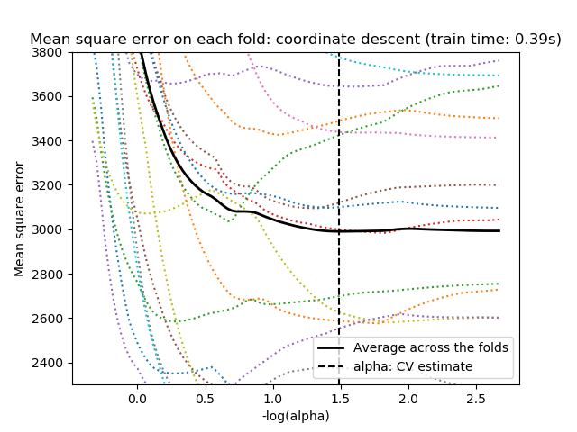

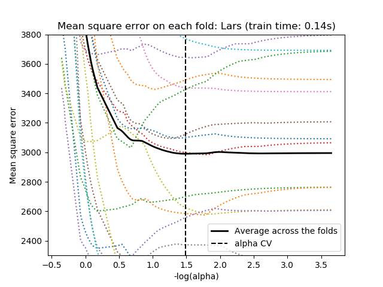

.. centered:: |lasso_cv_1| |lasso_cv_2|

基于信息标准的模型选择
^^^^^^^^^^^^^^^^^^^^^^^^^^^^^^^^^^^^^^^^^^

另外作为替代方案，估计器 :class:`LassoLarsIC` 建议使用Akaike信息准则(AIC)和Bayes信息准则(BIC)。使用基于信息准则的方法寻找
alpha 的最优值是一种计算成本较低的方法，因为这种方法中正则化路径只计算一次而不是使用k-fold交叉验证时的k+1次。
然而，这类准则需要对解的自由度进行适当的估计，是为大样本(渐近结果)导出的，并假定模型是正确的(即数据实际上是由该模型生成的)。
当问题条件数不好(特征多于样本)时，它们可能会崩溃。

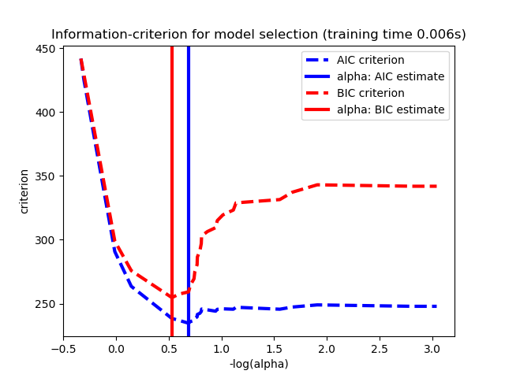

.. topic:: 案例:

  * :ref:`sphx_glr_auto_examples_linear_model_plot_lasso_model_selection.py`

与 SVM 的正则化参数的比较
^^^^^^^^^^^^^^^^^^^^^^^^^^^^^^^^^^^^^^^^^^^^^^^^^^^

``alpha`` 和 SVM 的正则化参数 ``C`` 之间的等式关系是 ``alpha = 1 / C`` 或者 ``alpha = 1 / (n_samples * C)`` ，
并依赖于估计器和模型优化的确切的目标函数。

.. _multi_task_lasso:

多任务 Lasso
================

:class:`MultiTaskLasso` 是一个线性模型，它联合估计多元回归问题的稀疏系数： ``y`` 是一个 ``(n_samples, n_tasks)`` 的2D array，
其约束条件和其他回归问题（也称为任务）是一样的，都是所选的特征。

下图比较了通过使用简单的 Lasso 或 MultiTaskLasso 得到的 W 中非零的位置。 
Lasso 估计产生分散的非零值，而 MultiTaskLasso 的一整列都是非零的。

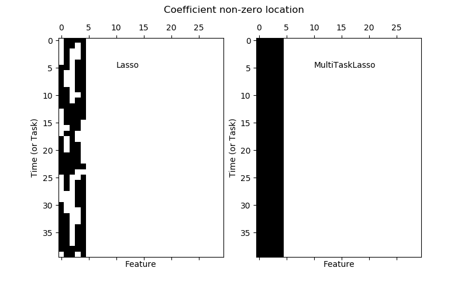

.. |multi_task_lasso_2| image:: ../auto_examples/linear_model/images/sphx_glr_plot_multi_task_lasso_support_002.png
    :target: ../auto_examples/linear_model/plot_multi_task_lasso_support.html
    :scale: 48%

.. centered:: |multi_task_lasso_1| |multi_task_lasso_2|

.. centered:: 拟合时间序列模型，强制让任何激活特征在任何时候都是激活的.

.. topic:: 案例:

  * :ref:`sphx_glr_auto_examples_linear_model_plot_multi_task_lasso_support.py`

在数学上，它由一个线性模型组成，以混合的 :math:`\ell_1` :math:`\ell_2` 先验 作为正则化器进行训练。最小化的目标函数是：

.. math::  \min_{w} { \frac{1}{2n_{samples}} ||X W - Y||_{Fro} ^ 2 + \alpha ||W||_{21}}

其中 :math:`Fro` indicates the Frobenius norm:

.. math:: ||A||_{Fro} = \sqrt{\sum_{ij} a_{ij}^2}

和 :math:`\ell_1` :math:`\ell_2` reads:

.. math:: ||A||_{2 1} = \sum_i \sqrt{\sum_j a_{ij}^2}

:class:`MultiTaskLasso` 类的实现也使用了坐标下降法(coordinate descent)对系数进行拟合的。

.. _elastic_net:

弹性网(Elastic Net)
========================
:class:`ElasticNet` 是一种使用 L1 和 L2 范数作为先验正则项训练的线性回归模型。
这种正则化项的组合允许学习到一个只有少量参数是非零稀疏的模型，就像 :class:`Lasso` 一样，但是它仍然保持一些像 :class:`Ridge` 的正则性质。
我们可以利用 ``l1_ratio`` 参数控制 L1 和 L2 的凸组合。

弹性网络在很多特征互相联系的情况下是非常有用的。Lasso 很可能只随机考虑这些特征中的一个，而弹性网络更倾向于选择两个。

在实践中，Lasso 和 Ridge 之间权衡的一个优势是它允许Elastic-Net在循环过程（Under rotate）中继承 Ridge 的稳定性。

最小化的目标函数如下所示：

.. math::

    \min_{w} { \frac{1}{2n_{samples}} ||X w - y||_2 ^ 2 + \alpha \rho ||w||_1 +
    \frac{\alpha(1-\rho)}{2} ||w||_2 ^ 2}

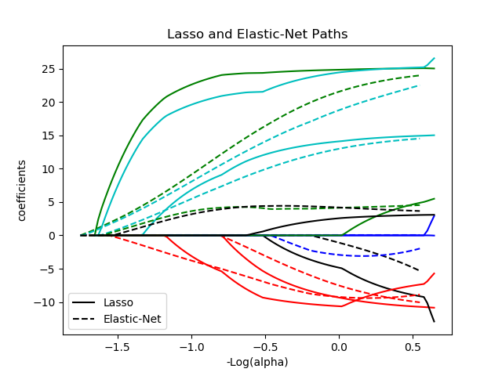

:class:`ElasticNetCV` 类可以被用来通过交叉验证设置 ``alpha`` (:math:`\alpha`) 和 ``l1_ratio`` (:math:`\rho`) 参数。

.. topic:: 案例:

  * :ref:`sphx_glr_auto_examples_linear_model_plot_lasso_and_elasticnet.py`
  * :ref:`sphx_glr_auto_examples_linear_model_plot_lasso_coordinate_descent_path.py`

下面的两篇参考文章解释了scikit-learn 的坐标下降求解器(coordinate descent solver)的迭代过程，以及用于控制收敛的对偶间隙(duality gap)的计算。 

.. topic:: 参考文献

    * "Regularization Path For Generalized linear Models by Coordinate Descent",
      Friedman, Hastie & Tibshirani, J Stat Softw, 2010 (`Paper
      <https://www.jstatsoft.org/article/view/v033i01/v33i01.pdf>`_).
    * "An Interior-Point Method for Large-Scale L1-Regularized Least Squares,"
      S. J. Kim, K. Koh, M. Lustig, S. Boyd and D. Gorinevsky,
      in IEEE Journal of Selected Topics in Signal Processing, 2007
      (`Paper <https://web.stanford.edu/~boyd/papers/pdf/l1_ls.pdf>`_)

.. _multi_task_elastic_net:

多任务弹性网
======================

:class:`MultiTaskElasticNet` 是一个针对多变量回归问题估计其稀疏系数的弹性网模型: ``Y`` 是一个 2D array,
其shape为 ``(n_samples, n_tasks)``。 其约束条件和其他回归问题（也称为任务）是一样的，都是所选的特征值。

数学上, 它是一个混合了 :math:`\ell_1` :math:`\ell_2` 先验 和 :math:`\ell_2` 先验作为正则化项的线性模型。
目标函数的最小化如下所示：

.. math::

    \min_{W} { \frac{1}{2n_{samples}} ||X W - Y||_{Fro}^2 + \alpha \rho ||W||_{2 1} +
    \frac{\alpha(1-\rho)}{2} ||W||_{Fro}^2}

:class:`MultiTaskElasticNet` 类的实现也使用了坐标下降法(coordinate descent)对系数进行拟合的。

:class:`MultiTaskElasticNetCV` 类可以被用来通过交叉验证设置 ``alpha`` (:math:`\alpha`) 和 ``l1_ratio`` (:math:`\rho`) 参数。

.. _least_angle_regression:

最小角回归
======================

最小角回归 （Least-angle regression -- LARS） 是对高维数据的回归算法， 由 Bradley Efron, 
Trevor Hastie, Iain Johnstone 和 Robert Tibshirani 开发完成。 LARS 和前向逐步回归(forward stepwise
regression)很像。在每一步，它寻找与响应最有关联的 预测。当有很多预测有相同的关联时，它没有继续利用相同的预测，
而是在这些预测中找出应该等角的方向。

LARS 的优点如下 :

  - 当 p >> n，该算法数值运算上非常有效。(例如当维度的数目远超点的个数)

  - 它在计算上和前向选择一样快，和普通最小二乘法有相同的运算复杂度。

  - 它产生了一个完整的分段线性的解决路径，在交叉验证或者其他相似的微调模型的方法上非常有用。

  - 如果两个变量对响应几乎有相等的联系，则它们的系数应该有相似的增长率。因此这个算法和我们直觉上的判断一样，而且还更加稳定。

  - 它很容易修改并为其他估算器生成解，比如Lasso。

LARS 的缺点如下 :

  - 因为 LARS 是建立在循环拟合剩余变量上的，所以它对噪声非常敏感。这个问题，在 2004 年统计年鉴的文章由 Weisberg 详细讨论。

LARS 模型可以在 :class:`Lars` ，或者它的底层实现 :func:`lars_path` 中被使用。

LARS Lasso
==========

:class:`LassoLars` 是一个使用 LARS 算法的 lasso 模型，不同于基于坐标下降法的实现，
它可以得到一个精确解，也就是一个关于自身参数标准化后的一个分段线性解。

.. figure:: ../auto_examples/linear_model/images/sphx_glr_plot_lasso_lars_001.png
   :target: ../auto_examples/linear_model/plot_lasso_lars.html
   :align: center
   :scale: 50%

::

   >>> from sklearn import linear_model
   >>> reg = linear_model.LassoLars(alpha=.1)
   >>> reg.fit([[0, 0], [1, 1]], [0, 1])  # doctest: +ELLIPSIS, +NORMALIZE_WHITESPACE
   LassoLars(alpha=0.1, copy_X=True, eps=..., fit_intercept=True,
        fit_path=True, max_iter=500, normalize=True, positive=False,
        precompute='auto', verbose=False)
   >>> reg.coef_    # doctest: +ELLIPSIS
   array([0.717157..., 0.        ])

.. topic:: 案例:

 * :ref:`sphx_glr_auto_examples_linear_model_plot_lasso_lars.py`

Lars 算法提供了一个几乎无代价的沿着正则化参数的系数的完整路径，因此常利用函数 :func:`lars_path` 来取回路径。

数学化表达式
------------------------

该算法和前向逐步回归(forward stepwise regression)非常相似，但是它没有在每一步包含变量，
它估计的参数是根据与其他剩余变量的联系来增加的。

在 LARS 的解中，没有给出一个向量的结果，而是给出一条曲线，显示参数向量的 L1 范式的每个值的解。 
完全的参数路径存在 ``coef_path_`` 下。它的 size 是 (n_features, max_features+1)。 
其中第一列通常是全 0 列。

.. topic:: 参考:

 * Original Algorithm is detailed in the paper `Least Angle Regression
   <http://www-stat.stanford.edu/~hastie/Papers/LARS/LeastAngle_2002.pdf>`_
   by Hastie et al.

.. _omp:

正交匹配追踪法 (OMP)
=================================
:class:`OrthogonalMatchingPursuit` and :func:`orthogonal_mp` implements the OMP
algorithm for approximating the fit of a linear model with constraints imposed
on the number of non-zero coefficients (ie. the L :sub:`0` pseudo-norm).

Being a forward feature selection method like :ref:`least_angle_regression`,
orthogonal matching pursuit can approximate the optimum solution vector with a
fixed number of non-zero elements:

.. math::
    \underset{\gamma}{\operatorname{arg\,min\,}}  ||y - X\gamma||_2^2 \text{ subject to } ||\gamma||_0 \leq n_{nonzero\_coefs}

Alternatively, orthogonal matching pursuit can target a specific error instead
of a specific number of non-zero coefficients. This can be expressed as:

.. math::
    \underset{\gamma}{\operatorname{arg\,min\,}} ||\gamma||_0 \text{ subject to } ||y-X\gamma||_2^2 \leq \text{tol}

OMP is based on a greedy algorithm that includes at each step the atom most
highly correlated with the current residual. It is similar to the simpler
matching pursuit (MP) method, but better in that at each iteration, the
residual is recomputed using an orthogonal projection on the space of the
previously chosen dictionary elements.

.. topic:: 案例:

 * :ref:`sphx_glr_auto_examples_linear_model_plot_omp.py`

.. topic:: 参考文献:

 * http://www.cs.technion.ac.il/~ronrubin/Publications/KSVD-OMP-v2.pdf

 * `Matching pursuits with time-frequency dictionaries
   <http://blanche.polytechnique.fr/~mallat/papiers/MallatPursuit93.pdf>`_,
   S. G. Mallat, Z. Zhang,

.. _bayesian_regression:

贝叶斯回归
===================

贝叶斯回归可以用于在估计阶段的参数正则化: 正则化参数的选择不是通过人为选择进行设置，而是根据手头的数据来调节的。

上述过程可以通过引入 无信息先验(`uninformative priors <https://en.wikipedia.org/wiki/Non-informative_prior#Uninformative_priors>`__) 
于模型中的超参数来完成。 在 `Ridge Regression`_  中使用的 :math:`\ell_{2}` 正则项相当于在 :math:`w` 为高斯先验条件下，
且此先验的精确度为 :math:`\lambda^{-1}` 求最大后验估计。在这里，我们没有手工调参数 `\lambda` ，而是让他作为一个变量，通过数据中估计得到。

为了得到一个全概率模型，输出 :math:`y` 也被认为是关于 :math:`X w` 的高斯分布:

.. math::  p(y|X,w,\alpha) = \mathcal{N}(y|X w,\alpha)

Alpha 在这里也是作为一个变量，通过数据中估计得到。

Bayesian Regression 的优点是:

    - 它能根据已有的数据进行改变。

    - 它能在估计过程中引入正则项的参数。

Bayesian Regression 的缺点是:

    - 它的推断过程是非常耗时的。

.. topic:: 参考文献

 * A good introduction to Bayesian methods is given in C. Bishop: Pattern
   Recognition and Machine learning

 * Original Algorithm is detailed in the  book Bayesian learning for neural
   networks by Radford M. Neal

.. _bayesian_ridge_regression:

贝叶斯岭回归
-------------------------

:class:`BayesianRidge` 类会估计一个求解回归问题的概率模型(probabilistic model)。
参数 :math:`w` 的先验值 通过 球面高斯(spherical Gaussian)给出:

.. math:: p(w|\lambda) =
    \mathcal{N}(w|0,\lambda^{-1}\mathbf{I}_{p})

:math:`\alpha` 和 :math:`\lambda` 的先验分布选择为 `gamma distributions <https://en.wikipedia.org/wiki/Gamma_distribution>`__, 
这个分布与高斯成共轭先验关系。

得到的模型一般称为 贝叶斯岭回归(*Bayesian Ridge Regression*)， 并且这个与传统的 :class:`Ridge` 非常相似。
参数 :math:`w`, :math:`\alpha` 和 :math:`\lambda` 是在模型拟合的时候一起被估算出来的。 
剩下的超参数就是 关于 :math:`\alpha` 和 :math:`\lambda` 的 gamma 分布的先验了。 
它们通常被选择为 无信息先验(*non-informative*) 。模型参数的估计一般利用最大化 边缘对数似然估计(*marginal
log likelihood*)。

默认情况下 :math:`\alpha_1 = \alpha_2 =  \lambda_1 = \lambda_2 = 10^{-6}`.

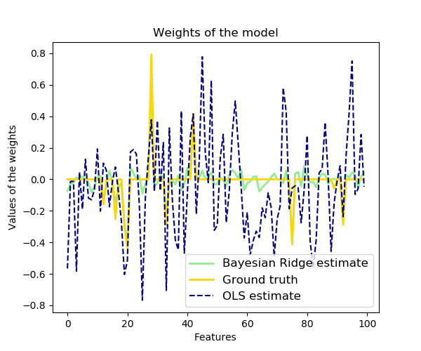

Bayesian Ridge Regression 用于回归问题 ::

    >>> from sklearn import linear_model
    >>> X = [[0., 0.], [1., 1.], [2., 2.], [3., 3.]]
    >>> Y = [0., 1., 2., 3.]
    >>> reg = linear_model.BayesianRidge()
    >>> reg.fit(X, Y)
    BayesianRidge(alpha_1=1e-06, alpha_2=1e-06, compute_score=False, copy_X=True,
           fit_intercept=True, lambda_1=1e-06, lambda_2=1e-06, n_iter=300,
           normalize=False, tol=0.001, verbose=False)

当模型拟合好以后, 就可以用来预测新的观测值啦::

    >>> reg.predict([[1, 0.]])
    array([0.50000013])

模型的权重 :math:`w` 可以这样获得 ::

    >>> reg.coef_
    array([0.49999993, 0.49999993])

由于贝叶斯框架的缘故，权值与 :ref:`ordinary_least_squares` 产生的不太一样。 
但是，贝叶斯岭回归对病态问题（ill-posed）的鲁棒性要更好。

.. topic:: 案例:

 * :ref:`sphx_glr_auto_examples_linear_model_plot_bayesian_ridge.py`

.. topic:: 参考文献

  * More details can be found in the article `Bayesian Interpolation
    <http://citeseerx.ist.psu.edu/viewdoc/download?doi=10.1.1.27.9072&rep=rep1&type=pdf>`_
    by MacKay, David J. C.

主动相关决策理论 - ARD
---------------------------------------

:class:`ARDRegression` 类 与  `Bayesian Ridge Regression`_ 非常相似,
但是可以学习到更稀疏的模型权重参数(sparser weights) :math:`w` [1]_ [2]_。
:class:`ARDRegression` 通过放弃球形高斯分布的假设(assumption of the Gaussian being spherical)
在 :math:`w` 上强加了一个不同的先验分布。

与贝叶斯岭回归不同的是, :math:`w` 上的分布被假定为是一个与坐标轴平行的(axis-parallel),椭圆形高斯分布。

这意味着 每一个权重 :math:`w_{i}` 是从一个高斯分布抽取的，此高斯分布以0位中心并且有一个精度 :math:`\lambda_{i}`:

.. math:: p(w|\lambda) = \mathcal{N}(w|0,A^{-1})

with :math:`diag \; (A) = \lambda = \{\lambda_{1},...,\lambda_{p}\}`.

与 `Bayesian Ridge Regression`_ 相比, :math:`w_{i}` 的每一个坐标都有自己的标准差 :math:`\lambda_i`。 在所有
:math:`\lambda_i` 上的先验分布被选择为由超参数 :math:`\lambda_1` 和 :math:`\lambda_2` 给出的相同的伽马分布(gamma distribution) 。

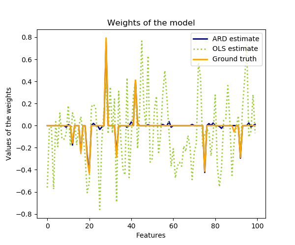

ARD 在文献中也被称之为 *Sparse Bayesian Learning* 和 *Relevance Vector Machine* [3]_ [4]_.

.. topic:: 案例:

  * :ref:`sphx_glr_auto_examples_linear_model_plot_ard.py`

.. topic:: 参考文献:

    .. [1] Christopher M. Bishop: Pattern Recognition and Machine Learning, Chapter 7.2.1

    .. [2] David Wipf and Srikantan Nagarajan: `A new view of automatic relevance determination <http://papers.nips.cc/paper/3372-a-new-view-of-automatic-relevance-determination.pdf>`_

    .. [3] Michael E. Tipping: `Sparse Bayesian Learning and the Relevance Vector Machine <http://www.jmlr.org/papers/volume1/tipping01a/tipping01a.pdf>`_

    .. [4] Tristan Fletcher: `Relevance Vector Machines explained <http://citeseerx.ist.psu.edu/viewdoc/download?doi=10.1.1.651.8603&rep=rep1&type=pdf>`_

.. _Logistic_regression:

Logistic 回归
===================

Logistic回归，虽然名字里有 “回归” 二字，但实际上是解决分类问题的一类线性模型。
在某些文献中，logistic回归又被称作 logit回归，最大熵分类(maximum-entropy classification (MaxEnt))，或 对数线性分类器(log-linear classifier)。
在该模型中，使用函数 `logistic function <https://en.wikipedia.org/wiki/Logistic_function>`_  把单次试验（single trial）的可能的输出结果建模为概率分布。

scikit-learn 中的 logistic regression 在 :class:`LogisticRegression` 类中实现了二分类（binary）、
一对多分类（one-vs-rest）及多项式 logistic 回归，并带有可选的 L1 和 L2 正则化。

作为一个优化问题，带 L2 惩罚项的二分类 logistic 回归要最小化以下代价函数（cost function）：

.. math:: \min_{w, c} \frac{1}{2}w^T w + C \sum_{i=1}^n \log(\exp(- y_i (X_i^T w + c)) + 1) .

类似的, 带有 L1 正则化的 logistic regression 求解下面的问题：

.. math:: \min_{w, c} \|w\|_1 + C \sum_{i=1}^n \log(\exp(- y_i (X_i^T w + c)) + 1).

注意, 在这个记法中, 假定了第 :math:`i` 次试验的观测值 :math:`y_i` 在集合 :math:`{-1, 1}` 中取值。

在 :class:`LogisticRegression` 类中实现了这些优化算法: "liblinear", "newton-cg", "lbfgs", "sag" 和 "saga"。

求解器 "liblinear" 使用一种坐标下降算法(coordinate descent (CD) algorithm), 并且依赖于优秀的C++库 
`LIBLINEAR library <https://www.csie.ntu.edu.tw/~cjlin/liblinear/>`_, 这个库已经被scikit-learn集成了进来。
然而，用liblinear库中实现的CD算法不能学习真正的多项式(多类)模型；作为替代方案，优化问题是以"one-vs-rest"的方式分解的，
因此对所有类都分别进行了binary classifier的训练。这一切都发生在底层，因此使用此 "liblinear" 求解器的 :class:`LogisticRegression` 
类的实例表现的像个多类分类器一样。 对于 L1 惩罚，函数 :func:`sklearn.svm.l1_min_c` 允许计算 C 的下界以便获得一个非空的模型(non "null" model)。
所谓 "null model" 是指 所有特征分量的权重系数都为0，也就是 coefficients 都是0。

"lbfgs", "sag" 和 "newton-cg" 求解器仅支持L2惩罚项而且被发现对某些高维数据收敛更快。
把 `multi_class` 设置成 "multinomial" 可以学习到一个真正的多项式(multinomial) logistic回归模型 [5]_, 这意味着与默认的 "one-vs-rest" 设置相比，
它的概率分布估计应该被更好的校准。

"sag" 求解器使用随机平均梯度下降(SAGD: Stochastic Average Gradient descent [6]_)算法。在大数据集(样本数量和特征数量都很多的数据集)上，
它比其他求解器要快很多。

"saga" 求解器 [7]_ 是 "sag" 的一个变体，也支持 non-smooth `penalty="l1"` 选项。因此，当需要进行 稀疏多项式回归
(sparse multinomial logistic regression)的时候，就应该选择这个求解器。

简而言之，下表总结了每个求解器所支持的惩罚。

+------------------------------+-----------------+-------------+-----------------+-----------+------------+
|                              |                       **Solvers**                                        |
+------------------------------+-----------------+-------------+-----------------+-----------+------------+
| **Penalties**                | **'liblinear'** | **'lbfgs'** | **'newton-cg'** | **'sag'** | **'saga'** |
+------------------------------+-----------------+-------------+-----------------+-----------+------------+
| Multinomial + L2 penalty     |       no        |     yes     |       yes       |    yes    |    yes     |
+------------------------------+-----------------+-------------+-----------------+-----------+------------+
| OVR + L2 penalty             |       yes       |     yes     |       yes       |    yes    |    yes     |
+------------------------------+-----------------+-------------+-----------------+-----------+------------+
| Multinomial + L1 penalty     |       no        |     no      |       no        |    no     |    yes     |
+------------------------------+-----------------+-------------+-----------------+-----------+------------+
| OVR + L1 penalty             |       yes       |     no      |       no        |    no     |    yes     |
+------------------------------+-----------------+-------------+-----------------+-----------+------------+
| **Behaviors**                |                                                                          |
+------------------------------+-----------------+-------------+-----------------+-----------+------------+
| Penalize the intercept (bad) |       yes       |     no      |       no        |    no     |    no      |
+------------------------------+-----------------+-------------+-----------------+-----------+------------+
| Faster for large datasets    |       no        |     no      |       no        |    yes    |    yes     |
+------------------------------+-----------------+-------------+-----------------+-----------+------------+
| Robust to unscaled datasets  |       yes       |     yes     |       yes       |    no     |    no      |
+------------------------------+-----------------+-------------+-----------------+-----------+------------+

"saga" 求解器通常是最好的选择但是需要做特征尺度缩放。 "liblinear" 求解器因为某些历史原因被用作默认值。

对于大数据集，还可以用 :class:`SGDClassifier` ，并使用对数损失（'log' loss）。

.. topic:: 案例:

  * :ref:`sphx_glr_auto_examples_linear_model_plot_logistic_l1_l2_sparsity.py`

  * :ref:`sphx_glr_auto_examples_linear_model_plot_logistic_path.py`

  * :ref:`sphx_glr_auto_examples_linear_model_plot_logistic_multinomial.py`

  * :ref:`sphx_glr_auto_examples_linear_model_plot_sparse_logistic_regression_20newsgroups.py`

  * :ref:`sphx_glr_auto_examples_linear_model_plot_sparse_logistic_regression_mnist.py`

.. _liblinear_differences:

.. topic:: 与 liblinear 的不同:

   当 ``fit_intercept=False`` 和 拟合得到的 ``coef_`` 是0 (或) 用于预测的数据是 0 的时候，使用参数为``solver=liblinear``的 
   :class:`LogisticRegression` 类 或 :class:`LinearSVC` 类 与 直接使用外部库liblinear 所获得的 得分 可能会有一些差别。
   这是因为 对于那些 ``decision_function`` 为zero的样本, :class:`LogisticRegression` 和 :class:`LinearSVC` 给出的预测是负类，而liblinear库给出的预测
   是正类。请注意 一个参数为 ``fit_intercept=False`` 并且在很多样本上 ``decision_function`` 为0的模型很可能是一个欠拟合的坏模型，并且建议你设置 
   ``fit_intercept=True`` 并且增加 intercept_scaling。

.. note:: **利用稀疏 logistic 回归进行特征选择**

   带 L1 罚项的 logistic 回归 将得到稀疏模型（sparse model），
   相当于进行了特征选择（feature selection），详情参见 :ref:`l1_feature_selection` 。
   .

:class:`LogisticRegressionCV` 类实现了Logistic Regression 和内建的 cross-validation 的融合用以寻找最优的 C 参数。
"newton-cg", "sag", "saga" 和 "lbfgs" 求解器 被发现在高维稠密数据上比较快, 因为其可以 warm-starting。 对于多分类情况，
如果 `multi_class` 选项被设置为 "ovr", 那么会为每个类都获取一个最优的 C ;如果 `multi_class` 选项被设置为 "multinomial", 
那么一个最优的 C 是通过最小化交叉熵损失来获得的。

.. topic:: 参考文献:

    .. [5] Christopher M. Bishop: Pattern Recognition and Machine Learning, Chapter 4.3.4

    .. [6] Mark Schmidt, Nicolas Le Roux, and Francis Bach: `Minimizing Finite Sums with the Stochastic Average Gradient. <https://hal.inria.fr/hal-00860051/document>`_

    .. [7] Aaron Defazio, Francis Bach, Simon Lacoste-Julien: `SAGA: A Fast Incremental Gradient Method With Support for Non-Strongly Convex Composite Objectives. <https://arxiv.org/abs/1407.0202>`_

随机梯度下降 - SGD
=================================

随机梯度下降(Stochastic gradient descent)是拟合线性模型的一个简单而高效的方法。在样本量（和特征数）很大时尤为有用。 
方法 ``partial_fit`` 可用于 online learning （在线学习）或基于 out-of-core learning （外存的学习）。

:class:`SGDClassifier` 和 :class:`SGDRegressor` 分别用于拟合分类问题和回归问题的线性模型，可使用不同的（凸）损失函数，支持不同的罚项。 
例如，设定 loss="log" ，则 :class:`SGDClassifier` 拟合一个逻辑斯蒂回归模型，而 loss="hinge" 拟合线性支持向量机（SVM）。

.. topic:: 参考

 * :ref:`sgd`

.. _perceptron:

感知器
==========

:class:`Perceptron` 是适用于大规模学习的一种简单算法。默认情况下：

    - 不需要设置学习率（learning rate）。

    - 不需要正则化处理。

    - 仅使用错误样本更新模型。

最后一点表明使用合页损失（hinge loss）的感知机比 使用 hinge loss 的SGD 略快，所得模型更稀疏。

.. _passive_aggressive:

被动攻击算法(Passive Aggressive Algorithms)
=============================

The passive-aggressive algorithms 是一个用于大规模学习的算法家族。
他们与感知器(Perceptron)相似,因为他们不需要学习器。 然而, 与感知器不同的是，他们包括了一个正则化参数 ``C``。

对于分类问题, :class:`PassiveAggressiveClassifier` 类 可以和 ``loss='hinge'`` (PA-I) 或 ``loss='squared_hinge'`` (PA-II)
一起使用。  对于回归问题, :class:`PassiveAggressiveRegressor` 类 可以和 ``loss='epsilon_insensitive'`` (PA-I) 或
``loss='squared_epsilon_insensitive'`` (PA-II) 一起使用。

.. topic:: 参考文献:

 * `"Online Passive-Aggressive Algorithms"
   <http://jmlr.csail.mit.edu/papers/volume7/crammer06a/crammer06a.pdf>`_
   K. Crammer, O. Dekel, J. Keshat, S. Shalev-Shwartz, Y. Singer - JMLR 7 (2006)

鲁棒回归:处理离群点（outliers）和模型错误
=====================================================

Robust regression 特别适用于回归模型包含损坏数据（corrupt data）的情况，如离群点或模型中的错误。

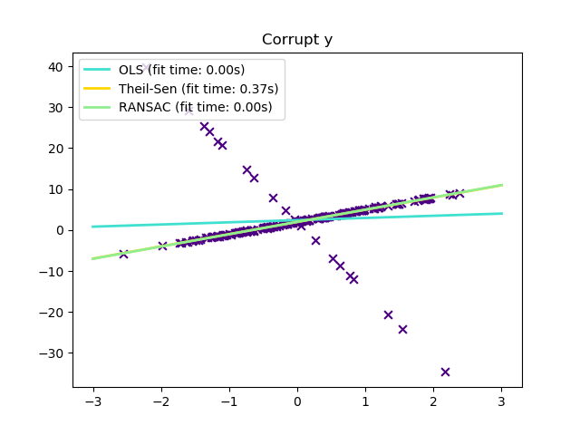

各种使用场景与相关概念
----------------------------------------

处理包含离群点的数据时牢记以下几点:

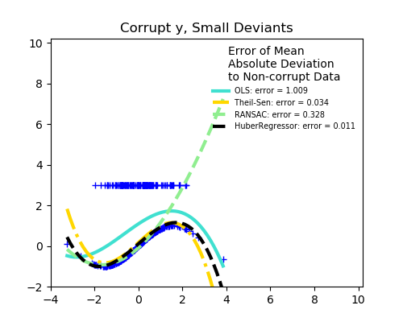

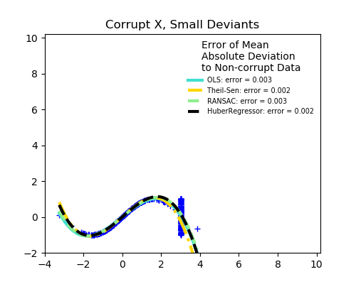

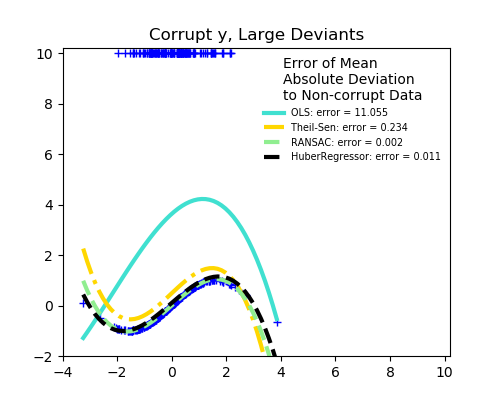

* **  异常值在 X 中 还是在 y 中  ** ?

  ==================================== ====================================
  Outliers in the y direction          Outliers in the X direction
  ==================================== ====================================
  |y_outliers|                         |X_outliers|
  ==================================== ====================================

* **  异常值的比例 versus 误差幅度  **

  外围点(outlying points)的数目很重要，但其中有多少是离群点(The number of outlying points matters, but also how much they are
  outliers.)。

  ==================================== ====================================
  Small outliers                       Large outliers
  ==================================== ====================================
  |y_outliers|                         |large_y_outliers|
  ==================================== ====================================

鲁棒回归的一个非常重要的概念就是 崩溃点(breakdown point): the fraction of data that can be outlying for the fit 
to start missing the inlying data.

注意，一般来说，在高维(比较大的 `n_features` )情况中，鲁棒的拟合是非常困难的.这里的鲁棒模型可能无法在这些设置中工作。

.. topic:: **折中权衡: 该用哪个估计器 ?**

  Scikit-learn 提供了 3 个 鲁棒回归估计器:
  :ref:`RANSAC <ransac_regression>`,
  :ref:`Theil Sen <theil_sen_regression>` 和
  :ref:`HuberRegressor <huber_regression>`

  * :ref:`HuberRegressor <huber_regression>` 应该比 :ref:`RANSAC <ransac_regression>` 和 :ref:`Theil Sen <theil_sen_regression>` 更快，
    除非样本数量非常大(i.e ``n_samples`` >> ``n_features``)。
    这是因为 :ref:`RANSAC <ransac_regression>` 和 :ref:`Theil Sen <theil_sen_regression>` 在数据集的一个较小的子集上进行拟合。
    然而,在默认参数下， :ref:`Theil Sen <theil_sen_regression>` 和 :ref:`RANSAC <ransac_regression>` 都不太可能与
    :ref:`HuberRegressor <huber_regression>` 一样鲁棒。

  * :ref:`RANSAC <ransac_regression>` 比 :ref:`Theil Sen <theil_sen_regression>` 更快，并且在样本量大的时候可伸缩性更好。

  * :ref:`RANSAC <ransac_regression>` 在 y 上有比较大的异常值的时候处理的更好点儿。

  * :ref:`Theil Sen <theil_sen_regression>` 在 X 上有中等大小的异常值的时候可以应付的更好，但是这一优点在高维空间中的问题上就消失了。

 当你犹豫不决的时候, 使用 :ref:`RANSAC <ransac_regression>` 吧!

.. _ransac_regression:

RANSAC:随机抽样一致性算法
--------------------------------

RANSAC (RANdom SAmple Consensus) 在完整数据集的所有inliers的随机子集上拟合一个模型(
fits a model from random subsets of inliers from the complete data set.)。

RANSAC 是一种不确定性算法(non-deterministic algorithm),它以某个概率产生一个合理的结果(reasonable result ),
这依赖于迭代次数(请看参数 `max_trials` 的解释)。 它通常用于线性和非线性回归问题，在摄影测量计算机视觉领域尤其流行。

RANSAC 算法把完整的输入样本数据划分成两个集合：inliers 和 outliers。inliers样本可能会受噪声影响，
outliers样本可能是由于测量错误或对数据的无效假设而产生的。所以，RANSAC产生的模型是只在确定的inliers样本集上估计出来的。

.. figure:: ../auto_examples/linear_model/images/sphx_glr_plot_ransac_001.png
   :target: ../auto_examples/linear_model/plot_ransac.html
   :align: center
   :scale: 50%

算法细节
^^^^^^^^^^^^^^^^^^^^^^^^

RANSAC算法的每个迭代执行以下步骤：

1. 从原始数据中随机选择 ``min_samples`` 个样本，然后检查这些样本是否是有效的(请看 ``is_data_valid``)。
2. 在上一步选出的随机子集上拟合一个模型 (``base_estimator.fit``) 并检查估计出的模型是否有效 (请看 ``is_model_valid``)。
3. 通过计算样本与估计出的模型的预测值之间的残差(residuals)把所有样本数据分为 inliers 或 outliers  (``base_estimator.predict(X) - y``) 。
   那些绝对残差小于残差阈值 ``residual_threshold`` 的所有样本被认为是 inliers。
4. 如果inlier样本的数量达到最大值就把拟合好的模型保存下来作为最优模型。
   如果 当前估计出的模型(current estimated model)与历史最优模型有同样多的inlier样本量 这样的情况发生了，
   那么只有在当前估计出的模型的得分更高的时候它才会被认为是最优模型。

上述几个步骤会一直执行 直到达到最大迭代次数(``max_trials``) 或 其中一个特定的停止准则被满足了 (请看 ``stop_n_inliers`` 和
``stop_score``)。 最终的模型是使用所有inlier样本(consensus set:一致集)估计得到的。
而最后使用的所有inlier样本是由之前迭代过程中确定的历史最优模型在原始样本集上挑选出的。

``is_data_valid`` 和 ``is_model_valid`` 函数允许辨识和拒绝(identify and reject)随机子样本集的退化组合( degenerate combinations)。
如果不需要估计出的模型(estimated model)来识别退化情形，那么 ``is_data_valid`` 应该被使用，因为
它被称为 prior to fitting the model ，从而获得更好的计算性能。(``is_data_valid`` should be used as it is called prior to 
fitting the model and thus leading to better computational performance.)

.. topic:: 案例:

  * :ref:`sphx_glr_auto_examples_linear_model_plot_ransac.py`
  * :ref:`sphx_glr_auto_examples_linear_model_plot_robust_fit.py`

.. topic:: 参考文献:

 * https://en.wikipedia.org/wiki/RANSAC
 * `"Random Sample Consensus: A Paradigm for Model Fitting with Applications to
   Image Analysis and Automated Cartography"
   <https://www.sri.com/sites/default/files/publications/ransac-publication.pdf>`_
   Martin A. Fischler and Robert C. Bolles - SRI International (1981)
 * `"Performance Evaluation of RANSAC Family"
   <http://www.bmva.org/bmvc/2009/Papers/Paper355/Paper355.pdf>`_
   Sunglok Choi, Taemin Kim and Wonpil Yu - BMVC (2009)

.. _theil_sen_regression:

Theil-Sen 估计器: 广义中值估计器
--------------------------------------------------------

:class:`TheilSenRegressor` estimator uses a generalization of the median in multiple dimensions. 
因此它对多变量离群点(multivariate outliers 或者叫 多元outliers) 比较鲁棒。但是，需要注意的是该估计器的鲁棒性会随着问题的维数增大而迅速降低。
在高维情形中它会丧失鲁棒性并且变得不会比普通最小二乘法更好。

.. topic:: 案例:

  * :ref:`sphx_glr_auto_examples_linear_model_plot_theilsen.py`
  * :ref:`sphx_glr_auto_examples_linear_model_plot_robust_fit.py`

.. topic:: 参考文献:

 * https://en.wikipedia.org/wiki/Theil%E2%80%93Sen_estimator

理论方面的思考
^^^^^^^^^^^^^^^^^^^^^^^^^^

在渐近效率和作为无偏估计器方面，:class:`TheilSenRegressor` 与 :ref:`Ordinary Least Squares (OLS) <ordinary_least_squares>`  
是具有可比性的。与OLS相比, Theil-Sen 是一个无参(non-parametric)的方法，这意味着它没有对数据的潜在分布做出任何假设。
因为 Theil-Sen 是一个基于中值的估计器(median-based estimator), 它在对抗损坏的数据也称为异常值(outliers)时更加的鲁棒。
在单变量(univariate)设置下，在简单线性回归任务上，Theil-Sen 算法有一个大概29.3%的崩溃点(breakdown point of about 29.3%)，
这意味着它可以容忍的任意损坏数据的占比可以达到29.3%。

scikit-learn 的 :class:`TheilSenRegressor` 类用 空间中位数(spatial median: 把一维中位数推广到多维空间 [#f2]_) 
实现了对多变量线性回归模型的推广 [#f1]_。

就时间与空间复杂度来说, Theil-Sen 可以依据下式进行伸缩(scale):

.. math::
    \binom{n_{samples}}{n_{subsamples}}

这使得在具有大量样本和大量特征的问题上进行全面的应用是不可行的。
因此, 通过只考虑所有可能组合的一个随机子集，可以选择子种群的大小来限制时间和空间复杂性。

.. topic:: 案例:

  * :ref:`sphx_glr_auto_examples_linear_model_plot_theilsen.py`

.. topic:: 参考文献:

    .. [#f1] Xin Dang, Hanxiang Peng, Xueqin Wang and Heping Zhang: `Theil-Sen Estimators in a Multiple Linear Regression Model. <http://home.olemiss.edu/~xdang/papers/MTSE.pdf>`_

    .. [#f2] T. Kärkkäinen and S. Äyrämö: `On Computation of Spatial Median for Robust Data Mining. <http://users.jyu.fi/~samiayr/pdf/ayramo_eurogen05.pdf>`_

.. _huber_regression:

Huber 回归
----------------

:class:`HuberRegressor` 类与 :class:`Ridge` 类有所不同，因为它将一个线性损失应用到那些被判断为是离群点的样本上。
如果一个样本的绝对误差小于某个指定的阈值，那么这个样本就被判断为是一个 inlier。
这与 :class:`TheilSenRegressor` 类 和 :class:`RANSACRegressor` 类是有区别的，因为它不忽略outliers的影响而是会给这些outliers一个比较小的权重。

.. figure:: /auto_examples/linear_model/images/sphx_glr_plot_huber_vs_ridge_001.png
   :target: ../auto_examples/linear_model/plot_huber_vs_ridge.html
   :align: center
   :scale: 50%

:class:`HuberRegressor` 类所要最小的损失函数由下式给出：

.. math::

  \min_{w, \sigma} {\sum_{i=1}^n\left(\sigma + H_{\epsilon}\left(\frac{X_{i}w - y_{i}}{\sigma}\right)\sigma\right) + \alpha {||w||_2}^2}

其中

.. math::

  H_{\epsilon}(z) = \begin{cases}
         z^2, & \text {if } |z| < \epsilon, \\
         2\epsilon|z| - \epsilon^2, & \text{otherwise}
  \end{cases}

建议把参数 ``epsilon`` 的值设为 1.35 以达到 95% 的统计效率(statistical efficiency)。

注意
-----
:class:`HuberRegressor` 类 与 把损失参数设为 `huber` 的 :class:`SGDRegressor` 类 的区别主要有以下方面：

- :class:`HuberRegressor` 是尺度不变的(scaling invariant)。 一旦设置了 ``epsilon`` , 把 ``X`` 和 ``y``
  放大或缩小不同的值将会产生对outliers一样的鲁棒性，就跟没有缩放之前一样。但是在 :class:`SGDRegressor` 类中，
  如果调整了 ``X`` 和 ``y`` 的尺度则 ``epsilon`` 也得被重新设置。

- :class:`HuberRegressor` 在数据量比较小的时候应该会更有效率，而 :class:`SGDRegressor` 需要在训练数据集上的很多次迭代才能产生相同的鲁棒性。

.. topic:: 案例:

  * :ref:`sphx_glr_auto_examples_linear_model_plot_huber_vs_ridge.py`

.. topic:: 参考文献:

  * Peter J. Huber, Elvezio M. Ronchetti: Robust Statistics, Concomitant scale estimates, pg 172

另外, 这个估计器不同于鲁邦回归的R语言实现(http://www.ats.ucla.edu/stat/r/dae/rreg.htm)，因为R语言的实现做了
一个加权最小二乘。基于 残差比给定阈值大多少 而产生的权重被赋予了每个样本。 

.. _polynomial_regression:

多项式回归:用基函数展开线性模型
===================================================================

.. currentmodule:: sklearn.preprocessing

机器学习中的一个常见模式是使用在数据的非线性函数上训练的线性模型。这种方法保持了线性方法的一般快速性能，
同时允许它们适应范围更广的数据。

比如，一个简单的线性回归器可以通过从系数构造多项式特征(**polynomial features**)而扩展到非线性数据的拟合任务中。
在标准线性回归模型中，一个用于拟合二维数据的模型如下所示：

.. math::    \hat{y}(w, x) = w_0 + w_1 x_1 + w_2 x_2

如果我们想要用抛物面拟合数据而不是平面，我们可以用二阶多项式组合特征，使模型看起来像这样：

.. math::    \hat{y}(w, x) = w_0 + w_1 x_1 + w_2 x_2 + w_3 x_1 x_2 + w_4 x_1^2 + w_5 x_2^2

上面的模型看起来仍然是一个线性模型(尽管有些令人吃惊)，为了说明这一点，我们想象着创建一个新的变量

.. math::  z = [x_1, x_2, x_1 x_2, x_1^2, x_2^2]

用上面的变量重新变换数据，原来的问题就可以写成这样：

.. math::    \hat{y}(w, x) = w_0 + w_1 z_1 + w_2 z_2 + w_3 z_3 + w_4 z_4 + w_5 z_5

我们看到由此产生的多项式回归(*polynomial regression*)其实是与我们之前见过的线性模型一样的并且可以用线性模型的求解方法解决它，
因为模型关于未知系数 :math:`w` 是线性组合的形式。考虑到可以对由这些基本函数构建的高维空间进行线性拟合，
该模型在拟合更大范围的数据时确实有非常大的弹性和灵活性。

这里有个例子，它将上述idea用于一维数据, 使用了不同阶的多项式特征：

.. figure:: ../auto_examples/linear_model/images/sphx_glr_plot_polynomial_interpolation_001.png
   :target: ../auto_examples/linear_model/plot_polynomial_interpolation.html
   :align: center
   :scale: 50%

这个图片的创建使用了 :class:`PolynomialFeatures` preprocessor。
这个预处理器(preprocessor)把输入数据矩阵变成一个给定阶数的新数据矩阵。其用法如下::

    >>> from sklearn.preprocessing import PolynomialFeatures
    >>> import numpy as np
    >>> X = np.arange(6).reshape(3, 2)
    >>> X
    array([[0, 1],
           [2, 3],
           [4, 5]])
    >>> poly = PolynomialFeatures(degree=2)
    >>> poly.fit_transform(X)
    array([[ 1.,  0.,  1.,  0.,  0.,  1.],
           [ 1.,  2.,  3.,  4.,  6.,  9.],
           [ 1.,  4.,  5., 16., 20., 25.]])

``X`` 的各个特征分量已经由 :math:`[x_1, x_2]` 变换为 :math:`[1, x_1, x_2, x_1^2, x_1 x_2, x_2^2]`, 
并且可被用于任意的线性模型。

这种类型的预处理器可以用 :ref:`Pipeline <pipeline>` 集成为一个工作流。 这样就可以用单个对象表示一个简单的多项式回归器，如下所示::

    >>> from sklearn.preprocessing import PolynomialFeatures
    >>> from sklearn.linear_model import LinearRegression
    >>> from sklearn.pipeline import Pipeline
    >>> import numpy as np
    >>> model = Pipeline([('poly', PolynomialFeatures(degree=3)),
    ...                   ('linear', LinearRegression(fit_intercept=False))])
    >>> # fit to an order-3 polynomial data
    >>> x = np.arange(5)
    >>> y = 3 - 2 * x + x ** 2 - x ** 3
    >>> model = model.fit(x[:, np.newaxis], y)
    >>> model.named_steps['linear'].coef_
    array([ 3., -2.,  1., -1.])

在多项式特征上训练好的线性模型可以准确的恢复输入多项式系数。

有些情况下，没有必要包括任意单个特征的更高阶特征, 而只需要所谓的 *interaction features*。
*interaction features* 是由最多 :math:`d` 个不同的特征相乘在一起构成的。
这可以从 :class:`PolynomialFeatures` 类中把参数设置成 ``interaction_only=True``得到。

比如说, 当处理布尔特征的时候, 对所有的 :math:`n`,  :math:`x_i^n = x_i` 因此这时候高阶多项式基是没用的;
但是任意两个布尔特征的乘积 :math:`x_i x_j` 却表达了两个布尔特征的联合(conjunction)。这样，我们就可以用线性分类器来求解异或(XOR)问题 ::

    >>> from sklearn.linear_model import Perceptron
    >>> from sklearn.preprocessing import PolynomialFeatures
    >>> import numpy as np
    >>> X = np.array([[0, 0], [0, 1], [1, 0], [1, 1]])
    >>> y = X[:, 0] ^ X[:, 1]
    >>> y
    array([0, 1, 1, 0])
    >>> X = PolynomialFeatures(interaction_only=True).fit_transform(X).astype(int)
    >>> X
    array([[1, 0, 0, 0],
           [1, 0, 1, 0],
           [1, 1, 0, 0],
           [1, 1, 1, 1]])
    >>> clf = Perceptron(fit_intercept=False, max_iter=10, tol=None,
    ...                  shuffle=False).fit(X, y)

最后，这个线性分类器的预测("predictions")相当完美 ::

    >>> clf.predict(X)
    array([0, 1, 1, 0])
    >>> clf.score(X, y)
    1.0
