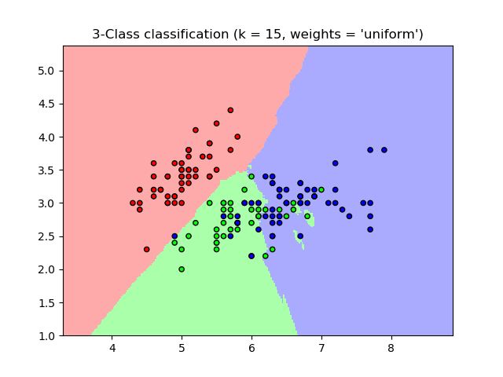
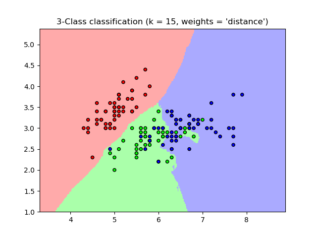
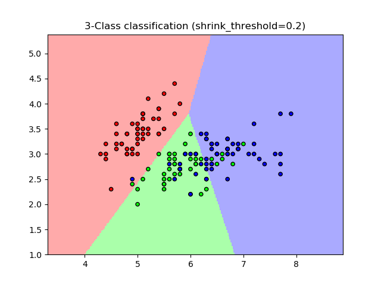

.. _neighbors:

===============================
最近邻方法(Nearest Neighbors)
===============================

.. sectionauthor:: Jake Vanderplas <vanderplas@astro.washington.edu>

.. currentmodule:: sklearn.neighbors

:mod:`sklearn.neighbors` 模块提供了基于邻居的(neighbors-based)的无监督学习和监督学习的功能。 
无监督的最近邻是许多其它学习方法的基础，尤其是 流行学习(manifold learning) 和 谱聚类(spectral clustering)。 
基于邻居的监督学习分为两种： 分类( `classification`_ ):针对的是具有离散标签的数据，回归(`regression`_):针对的是具有连续标签的数据。

最近邻方法背后的原理是从训练样本中找到与新样本点在距离上最近的预定数量的几个点，然后从这几个已知标签的样本点中预测新样本的标签。 
这些点的数量可以是用户自定义的常量（K-最近邻学习）， 也可以根据不同的点的局部密度（基于半径的最近邻学习）。
距离通常可以通过任何测度(metric)来衡量： 标准欧式距离(standard Euclidean distance) 是最常见的选择。
Neighbors-based方法被称为 *non-generalizing* 的机器学习方法， 
因为它们只是简单地”记住”了其所有的训练数据（可能转换为一个快速索引结构，如 :ref:`Ball Tree <ball_tree>` 或 :ref:`KD Tree <kd_tree>` ）。

尽管它简单，但最近邻算法已经成功地适用于很多的分类和回归问题，例如手写数字或卫星图像的场景。 
作为一个 非参数化(non-parametric)方法，它经常成功地应用于决策边界非常不规则的分类情景下。

:mod:`sklearn.neighbors` 模块可以处理 Numpy 数组或 `scipy.sparse` 矩阵作为其输入。 
对于稠密矩阵，大多数可能的距离测度都是支持的。对于稀疏矩阵，支持任意的 Minkowski测度 用于搜索。

许多学习方法都依赖最近邻作为其核心。 一个例子是 核密度估计(:ref:`kernel density estimation <kernel_density>`) , 
在 密度估计( :ref:`density estimation <density_estimation>` ) 章节中有讨论。

.. _unsupervised_neighbors:

无监督最近邻
==============================

:class:`NearestNeighbors` 类实现了 无监督的最近邻学习。 它为三种不同的最近邻算法提供统一的接口：:class:`BallTree` , :class:`KDTree`, 
还有基于 :mod:`sklearn.metrics.pairwise` 模块的 暴力搜索算法(brute-force search)。
近邻搜索算法的选择可通过关键字参数 ``'algorithm'`` 来控制， 取值必须是 ``['auto', 'ball_tree', 'kd_tree', 'brute']`` 其中的一个。
当默认值设置为 ``'auto'`` 时，算法会尝试从训练数据中确定最佳方法。关于上述每个选项的优缺点的讨论，请看 `Nearest Neighbor Algorithms`_.。

    .. warning::

        关于最近邻算法，如果邻居 :math:`k+1` 和邻居 :math:`k` 具有相同的距离，但具有不同的标签， 结果将取决于训练数据的顺序。

寻找最近的邻居
-----------------------------
对于 找到两组数据集中最近邻点 的简单任务, 可以使用 :mod:`sklearn.neighbors` 模块中的无监督算法:

    >>> from sklearn.neighbors import NearestNeighbors
    >>> import numpy as np
    >>> X = np.array([[-1, -1], [-2, -1], [-3, -2], [1, 1], [2, 1], [3, 2]])
    >>> nbrs = NearestNeighbors(n_neighbors=2, algorithm='ball_tree').fit(X)
    >>> distances, indices = nbrs.kneighbors(X)
    >>> indices                                           # doctest: +ELLIPSIS
    array([[0, 1],
           [1, 0],
           [2, 1],
           [3, 4],
           [4, 3],
           [5, 4]]...)
    >>> distances
    array([[0.        , 1.        ],
           [0.        , 1.        ],
           [0.        , 1.41421356],
           [0.        , 1.        ],
           [0.        , 1.        ],
           [0.        , 1.41421356]])

因为查询集(query set)匹配训练集(training set)，每个点的最近邻点是其自身，距离为0。

还可以有效地生成一个稀疏图(sparse graph)来标识相连点之间的连接情况：

    >>> nbrs.kneighbors_graph(X).toarray()
    array([[1., 1., 0., 0., 0., 0.],
           [1., 1., 0., 0., 0., 0.],
           [0., 1., 1., 0., 0., 0.],
           [0., 0., 0., 1., 1., 0.],
           [0., 0., 0., 1., 1., 0.],
           [0., 0., 0., 0., 1., 1.]])

由于数据集是结构化的，因此按索引顺序的相邻点就在参数空间也是相邻点，从而生成了近似 K-近邻 的块对角矩阵(block-diagonal matrix)。 
这种稀疏图在各种利用样本点之间的空间关系进行无监督学习的情况下都很有用：特别地请看 :class:`sklearn.manifold.Isomap`,
:class:`sklearn.manifold.LocallyLinearEmbedding`, 和 :class:`sklearn.cluster.SpectralClustering`。

KDTree类 和 BallTree类
---------------------------
另外，我们可以直接使用 :class:`KDTree` 或 :class:`BallTree` 来找最近邻。 
这是上面提到过的 :class:`NearestNeighbors` 类 所封装的功能。 
KDTree 和 BallTree 具有相同的接口； 我们将在这里展示使用 KDTree 的例子::

    >>> from sklearn.neighbors import KDTree
    >>> import numpy as np
    >>> X = np.array([[-1, -1], [-2, -1], [-3, -2], [1, 1], [2, 1], [3, 2]])
    >>> kdt = KDTree(X, leaf_size=30, metric='euclidean')
    >>> kdt.query(X, k=2, return_distance=False)          # doctest: +ELLIPSIS
    array([[0, 1],
           [1, 0],
           [2, 1],
           [3, 4],
           [4, 3],
           [5, 4]]...)

对于 最近邻搜索 中参数选项的更多信息，包括各种距离度量的说明和策略的说明等，请参阅 :class:`KDTree` 和 :class:`BallTree` 类文档。 
关于可用测度(metrics)的列表，请参阅 :class:`DistanceMetric`  类。

.. _classification:

最近邻分类器
================================

基于邻居的分类是 基于实例的学习(*instance-based learning*) 或 非概括性学习(*non-generalizing learning*): 
它并不试图构建一个一般的内部模型，而只是存储训练数据的实例。
分类是根据每个点的最近邻居的简单多数票计算的：一个查询点被分配给数据类，该类在该点最近的邻居中有最多的代表。

scikit-learn 实现了两个不同的最近邻分类器：:class:`KNeighborsClassifier` 类实现了 基于每个查询点的k个最近邻进行学习的方法，
其中 :math:`k` 是用户指定的整数值。 :class:`RadiusNeighborsClassifier` 类实现了 基于固定半径内的邻居进行学习的方法，其中
:math:`r` 是用户指定的浮点值。

:class:`KNeighborsClassifier` 类中的 :math:`k`-neighbors classification  是最常用的技术。
:math:`k` 值的最优选择是高度数据依赖的：一般来说  :math:`k` 值越大就越能够压制噪声，但是会使得分类边界变得越不清晰。

如果数据是不均匀采样的，那么 :class:`RadiusNeighborsClassifier` 类中的基于半径的近邻分类(radius-based neighbors classification)可能是更好的选择。

用户指定一个固定的半径 :math:`r` , 以便在越稀疏的邻域内的点可以使用越少的最近邻点进行分类。对于高维参数空间，这个方法就会因为维数灾难而变得越来越没有效率。

基本的最近邻分类使用均匀的权重：分配给查询点的标签值是从其最近邻的简单多数投票中计算出来的。 
在某些环境下，最好对邻居进行加权，使得离得越近的点对最终的预测做出越大的贡献。这可以通过 ``weights`` 关键字来实现。
该参数的默认值 ``weights = 'uniform'`` 给每个邻居分配均匀的权重。而 ``weights = 'distance'`` 给每个邻居分配的权重是每个邻居点到查询点的距离的倒数。
除此之外，用户还可以传递自定义的距离函数来计算权重：

.. centered:: |classification_1| |classification_2|

.. topic:: 案例:

  * :ref:`sphx_glr_auto_examples_neighbors_plot_classification.py`: an example of
    classification using nearest neighbors.

.. _regression:

最近邻回归器
============================

最近邻回归是用在数据标签为连续变量而不是离散变量的情况下。分配给查询点的标签是由它的最近邻标签的均值计算而来的。

scikit-learn 实现了两个不同的最近邻回归器：:class:`KNeighborsRegressor` 类实现了 基于每个查询点的k个最近邻进行学习的方法，
其中 :math:`k` 是用户指定的整数值。 :class:`RadiusNeighborsRegressor` 类实现了 基于固定半径内的邻居进行学习的方法，其中
:math:`r` 是用户指定的浮点值。

基本的最近邻回归使用均匀的权重：分配给查询点的标签值是从其最近邻的简单多数投票中计算出来的。 
在某些环境下，最好对邻居进行加权，使得离得越近的点对最终的预测做出越大的贡献。这可以通过 ``weights`` 关键字来实现。
该参数的默认值 ``weights = 'uniform'`` 给每个邻居分配均匀的权重。而 ``weights = 'distance'`` 给每个邻居分配的权重是每个邻居点到查询点的距离的倒数。
除此之外，用户还可以传递自定义的距离函数来计算权重：

.. figure:: ../auto_examples/neighbors/images/sphx_glr_plot_regression_001.png
   :target: ../auto_examples/neighbors/plot_regression.html
   :align: center
   :scale: 75

多输出最近邻回归的使用案例可以看 :ref:`sphx_glr_auto_examples_plot_multioutput_face_completion.py`。 在这个案例中，输入 X 是一些人脸的上半部分，
输出 Y 是那些人脸的下半部分。

.. figure:: ../auto_examples/images/sphx_glr_plot_multioutput_face_completion_001.png
   :target: ../auto_examples/plot_multioutput_face_completion.html
   :scale: 75
   :align: center

.. topic:: 案例:

  * :ref:`sphx_glr_auto_examples_neighbors_plot_regression.py`: an example of regression
    using nearest neighbors.

  * :ref:`sphx_glr_auto_examples_plot_multioutput_face_completion.py`: an example of
    multi-output regression using nearest neighbors.

最近邻算法
===========================

.. _brute_force:

Brute Force
-----------

最近邻的快速计算是机器学习中一个活跃的研究领域。最简单的近邻搜索的实现涉及数据集中所有成对点之间距离的暴力计算(Brute Force computation)：
对于 :math:`D` 维空间中的 :math:`N` 个样本来说, 这个方法的复杂度是 :math:`O[D N^2]` 。 
对于少量的数据样本，高效的暴力近邻搜索是非常有竞争力的。 然而，随着样本数 :math:`N` 的增长，暴力方法很快变得不切实际了。
在 :mod:`sklearn.neighbors` 模块中， 暴力近邻搜索通过关键字参数 ``algorithm = 'brute'`` 来指定，并通过
:mod:`sklearn.metrics.pairwise` 中的例程(routines)来进行计算。

.. _kd_tree:

K-D Tree
--------

为了解决效率低下的暴力计算方法，已经发明了大量的基于树的数据结构。总的来说， 
这些数据结构试图通过有效地编码样本的 聚合距离信息(aggregate distance information) 来减少所需的距离计算量。 
基本思想是，若 :math:`A` 点距离 :math:`B` 点非常远，:math:`B` 点距离 :math:`C` 点非常近， 可知 :math:`A` 点与 :math:`C` 点很遥远，
不需要明确计算它们的距离。 通过这样的方式，近邻搜索的计算成本可以降低为 :math:`O[D N \log(N)]` 或更低。 
这是对于暴力搜索在大样本数 :math:`N` 中表现的显著改善。

利用这种聚合信息的早期方法是 *KD tree* 数据结构（* K-dimensional tree * 的简写）, 
它将二维 *Quad-trees* 和三维 *Oct-trees* 推广到任意数量的维度. KD 树是一个二叉树结构，
它沿着数据轴递归地划分参数空间，将其划分为嵌入数据点的嵌套的各向异性区域。 
KD 树的构造非常快：因为只需沿数据轴执行分区, 无需计算 D-dimensional 距离。 
一旦构建完成, 查询点的最近邻距离计算复杂度仅为 :math:`O[\log(N)]` 。 虽然 KD 树的方法对于低维度 (:math:`D < 20`) 近邻搜索非常快, 
当 D 增长到很大时, 效率变低: 这就是所谓的 “维度灾难” 的一种体现。 在 scikit-learn 中, KD 树近邻搜索可以使用关键字 ``algorithm = 'kd_tree'`` 来指定, 
并且使用类 :class:`KDTree` 来计算。

.. topic:: 参考文献:

   * `"Multidimensional binary search trees used for associative searching"
     <http://dl.acm.org/citation.cfm?doid=361002.361007>`_,
     Bentley, J.L., Communications of the ACM (1975)

.. _ball_tree:

Ball Tree
---------

为了解决 KD 树在高维上效率低下的问题, *ball tree* 数据结构就被发明了。 其中 KD 树沿迪卡尔轴（即坐标轴）分割数据, 而
ball 树在沿着一系列的 nesting hyper-spheres 来分割数据。 通过这种方法构建的树要比 KD 树消耗更多的时间, 
但是这种数据结构对于高结构化的数据是非常有效的, 即使在高维度上也是一样。

ball tree 将数据递归地划分到由质心 :math:`C` 和 半径 :math:`r` 定义的节点上，以使得 节点内的每个点都位于由 质心 :math:`C` 和 半径 :math:`r`定义的
超球面(hyper-sphere)内。通过使用 三角不等式(*triangle inequality*) 减少近邻搜索的候选点数:

.. math::   |x+y| \leq |x| + |y|

通过这种设置, 测试点和质心之间的单一距离计算足以确定测试点到节点内所有点的距离的下限和上限。
由于 ball tree 节点的球形几何(spherical geometry), 它在高维度上的性能超出 *KD-tree* , 尽管实际的性能高度依赖于训练数据的结构。
在 scikit-learn 中, 基于 ball tree 的近邻搜索可以使用关键字 ``algorithm = 'ball_tree'`` 来指定, 并且使用类 :class:`sklearn.neighbors.BallTree`
来计算, 或者, 用户可以直接使用 :class:`BallTree` 类。

.. topic:: 参考文献:

   * `"Five balltree construction algorithms"
     <http://citeseer.ist.psu.edu/viewdoc/summary?doi=10.1.1.91.8209>`_,
     Omohundro, S.M., International Computer Science Institute
     Technical Report (1989)

最近邻算法的选择
-------------------------------------
对一个给定的数据集,选择一个合适的最近邻算法是很复杂的，其依赖于很多个因素：

* 样本数量 :math:`N` (i.e. ``n_samples``) 和 特征维数 :math:`D` (i.e. ``n_features``).

  * *Brute force* 的查询时间增长复杂度是 :math:`O[D N]`
  * *Ball tree* 的查询时间增长复杂度是 :math:`O[D \log(N)]`
  * *KD tree* 的查询时间随着 :math:`D` 变化，所以很难准确的量化。对于一个小的 :math:`D` (<=20)
    代价近似是 :math:`O[D\log(N)]`, 而 KD tree 的查询时间也非常有效率。对于较大的 :math:`D` ，代价几乎增加到 :math:`O[DN]`，
    由于树结构引起的过载(overhead)导致查询比 brute force 还要慢。

  对比较小的数据集 (:math:`N` <= 30), :math:`\log(N)` 与 :math:`N`是具有可比性的，并且暴力搜索算法会比基于树的搜索算法更有效率。
  :class:`KDTree` 类和 :class:`BallTree` 类都强调了这一点：通过提供一个参数 *leaf size* 来控制样本的数量，
  一旦小于这个数量则直接使用暴力搜索进行查询。这样的做法使得这两个算法类对于较小的 :math:`N` 能够达到接近暴力搜索算法的效率。

* 数据的结构: 数据的内在纬度(*intrinsic dimensionality*) 和/或 数据的稀疏性(*sparsity*)。
  数据的内在纬度(Intrinsic dimensionality)指的是数据所在的流形(manifold)的纬度 :math:`d \le D`, 其中 数据的流形可以是线性或非线性的嵌入到参数空间里的。
  数据的稀疏性是指数据填充参数空间的度(这里数据稀疏性的概念区别于稀疏矩阵的稀疏概念，数据矩阵有可能一个0都没有，但是该矩阵的**结构**可能仍然是稀疏的。)

  * *Brute force* 的查询时间与数据的结构无关。
  * *Ball tree* 和 *KD tree* 的查询时间可能会受数据的结构的很大影响。通常情况下，具有越小的内在纬度的越稀疏的数据会带来越快的查询时间。
    因为 KD tree 的内部表示是对齐到参数坐标系轴上的，所以它不会在任意结构化的数据上与ball tree有同样的效率提升。

  机器学习中用到的数据集都是倾向于非常结构化的, 并且非常适合于基于树的查询。

* 一个查询点需要的邻居的数量 :math:`k`

  * *Brute force* 的查询时间在很大程度上不受 :math:`k` 值的影响。
  * *Ball tree* 和 *KD tree* 的查询时间将会随着 :math:`k` 的增加而越来越小。
    这主要基于两方面的影响: 首先, 一个较大的 :math:`k` 值会导致 搜索参数空间的一个较大的部分的必要性；第二，使用 :math:`k > 1` 
    需要在遍历树时对结果进行内部排队。

  随着 :math:`k` 相较于 :math:`N` 越来越大, 基于树的查询进行剪枝的能力就会越来越小。在这种情况下，暴力搜索查询会更有效率。

* 查询点的数量。 ball tree 和 KD Tree 都需要一个构建阶段. 在许多查询中分摊时，这种结构的成本可以忽略不计。 如果只执行少量的查询, 
  可是构建成本却占总成本的很大一部分. 如果仅需查询很少的点, 暴力方法会比基于树的方法更好.

Currently, ``algorithm = 'auto'`` selects ``'kd_tree'`` if :math:`k < N/2`
and the ``'effective_metric_'`` is in the ``'VALID_METRICS'`` list of
``'kd_tree'``. It selects ``'ball_tree'`` if :math:`k < N/2` and the
``'effective_metric_'`` is in the ``'VALID_METRICS'`` list of
``'ball_tree'``. It selects ``'brute'`` if :math:`k < N/2` and the
``'effective_metric_'`` is not in the ``'VALID_METRICS'`` list of
``'kd_tree'`` or ``'ball_tree'``. It selects ``'brute'`` if :math:`k >= N/2`.
This choice is based on the assumption that the number of query points is at
least the same order as the number of training points, and that ``leaf_size``
is close to its default value of ``30``.

``leaf_size`` 的效果
-----------------------

如上所述, 对于小样本暴力搜索是比基于数的搜索更有效的方法. 这一事实在 ball 树和 
KD 树中被解释为在叶节点内部切换到蛮力搜索. 该开关的级别可以使用参数 ``leaf_size`` 来指定. 
这个参数选择有很多的效果:

** 构建时间(construction time) **
  更大的 ``leaf_size`` 会导致更快的树构建时间, 因为需要创建的节点更少。
  A larger ``leaf_size`` leads to a faster tree construction time, because
  fewer nodes need to be created

** 查询时间(query time)**
  一个或大或小的 ``leaf_size`` 可能会导致次优查询成本. 当 ``leaf_size`` 接近 1 时, 遍历节点所涉及的开销大大减慢了查询时间. 
  当 ``leaf_size`` 接近训练集的大小，查询变得本质上是暴力的. 这些之间的一个很好的妥协是 ``leaf_size = 30``, 这是该参数的默认值。

** 内存(memory) **
  随着 ``leaf_size`` 的增加，存储树结构所需的内存减少。 对于存储每个节点的:math:`D`维质心的 ball tree，这点至关重要。 
  针对 :class:`BallTree` 所需的存储空间近似于 ``1 / leaf_size`` 乘以训练集的大小。

``leaf_size`` 在 brute force 查询中是没有用到的。

.. _nearest_centroid_classifier:

最近质心分类器
===========================

该 :class:`NearestCentroid` 分类器是一个简单的算法, 通过其成员的质心来表示每个类。 
实际上, 这使得它类似于 :class:`sklearn.KMeans` 算法的标签更新阶段. 它也没有参数选择, 使其成为良好的基准分类器. 
然而，在非凸类上，以及当类具有截然不同的方差时，它都会受到影响。所以这个分类器假设所有维度的方差都是相等的。 
对于没有做出这个假设的更复杂的方法, 请参阅线性判别分析 (:class:`sklearn.discriminant_analysis.LinearDiscriminantAnalysis`) 
和二次判别分析 (:class:`sklearn.discriminant_analysis.QuadraticDiscriminantAnalysis`). 默认的 :class:`NearestCentroid` 用法示例如下:

    >>> from sklearn.neighbors.nearest_centroid import NearestCentroid
    >>> import numpy as np
    >>> X = np.array([[-1, -1], [-2, -1], [-3, -2], [1, 1], [2, 1], [3, 2]])
    >>> y = np.array([1, 1, 1, 2, 2, 2])
    >>> clf = NearestCentroid()
    >>> clf.fit(X, y)
    NearestCentroid(metric='euclidean', shrink_threshold=None)
    >>> print(clf.predict([[-0.8, -1]]))
    [1]

Nearest Shrunken Centroid
-------------------------

该 :class:`NearestCentroid` 分类器有一个 ``shrink_threshold`` 参数, 它实现了 nearest shrunken centroid 分类器. 
实际上, 每个质心的每个特征的值除以该特征的类中的方差. 然后通过 ``shrink_threshold`` 来减小特征值. 
最值得注意的是, 如果特定特征值过0, 则将其设置为0. 实际上，这个方法移除了影响分类器的特征。 
这很有用, 例如, 去除噪声特征.

在以下例子中, 使用一个较小的 shrink 阀值将模型的准确度从 0.81 提高到 0.82。

.. centered:: |nearest_centroid_1| |nearest_centroid_2|

.. topic:: 案例:

  * :ref:`sphx_glr_auto_examples_neighbors_plot_nearest_centroid.py`: an example of
    classification using nearest centroid with different shrink thresholds.
