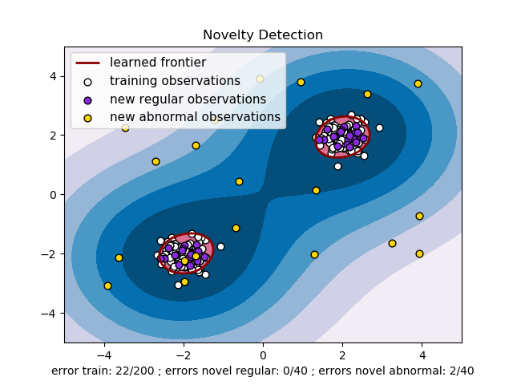

.. _outlier_detection:

===================================================
新奇点和孤立点检测(Novelty and Outlier Detection)
===================================================

.. currentmodule:: sklearn

很多机器学习应用都需要有能力判断一个新的观测是否跟已有观测具有相同的分布，或者来自不同的分布。
如果来自于相同的分布，则这个新的观测就是一个 *inlier* ; 如果不同，则这个新的观测被称为 *outlier* 。
这种能力通常用于对真实的数据集进行清洗。首先我们要区分两个重要的概念:

:outlier detection:
  训练数据中包含有一些outliers,它们被定义为远离其他观测值的观测值。所以，outliers应该译为“离群点，孤立点”。
  孤立点检测器(Outlier detection estimators) 因此尝试在训练数据最集中的那些区域上进行拟合，
  而忽略那些异常的观测值(deviant observations)。

:novelty detection:
  已有的训练数据并没有被outliers污染，而我们感兴趣的是去检测一个 **新来的** 观测值是否是outlier。
  在这样的一个语境下，此时的outlier我们称之为 novelty。
  在这儿 ，我把 novelty 译为 "新奇点" ,意为 **新来的奇怪的点** 。

孤立点检测 和 新奇点检测 都被用于异常检测(anomaly detection), 所谓anomaly detection就是
检测反常的的观测或不平常的观测。 
孤立点检测 也被称之为 无监督异常检测; 而 新奇点检测 被称之为 半监督异常检测。
在孤立点检测的语境下, outliers/anomalies 不能够形成一个稠密的聚类簇，因为可用的estimators都假定了
outliers/anomalies 位于低密度区域。相反的，在新奇点检测的语境下， novelties/anomalies 是可以形成
稠密聚类簇(dense cluster)的，只要它们在训练数据的一个低密度区域，这被认为是正常的(normal)。

scikit-learn 提供了一系列机器学习工具可以被用于新奇点或孤立点检测。 
这些检测策略被实现成一些 以无监督学习的方式从数据中学习 的估计器类(estimator)::

    estimator.fit(X_train)

fit好了estimator以后，新的观测数据可以用 ``predict`` 方法判断其是 inliers or outliers？::

    estimator.predict(X_test)

Inliers 被标记为 1, 而 outliers 被标记为 -1。 预测方法使用一个阈值在估计器计算出的原始评分函数上。
这个评分函数可以通过方法 ``score_samples`` 进行访问，而且 这个阈值可以由参数 ``contamination`` 控制。

``decision_function`` 方法也是从评分函数定义的，这样的话，得分为负值的就是 outliers, 得分为非负的就是 inliers::

    estimator.decision_function(X_test)

请注意 :class:`neighbors.LocalOutlierFactor` 类默认不支持 ``predict``, ``decision_function`` 和 
``score_samples`` 方法，而只支持 ``fit_predict`` 方法, 因为这个 estimator 一开始就是要把它用到孤立点检测中去的。
训练样本的异常性得分(scores of abnormality)可以通过 ``negative_outlier_factor_`` 属性来访问获取。

如果你真的特别想用 :class:`neighbors.LocalOutlierFactor` 类进行 新奇点检测(novelty detection), 
i.e. 对新的未见过的样本 预测其标签或计算其异常性得分, 你可以在实例化这个estimator的时候将其
``novelty`` 参数设为 ``True`` ，这一步必须要在拟合之前做。这样的话，``fit_predict`` 方法就不可用了。

.. warning:: **使用局部异常因子(Local Outlier Factor,LOF)进行新奇点检测**

  当 ``novelty`` 参数被设为 ``True`` 时，要当心 你必须只能使用 ``predict``, 
  ``decision_function`` 和 ``score_samples`` 在新的未见过的数据上，而不能把这几个函数用在训练数据上，
  因为这样会导致错误的结果。训练样本的异常性得分总是可以通过 ``negative_outlier_factor_`` 属性来访问获取。

:class:`neighbors.LocalOutlierFactor` 类在孤立点检测和新奇点检测中的行为被总结在下面的表格里啦。

===================== ================================ =====================
Method                Outlier detection                Novelty detection
===================== ================================ =====================
``fit_predict``       OK                               Not available
``predict``           Not available                    Use only on new data
``decision_function`` Not available                    Use only on new data
``score_samples``     Use ``negative_outlier_factor_`` Use only on new data
===================== ================================ =====================

孤立点检测方法一览
=====================================

下面这个案例针对scikit-learn 中的所有孤立点检测算法进行了对比。
局部异常因子(LOF) 没有在图的背景上画出决策边界，因为在孤立点检测中使用LOF时
它没有 predict 方法可以用在新数据上（见上面表格）。

:class:`ensemble.IsolationForest` 和 :class:`neighbors.LocalOutlierFactor` 
在这里所用的数据集上表现得相当好。 :class:`svm.OneClassSVM` 类对outliers本来就很敏感，
因此在outlier的检测中表现的非常好。最后, :class:`covariance.EllipticEnvelope` 类
假定了数据是服从高斯分布的且要学习一个椭圆(ellipse)。关于这个对比试验中各种estimators的更多详细信息
请参考 :ref:`sphx_glr_auto_examples_plot_anomaly_comparison.py` 和后续小节。

.. topic:: 案例:

  * 请看 :ref:`sphx_glr_auto_examples_plot_anomaly_comparison.py`
    对比实验，包括了 :class:`svm.OneClassSVM` 类, :class:`ensemble.IsolationForest` 类, 
    :class:`neighbors.LocalOutlierFactor` 类以及 :class:`covariance.EllipticEnvelope` 类。

新奇点检测(Novelty Detection)
================================

我们现在有一个从相同的分布(该分布由 :math:`p` 个特征分量描述)中得到的 :math:`n` 个观测组成的数据集。
现在我们再往这个观测集合中添加一个新的观测(a new observation)。那么这个新加入的观测是否与该集合中旧有的那些观测
非常不一样以至于我们必须怀疑它是否是正常的(regular or not)? (也就是说这个新的观测是否来自于一个相同的分布？)
或者我们从反向考虑，这个新的观测是否与旧有的那些观测特别的相似以至于我们无法将它与原来的旧观测数据区别开来？
这就是 新奇点检测(novelty detection) 中要强调的问题和它要给我们提供的工具的用途。

一般情况下，新奇点检测器 将学习一个粗糙的、封闭的边界来划分初始观测分布的等高线，绘制在嵌入 :math:`p` 维空间中。
然后，如果新的观测在边界分隔的子空间内(within the frontier-delimited subspace)，他们被认为来自相同的群体，
而不是最初的观测。否则，如果这些新观测数据身处边界之外，我们可以说他们是不正常的(abnormal)，
并且根据我们的评估给出一个置信度。

One-Class SVM 已经被 Schölkopf 引入来完成这样一个目的，而且它被实现在 :ref:`svm` 模块中
的 :class:`svm.OneClassSVM` 类中。 使用该类需要选择一个 kernel 和一个标量参数来定义上面提到的边界(frontier)。
RBF kernel 是通常的选项，尽管没有准确的公式或算法来设置RBF kernel的带宽参数(bandwidth)。
这是 scikit-learn 中的默认实现。 参数 :math:`\nu` , 也被称为One-Class SVM的边界(margin), 
对应于在边界外边(outside frontier)找到一个新的但是正常的观测的概率。

.. topic:: 参考文献:

    * `Estimating the support of a high-dimensional distribution
      <http://dl.acm.org/citation.cfm?id=1119749>`_ Schölkopf,
      Bernhard, et al. Neural computation 13.7 (2001): 1443-1471.

.. topic:: 案例:

   * 请看 :ref:`sphx_glr_auto_examples_svm_plot_oneclass.py` 用于可视化 :class:`svm.OneClassSVM` 类对象
     从数据中学习到的边界(frontier)。
   * :ref:`sphx_glr_auto_examples_applications_plot_species_distribution_modeling.py`

孤立点检测(Outlier Detection)
==================================

Outlier detection is similar to novelty detection in the sense that
the goal is to separate a core of regular observations from some
polluting ones, called *outliers*. Yet, in the case of outlier
detection, we don't have a clean data set representing the population
of regular observations that can be used to train any tool.

Fitting an elliptic envelope
----------------------------

One common way of performing outlier detection is to assume that the
regular data come from a known distribution (e.g. data are Gaussian
distributed). From this assumption, we generally try to define the
"shape" of the data, and can define outlying observations as
observations which stand far enough from the fit shape.

The scikit-learn provides an object
:class:`covariance.EllipticEnvelope` that fits a robust covariance
estimate to the data, and thus fits an ellipse to the central data
points, ignoring points outside the central mode.

For instance, assuming that the inlier data are Gaussian distributed, it
will estimate the inlier location and covariance in a robust way (i.e.
without being influenced by outliers). The Mahalanobis distances
obtained from this estimate is used to derive a measure of outlyingness.
This strategy is illustrated below.

.. figure:: ../auto_examples/covariance/images/sphx_glr_plot_mahalanobis_distances_001.png
   :target: ../auto_examples/covariance/plot_mahalanobis_distances.html
   :align: center
   :scale: 75%

.. topic:: 案例:

   * See :ref:`sphx_glr_auto_examples_covariance_plot_mahalanobis_distances.py` for
     an illustration of the difference between using a standard
     (:class:`covariance.EmpiricalCovariance`) or a robust estimate
     (:class:`covariance.MinCovDet`) of location and covariance to
     assess the degree of outlyingness of an observation.

.. topic:: 参考文献:

    * Rousseeuw, P.J., Van Driessen, K. "A fast algorithm for the minimum
      covariance determinant estimator" Technometrics 41(3), 212 (1999)

.. _isolation_forest:

Isolation Forest
----------------------------

One efficient way of performing outlier detection in high-dimensional datasets
is to use random forests.
The :class:`ensemble.IsolationForest` 'isolates' observations by randomly selecting
a feature and then randomly selecting a split value between the maximum and
minimum values of the selected feature.

Since recursive partitioning can be represented by a tree structure, the
number of splittings required to isolate a sample is equivalent to the path
length from the root node to the terminating node.

This path length, averaged over a forest of such random trees, is a
measure of normality and our decision function.

Random partitioning produces noticeably shorter paths for anomalies.
Hence, when a forest of random trees collectively produce shorter path
lengths for particular samples, they are highly likely to be anomalies.

该策略已在下面的例子中进行了说明。

.. figure:: ../auto_examples/ensemble/images/sphx_glr_plot_isolation_forest_001.png
   :target: ../auto_examples/ensemble/plot_isolation_forest.html
   :align: center
   :scale: 75%

.. topic:: 案例:

   * 请看 :ref:`sphx_glr_auto_examples_ensemble_plot_isolation_forest.py`  类 :class:`ensemble.IsolationForest` 的用法的示例说明。

   * 请看 :ref:`sphx_glr_auto_examples_plot_anomaly_comparison.py` 
     类 :class:`ensemble.IsolationForest` ，类 :class:`neighbors.LocalOutlierFactor`,
     类 :class:`svm.OneClassSVM` (调整为像孤立点检测方法一样执行) 以及 
     一个基于协方差的孤立点检测和 :class:`covariance.EllipticEnvelope` 类。

.. topic:: 参考文献:

    * Liu, Fei Tony, Ting, Kai Ming and Zhou, Zhi-Hua. "Isolation forest."
      Data Mining, 2008. ICDM'08. Eighth IEEE International Conference on.

Local Outlier Factor
--------------------
Another efficient way to perform outlier detection on moderately high dimensional
datasets is to use the Local Outlier Factor (LOF) algorithm.

The :class:`neighbors.LocalOutlierFactor` (LOF) algorithm computes a score
(called local outlier factor) reflecting the degree of abnormality of the
observations.
It measures the local density deviation of a given data point with respect to
its neighbors. The idea is to detect the samples that have a substantially
lower density than their neighbors.

In practice the local density is obtained from the k-nearest neighbors.
The LOF score of an observation is equal to the ratio of the
average local density of his k-nearest neighbors, and its own local density:
a normal instance is expected to have a local density similar to that of its
neighbors, while abnormal data are expected to have much smaller local density.

The number k of neighbors considered, (alias parameter n_neighbors) is typically
chosen 1) greater than the minimum number of objects a cluster has to contain,
so that other objects can be local outliers relative to this cluster, and 2)
smaller than the maximum number of close by objects that can potentially be
local outliers.
In practice, such informations are generally not available, and taking
n_neighbors=20 appears to work well in general.
When the proportion of outliers is high (i.e. greater than 10 \%, as in the
example below), n_neighbors should be greater (n_neighbors=35 in the example
below).

The strength of the LOF algorithm is that it takes both local and global
properties of datasets into consideration: it can perform well even in datasets
where abnormal samples have different underlying densities.
The question is not, how isolated the sample is, but how isolated it is
with respect to the surrounding neighborhood.

When applying LOF for outlier detection, there are no ``predict``,
``decision_function`` and ``score_samples`` methods but only a ``fit_predict``
method. The scores of abnormality of the training samples are accessible
through the ``negative_outlier_factor_`` attribute.
Note that ``predict``, ``decision_function`` and ``score_samples`` can be used
on new unseen data when LOF is applied for novelty detection, i.e. when the
``novelty`` parameter is set to ``True``. See :ref:`novelty_with_lof`.

该策略已在下面的例子中进行了说明。

.. figure:: ../auto_examples/neighbors/images/sphx_glr_plot_lof_outlier_detection_001.png
   :target: ../auto_examples/neighbors/sphx_glr_plot_lof_outlier_detection.html
   :align: center
   :scale: 75%

.. topic:: 案例:

   * 请看 :ref:`sphx_glr_auto_examples_neighbors_plot_lof_outlier_detection.py`
    :class:`neighbors.LocalOutlierFactor` 类的用法的示例说明。

   * 请看 :ref:`sphx_glr_auto_examples_plot_anomaly_comparison.py` 
    将该算法 与其他的异常检测(anomaly detection)算法进行对比。

.. topic:: 参考文献:

   *  Breunig, Kriegel, Ng, and Sander (2000)
      `LOF: identifying density-based local outliers.
      <http://www.dbs.ifi.lmu.de/Publikationen/Papers/LOF.pdf>`_
      Proc. ACM SIGMOD

.. _novelty_with_lof:

使用LOF进行新奇点检测
===========================================

如果要用 :class:`neighbors.LocalOutlierFactor` 类进行 新奇点检测, 
i.e. 对新的未见过的样本 预测其标签或计算其异常性得分, 你可以在实例化这个estimator的时候将其
``novelty`` 参数设为 ``True`` ，这一步必须要在拟合之前做::

  lof = LocalOutlierFactor(novelty=True)
  lof.fit(X_train)

请注意 ``fit_predict`` 方法在这情况下就不可用了。

.. warning:: **使用 局部异常因子(LOF) 进行新奇点检测**

  当 ``novelty`` 参数被设为 ``True`` 时，要当心 你必须只能使用 ``predict``, 
  ``decision_function`` 和 ``score_samples`` 在新的未见过的数据上，而不能把这几个函数用在训练数据上，
  因为这样会导致错误的结果。训练样本的异常性得分总是可以通过 ``negative_outlier_factor_`` 属性来访问获取。

使用 局部异常因子(LOF)进行新奇点检测 的示例见下图。

  .. figure:: ../auto_examples/neighbors/images/sphx_glr_plot_lof_novelty_detection_001.png
     :target: ../auto_examples/neighbors/sphx_glr_plot_lof_novelty_detection.html
     :align: center
     :scale: 75%

