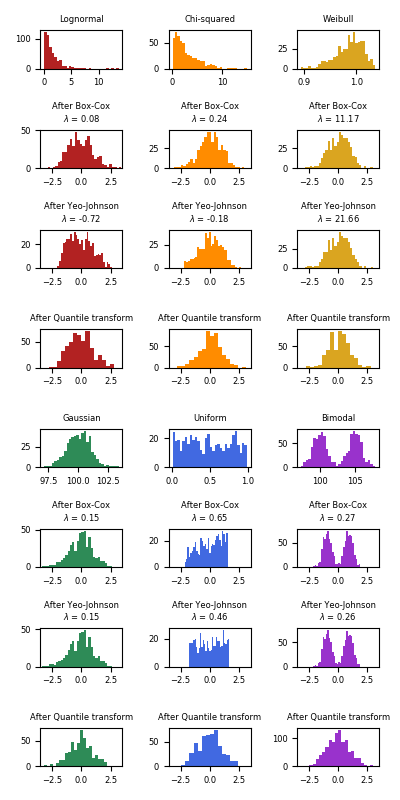

.. _preprocessing:

==============================
预处理数据(Preprocessing data)
==============================

.. currentmodule:: sklearn.preprocessing

``sklearn.preprocessing`` 包提供了几个常见的实用工具函数和变换器类，用来将原始特征向量修改为更适合机器学习模型的表达形式。

一般来说，机器学习算法会受益于数据集的标准化。如果数据集中出现一些离群/异常值(outliers)，那么鲁棒的缩放器或变换器(scalers or transformers)更合适。
不同缩放器、变换器和归一化器(normalizer)在包含边缘离群值的数据集上的行为请参看 :ref:`sphx_glr_auto_examples_preprocessing_plot_all_scaling.py` 。

.. topic:: 译者注

  本章节视频：
  `SKlearn数据预处理之标准化(Stardardization) 
  <http://www.studyai.com/course/play/d954602ecc014b1d80416b43ac848806>`_ ;
  `SKLearn数据预处理之规范化(Normalize)和二值化(Binarize) 
  <http://www.studyai.com/course/play/4a8bd51565714552bcad6ec7983dce54>`_ ;
  `标称型特征的编码和缺失值补全 <http://www.studyai.com/course/play/1be47f563bde488abde0c95baece6db2>`_。

.. _preprocessing_scaler:

标准化,or 均值去除和方差缩放
=====================================================

数据集的 标准化(**Standardization**) 对 **scikit-learn中实现的大多数机器学习算法来说是常见的要求** 。
如果个别特征或多或少看起来不是很像标准正态分布(具有零均值和单位方差)，那么这些机器学习算法的表现可能会比较差。

在实践中,我们经常忽略分布的形状，直接通过去除每个特征分量的均值来对每个特征进行中心化，
再通过除以非常量特征(non-constant features)的标准差对其进行缩放。

例如，在机器学习算法的目标函数(例如SVM的RBF内核或线性模型的l1和l2正则化)
中有很多地方都假定了所有特征都是以0为中心而且它们的方差也具有相同的阶数。
如果某个特征的方差比其他特征大几个数量级，那么它就会在学习算法的目标函数中占据主导位置，
导致学习器并不能像我们所期望的那样，从其他特征中学习。

函数 :func:`scale` 提供了一个快速简单的方法来在单个 array-like 数据集上执行上述标准化操作 ::

  >>> from sklearn import preprocessing
  >>> import numpy as np
  >>> X_train = np.array([[ 1., -1.,  2.],
  ...                     [ 2.,  0.,  0.],
  ...                     [ 0.,  1., -1.]])
  >>> X_scaled = preprocessing.scale(X_train)

  >>> X_scaled                                          # doctest: +ELLIPSIS
  array([[ 0.  ..., -1.22...,  1.33...],
         [ 1.22...,  0.  ..., -0.26...],
         [-1.22...,  1.22..., -1.06...]])

..
        >>> import numpy as np
        >>> print_options = np.get_printoptions()
        >>> np.set_printoptions(suppress=True)

被缩放的数据具有零均值和单位方差::

  >>> X_scaled.mean(axis=0)
  array([0., 0., 0.])

  >>> X_scaled.std(axis=0)
  array([1., 1., 1.])

..    >>> print_options = np.set_printoptions(print_options)

``preprocessing`` 模块还提供了一个工具类 :class:`StandardScaler` ，它实现了 ``Transformer`` 的API来计算训练集上的平均值和标准偏差，
以便以后能够在测试集上重新应用相同的变换。因此，这个类适用于 :class:`sklearn.pipeline.Pipeline` 的早期步骤:

  >>> scaler = preprocessing.StandardScaler().fit(X_train)
  >>> scaler
  StandardScaler(copy=True, with_mean=True, with_std=True)

  >>> scaler.mean_                                      # doctest: +ELLIPSIS
  array([1. ..., 0. ..., 0.33...])

  >>> scaler.scale_                                       # doctest: +ELLIPSIS
  array([0.81..., 0.81..., 1.24...])

  >>> scaler.transform(X_train)                           # doctest: +ELLIPSIS
  array([[ 0.  ..., -1.22...,  1.33...],
         [ 1.22...,  0.  ..., -0.26...],
         [-1.22...,  1.22..., -1.06...]])

然后，缩放器的实例就可以在新的数据上实现和训练集相同缩放操作::

  >>> X_test = [[-1., 1., 0.]]
  >>> scaler.transform(X_test)                # doctest: +ELLIPSIS
  array([[-2.44...,  1.22..., -0.26...]])

你也可以通过在 :class:`StandardScaler` 类的构造函数中传入参数 ``with_mean=False`` 或者 ``with_std=False`` 来禁用中心化或缩放操作。

缩放特征到指定范围
---------------------------

另外一种可选的标准化(standardization)是将特征缩放到给定的最小值和最大值之间，通常在 0 和 1 之间，
或者也可以将每个特征的最大绝对值转换至单位大小。
可以分别使用 :class:`MinMaxScaler` 或 :class:`MaxAbsScaler` 实现。

使用这种缩放的动机包括实现对特征的极小标准差的鲁棒性以及在稀疏矩阵中保留零元素。

以下是一个将简单的数据矩阵缩放到 ``[0, 1]`` 范围内的例子::

  >>> X_train = np.array([[ 1., -1.,  2.],
  ...                     [ 2.,  0.,  0.],
  ...                     [ 0.,  1., -1.]])
  ...
  >>> min_max_scaler = preprocessing.MinMaxScaler()
  >>> X_train_minmax = min_max_scaler.fit_transform(X_train)
  >>> X_train_minmax
  array([[0.5       , 0.        , 1.        ],
         [1.        , 0.5       , 0.33333333],
         [0.        , 1.        , 0.        ]])

然后，上述变换器的同一个实例可以被用于在训练过程中不可见的新的测试数据:实现和训练数据上
一致的缩放和移位操作(scaling and shifting operations)::

  >>> X_test = np.array([[-3., -1.,  4.]])
  >>> X_test_minmax = min_max_scaler.transform(X_test)
  >>> X_test_minmax
  array([[-1.5       ,  0.        ,  1.66666667]])

可以检查缩放器（scaler）的属性，来观察在训练集中学习到的变换操作的基本性质 ::

  >>> min_max_scaler.scale_                             # doctest: +ELLIPSIS
  array([0.5       , 0.5       , 0.33...])

  >>> min_max_scaler.min_                               # doctest: +ELLIPSIS
  array([0.        , 0.5       , 0.33...])

如果给 :class:`MinMaxScaler` 类提供一个明确的 ``feature_range=(min, max)`` ， 那么完整的公式是::

    X_std = (X - X.min(axis=0)) / (X.max(axis=0) - X.min(axis=0))

    X_scaled = X_std * (max - min) + min

类 :class:`MaxAbsScaler` 的工作原理与 :class:`MinMaxScaler` 类 非常相似，
但是它只通过除以每个特征的最大值将训练数据缩放至 ``[-1, 1]`` 区间内，
这就意味着，训练数据应该是已经零中心化或者是稀疏数据。 

用先前的例子中的数据实现最大绝对值缩放操作 ::

  >>> X_train = np.array([[ 1., -1.,  2.],
  ...                     [ 2.,  0.,  0.],
  ...                     [ 0.,  1., -1.]])
  ...
  >>> max_abs_scaler = preprocessing.MaxAbsScaler()
  >>> X_train_maxabs = max_abs_scaler.fit_transform(X_train)
  >>> X_train_maxabs                # doctest +NORMALIZE_WHITESPACE^
  array([[ 0.5, -1. ,  1. ],
         [ 1. ,  0. ,  0. ],
         [ 0. ,  1. , -0.5]])
  >>> X_test = np.array([[ -3., -1.,  4.]])
  >>> X_test_maxabs = max_abs_scaler.transform(X_test)
  >>> X_test_maxabs                 # doctest: +NORMALIZE_WHITESPACE
  array([[-1.5, -1. ,  2. ]])
  >>> max_abs_scaler.scale_         # doctest: +ELLIPSIS +NORMALIZE_WHITESPACE
  array([2.,  1.,  2.])

就像函数  :func:`scale` 一样，预处理模块进一步提供了方便的函数 :func:`minmax_scale` 和 :func:`maxabs_scale` 。
当你不想创建对象时，可以使用这些函数 。

缩放稀疏数据
-------------------
中心化稀疏(矩阵)数据会破坏数据的稀疏结构，因此很少有一个比较合理的实现方式。但是缩放稀疏输入是有意义的，尤其是当几个特征在不同的量级范围时。

类 :class:`MaxAbsScaler`  和 函数 :func:`maxabs_scale` 是专为缩放稀疏数据而设计的，并且是缩放稀疏数据的推荐方法。
但是， 函数 :func:`scale` 和 :class:`StandardScaler` 类也能够接受 ``scipy.sparse`` 作为输入，只要参数 ``with_mean=False`` 被显式的传入它的构造器。
否则会出现 ``ValueError`` 的错误，因为默默的中心化(silently centering)会破坏稀疏性，并且经常会因为分配过多的内存而使执行崩溃。 
:class:`RobustScaler` 类不能适配(fit)稀疏输入，但你可以在稀疏输入上使用 ``transform`` 方法。

注意，缩放器(scaler)可以接受 压缩过的稀疏行 也可以接受 压缩过的稀疏列(参见 ``scipy.sparse.csr_matrix`` 以及 ``scipy.sparse.csc_matrix`` )。
任何其他 稀疏输入将会 ** 转化为压缩稀疏行表示 ** 。为了避免不必要的内存复制，建议在早期选择 CSR 或 CSC 表示。

最后，如果已经中心化的数据足够小，使用 ``toarray`` 方法将输入的稀疏矩阵显式转换为数组是另一种选择。

缩放带有异常值的数据
--------------------------

如果你的数据包含许多异常值，使用均值和方差缩放可能并不是一个很好的选择。
这种情况下，你可以使用 :func:`robust_scale` 以及 :class:`RobustScaler` 作为替代品。
它们对你的数据的中心和范围使用更有鲁棒性的估计。

.. topic:: 参考文献:

  更多关于中心化和缩放数据的重要性讨论在此FAQ中提及: `Should I normalize/standardize/rescale the data?
  <http://www.faqs.org/faqs/ai-faq/neural-nets/part2/section-16.html>`_

.. topic:: 缩放与白化(Scaling vs Whitening)

  有时候独立地中心化和缩放数据是不够的，因为下游的机器学习模型会进一步对特征之间的线性依赖做出一些假设。

  要解决这个问题，你可以使用 :class:`sklearn.decomposition.PCA` 类 并指定参数 ``whiten=True`` 来进一步移除特征间的线性关联。

.. topic:: 缩放一个 1D array

   上面介绍过的所有函数(i.e. :func:`scale`, :func:`minmax_scale`, :func:`maxabs_scale`, 和 :func:`robust_scale`)
   都可以直接处理一维数组。

.. _kernel_centering:

中心化 核矩阵
-------------------------

如果你有一个 核 :math:`K` 的核矩阵(其中，核 :math:`K` 在 由函数 :math:`phi` 定义的特征空间上计算点积(dot product)),  
类 :class:`KernelCenterer` 可以 变换 核矩阵(kernel matrix) 以使得它包含由函数 :math:`phi` 
定义的被去除了均值的特征空间上的内积(inner products)。

.. _preprocessing_transformer:

非线性变换
=========================

映射到均匀分布
---------------------------------

类似于缩放器(scalers)， :class:`QuantileTransformer` 类将 所有特征 放到 同样的已知范围 或 同样的已知分布 下。
但是，通过执行一个排序变换(rank transformation), 它能够使 异常的分布(unusual distributions) 被平滑化，
并且能够做到 比使用缩放器(scalers)方法 更少地受到离群值的影响。
然而，它的确使 特征间 及 特征内 的 关联和距离 被打乱了。

类 :class:`QuantileTransformer` 和 函数 :func:`quantile_transform` 
提供了一个 基于分位数函数的无参数变换器 将数据映射到一个取值在0到1之间的均匀分布上 ::

  >>> from sklearn.datasets import load_iris
  >>> from sklearn.model_selection import train_test_split
  >>> iris = load_iris()
  >>> X, y = iris.data, iris.target
  >>> X_train, X_test, y_train, y_test = train_test_split(X, y, random_state=0)
  >>> quantile_transformer = preprocessing.QuantileTransformer(random_state=0)
  >>> X_train_trans = quantile_transformer.fit_transform(X_train)
  >>> X_test_trans = quantile_transformer.transform(X_test)
  >>> np.percentile(X_train[:, 0], [0, 25, 50, 75, 100]) # doctest: +SKIP
  array([ 4.3,  5.1,  5.8,  6.5,  7.9])

这个特征对应于萼片的长度(以厘米为单位)。一旦应用分位数变换，这些landmarks就接近于之前定义的百分位数 ::

  >>> np.percentile(X_train_trans[:, 0], [0, 25, 50, 75, 100])
  ... # doctest: +ELLIPSIS +SKIP
  array([ 0.00... ,  0.24...,  0.49...,  0.73...,  0.99... ])

这可以在带有类似remarks的独立测试集上得到确认 ::

  >>> np.percentile(X_test[:, 0], [0, 25, 50, 75, 100])
  ... # doctest: +SKIP
  array([ 4.4  ,  5.125,  5.75 ,  6.175,  7.3  ])
  >>> np.percentile(X_test_trans[:, 0], [0, 25, 50, 75, 100])
  ... # doctest: +ELLIPSIS +SKIP
  array([ 0.01...,  0.25...,  0.46...,  0.60... ,  0.94...])

映射到高斯分布
----------------------------------

在许多建模场景中，需要数据集中的特征的正态化(normality)。幂变换(Power transforms)是一类参数化的单调变换(parametric, monotonic transformations)，
其目的是将数据从任何分布映射到尽可能接近高斯分布，以便稳定方差(stabilize variance)和最小化偏斜(minimize skewness)。

类 :class:`PowerTransformer` 目前提供两个这样的幂变换,the Yeo-Johnson transform 和 the Box-Cox transform。

The Yeo-Johnson transform 如下定义:

.. math::
    x_i^{(\lambda)} =
    \begin{cases}
     [(x_i + 1)^\lambda - 1] / \lambda & \text{if } \lambda \neq 0, x_i \geq 0, \\[8pt]
    \ln{(x_i) + 1} & \text{if } \lambda = 0, x_i \geq 0 \\[8pt]
    -[(-x_i + 1)^{2 - \lambda} - 1] / (2 - \lambda) & \text{if } \lambda \neq 2, x_i < 0, \\[8pt]
     - \ln (- x_i + 1) & \text{if } \lambda = 2, x_i < 0
    \end{cases}

而 the Box-Cox transform 如下定义:

.. math::
    x_i^{(\lambda)} =
    \begin{cases}
    \dfrac{x_i^\lambda - 1}{\lambda} & \text{if } \lambda \neq 0, \\[8pt]
    \ln{(x_i)} & \text{if } \lambda = 0,
    \end{cases}

Box-Cox 仅能被应用于严格正(positive)的数据上。 在这两种方法中，变换(transformation)通过 :math:`\lambda` 被参数化：
参数 :math:`\lambda` 的值可以通过极大似然估计法(maximum likelihood estimation)得到。这里有一个使用例子：使用 Box-Cox 
把从对数正态分布(lognormal distribution)抽取出的样本映射成服从正太分布(normal distribution)的数据::

  >>> pt = preprocessing.PowerTransformer(method='box-cox', standardize=False)
  >>> X_lognormal = np.random.RandomState(616).lognormal(size=(3, 3))
  >>> X_lognormal                                         # doctest: +ELLIPSIS
  array([[1.28..., 1.18..., 0.84...],
         [0.94..., 1.60..., 0.38...],
         [1.35..., 0.21..., 1.09...]])
  >>> pt.fit_transform(X_lognormal)                   # doctest: +ELLIPSIS
  array([[ 0.49...,  0.17..., -0.15...],
         [-0.05...,  0.58..., -0.57...],
         [ 0.69..., -0.84...,  0.10...]])

上述例子设置了参数 `standardize` 的选项为 `False` 。  但是，默认情况下，类 :class:`PowerTransformer` 将会应用 
zero-mean, unit-variance normalization 到变换出的输出上。

下面的例子中 将 Box-Cox 和 Yeo-Johnson 应用到各种不同的概率分布上。 请注意 当把这些方法用到某个分布上的时候，
幂变换得到的分布非常像高斯分布。但是对其他的一些分布，结果却不太有效。这更加强调了在幂变换前后对数据进行可视化的重要性。

我们也可以 使用类 :class:`QuantileTransformer` (通过设置 ``output_distribution='normal'``)把数据
变换成一个正态分布。下面是将其应用到iris dataset上的结果::

  >>> quantile_transformer = preprocessing.QuantileTransformer(
  ...     output_distribution='normal', random_state=0)
  >>> X_trans = quantile_transformer.fit_transform(X)
  >>> quantile_transformer.quantiles_ # doctest: +ELLIPSIS +NORMALIZE_WHITESPACE
  array([[4.3...,   2...,     1...,     0.1...],
         [4.31...,  2.02...,  1.01...,  0.1...],
         [4.32...,  2.05...,  1.02...,  0.1...],
         ...,
         [7.84...,  4.34...,  6.84...,  2.5...],
         [7.87...,  4.37...,  6.87...,  2.5...],
         [7.9...,   4.4...,   6.9...,   2.5...]])

因此，输入的中值(median)变成了输出的均值(mean)，以 0 为中心。正态输出被裁剪以便输入的最大最小值(分别对应于 1e-7 和 1 - 1e-7)不会在变换之下变成无穷。

.. _preprocessing_normalization:

归一化
=============

归一化(**Normalization**) 是 **缩放单个样本使其具有单位范数** 的过程。
如果你计划使用二次形式(quadratic form 如点积或任何其他核函数)来量化任何样本间的相似度，则此过程将非常有用。

这个 assumption 是 向量空间模型(`Vector Space Model <https://en.wikipedia.org/wiki/Vector_Space_Model>`_ ) 的基础，经常在文本分类和内容聚类中使用.

函数 :func:`normalize` 提供了一个快速简单的方法在类似数组的数据集上执行操作，使用 ``l1`` 或 ``l2`` 范数 ::

  >>> X = [[ 1., -1.,  2.],
  ...      [ 2.,  0.,  0.],
  ...      [ 0.,  1., -1.]]
  >>> X_normalized = preprocessing.normalize(X, norm='l2')

  >>> X_normalized                                      # doctest: +ELLIPSIS
  array([[ 0.40..., -0.40...,  0.81...],
         [ 1.  ...,  0.  ...,  0.  ...],
         [ 0.  ...,  0.70..., -0.70...]])

``preprocessing`` 模块提供的工具类  :class:`Normalizer` 使用 ``Transformer`` API 实现了相同的操作
(尽管在这种情况下， ``fit`` 方法是没有用的：该类是无状态的，因为归一化操作独立的对待样本)。

因此这个类适用于 :class:`sklearn.pipeline.Pipeline` 的早期步骤 ::

  >>> normalizer = preprocessing.Normalizer().fit(X)  # fit does nothing
  >>> normalizer
  Normalizer(copy=True, norm='l2')

在这之后 归一化器的实例 就可以被使用在样本向量中，像任何其他变换器一样 ::

  >>> normalizer.transform(X)                            # doctest: +ELLIPSIS
  array([[ 0.40..., -0.40...,  0.81...],
         [ 1.  ...,  0.  ...,  0.  ...],
         [ 0.  ...,  0.70..., -0.70...]])

  >>> normalizer.transform([[-1.,  1., 0.]])             # doctest: +ELLIPSIS
  array([[-0.70...,  0.70...,  0.  ...]])

.. topic:: 稀疏输入

  函数 :func:`normalize` 和 类 :class:`Normalizer` 接受 **both dense array-like
  and sparse matrices from scipy.sparse 作为输入**.

  对于稀疏输入，在被提交给高效Cython例程前，数据被 **转化为压缩的稀疏行形式** (参见 ``scipy.sparse.csr_matrix`` )。
  为了避免不必要的内存复制，推荐在上游选择CSR表示。

.. _preprocessing_categorical_features:

编码 标称型特征
=============================
在机器学习中，特征经常不是连续的数值型的而是 标称型的(categorical)。举个例子，一个人的特征可能有 
``["male", "female"]``,
``["from Europe", "from US", "from Asia"]``,
``["uses Firefox", "uses Chrome", "uses Safari", "uses Internet Explorer"]`` 等。
这些特征能够被有效地编码成整数，比如 ``["male", "from US", "uses Internet Explorer"]`` 可以被表示为 [0, 1, 3] ， 
``["female", "from Asia", "uses Chrome"]`` 表示为 [1, 2, 1] 。

要把 标称型特征(categorical features) 转换为 这样的整数编码(integer codes), 我们可以使用 :class:`OrdinalEncoder` 。 
这个 etimator 把每一个 categorical feature 变换成 一个新的整数数字特征 (0 到 n_categories - 1)::

    >>> enc = preprocessing.OrdinalEncoder()
    >>> X = [['male', 'from US', 'uses Safari'], ['female', 'from Europe', 'uses Firefox']]
    >>> enc.fit(X)  # doctest: +ELLIPSIS
    OrdinalEncoder(categories='auto', dtype=<... 'numpy.float64'>)
    >>> enc.transform([['female', 'from US', 'uses Safari']])
    array([[0., 1., 1.]])

这样的整数特征表示并不能在scikit-learn的估计器中直接使用，因为这样的连续输入，
估计器会认为类别之间是有序的，但实际却是无序的。(例如：浏览器的类别数据则是任意排序的)。

另外一种将 categorical features 转换为能够被scikit-learn中模型使用的编码是 one-of-K， 又称之为 one-hot 编码 或 dummy encoding。
这种编码类型已经在类 :class:`OneHotEncoder` 中实现。该类把每一个具有 ``n_categories`` 个可能取值的 categorical特征 变换为
长度为 ``n_categories`` 的二进制特征向量，里面只有一个地方是1，其余位置都是0。

继续我们上面的例子::

  >>> enc = preprocessing.OneHotEncoder()
  >>> X = [['male', 'from US', 'uses Safari'], ['female', 'from Europe', 'uses Firefox']]
  >>> enc.fit(X)  # doctest: +ELLIPSIS
  OneHotEncoder(categorical_features=None, categories=None,
         dtype=<... 'numpy.float64'>, handle_unknown='error',
         n_values=None, sparse=True)
  >>> enc.transform([['female', 'from US', 'uses Safari'],
  ...                ['male', 'from Europe', 'uses Safari']]).toarray()
  array([[1., 0., 0., 1., 0., 1.],
         [0., 1., 1., 0., 0., 1.]])

默认情况下，每个特征使用几维的数值可以从数据集自动推断。而且可以在属性 ``categories_`` 中找到:: 

    >>> enc.categories_
    [array(['female', 'male'], dtype=object), array(['from Europe', 'from US'], dtype=object), array(['uses Firefox', 'uses Safari'], dtype=object)]

当然，你也可以通过使用参数 ``categories`` 来明确指定。在我们的例子数据集中，有两个性别类，四个可能的洲，四个网络浏览器 ::

    >>> genders = ['female', 'male']
    >>> locations = ['from Africa', 'from Asia', 'from Europe', 'from US']
    >>> browsers = ['uses Chrome', 'uses Firefox', 'uses IE', 'uses Safari']
    >>> enc = preprocessing.OneHotEncoder(categories=[genders, locations, browsers])
    >>> # Note that for there are missing categorical values for the 2nd and 3rd
    >>> # feature
    >>> X = [['male', 'from US', 'uses Safari'], ['female', 'from Europe', 'uses Firefox']]
    >>> enc.fit(X) # doctest: +ELLIPSIS
    OneHotEncoder(categorical_features=None,
           categories=[...],
           dtype=<... 'numpy.float64'>, handle_unknown='error',
           n_values=None, sparse=True)
    >>> enc.transform([['female', 'from Asia', 'uses Chrome']]).toarray()
    array([[1., 0., 0., 1., 0., 0., 1., 0., 0., 0.]])

如果训练数据中可能含有缺失的categrical features, 通过指定 ``handle_unknown='ignore'`` 通常比像上面代码那样手动设置 ``categories`` 更好。
当 ``handle_unknown='ignore'`` 被指定后，并且在变换过程中真的碰到了未知的 categories, 则 不会抛出任何错误但是由此产生的该特征的 one-hot 编码列
将会全部变成 0 。(这个参数设置选项 ``handle_unknown='ignore'`` 仅仅在 one-hot encoding 的时候得到支持)::

    >>> enc = preprocessing.OneHotEncoder(handle_unknown='ignore')
    >>> X = [['male', 'from US', 'uses Safari'], ['female', 'from Europe', 'uses Firefox']]
    >>> enc.fit(X) # doctest: +ELLIPSIS
    OneHotEncoder(categorical_features=None, categories=None,
           dtype=<... 'numpy.float64'>, handle_unknown='ignore',
           n_values=None, sparse=True)
    >>> enc.transform([['female', 'from Asia', 'uses Chrome']]).toarray()
    array([[1., 0., 0., 0., 0., 0.]])

请查看 :ref:`dict_feature_extraction` 用于表示成字典形式的标称型特征而不是标量形式。

.. _preprocessing_discretization:

离散化
==============

离散化 (`Discretization <https://en.wikipedia.org/wiki/Discretization_of_continuous_features>`_)
(有些时候叫 量化(quantization) 或 装箱(binning)) 提供了将连续特征划分为离散特征值的方法。
某些具有连续特征的数据集会受益于离散化，因为 离散化可以把具有连续属性的数据集变换成只有名义属性(nominal attributes)的数据集。
(译者注： nominal attributes 其实就是 categorical features, 可以译为 名称属性，名义属性，符号属性，离散属性 等)

One-hot 编码的离散化特征 可以使得一个模型更加的有表现力(expressive)，同时还能保留其可解释性(interpretability)。 
比如，用离散化器进行预处理可以给线性模型引入非线性。

K-bins 离散化
---------------------

:class:`KBinsDiscretizer` 类使用 ``k`` 个等宽的 bins 把特征离散化 ::

  >>> X = np.array([[ -3., 5., 15 ],
  ...               [  0., 6., 14 ],
  ...               [  6., 3., 11 ]])
  >>> est = preprocessing.KBinsDiscretizer(n_bins=[3, 2, 2], encode='ordinal').fit(X)

默认情况下，输出是被 one-hot 编码到一个稀疏矩阵。(请看 :ref:`preprocessing_categorical_features`)。
而且可以使用参数 ``encode`` 进行配置。对每一个特征， bin 的边界以及总数目 在 ``fit`` 过程中被计算出来，它们将用来定义区间。
因此，对现在的例子，这些区间间隔被定义如下:

 - feature 1: :math:`{[-\infty, -1), [-1, 2), [2, \infty)}`
 - feature 2: :math:`{[-\infty, 5), [5, \infty)}`
 - feature 3: :math:`{[-\infty, 14), [14, \infty)}`

基于这些 bin 区间, ``X`` 就被变换成下面这样::

  >>> est.transform(X)                      # doctest: +SKIP
  array([[ 0., 1., 1.],
         [ 1., 1., 1.],
         [ 2., 0., 0.]])

由此产生的数据集包含了有序属性(ordinal attributes),可以被进一步用在类  :class:`sklearn.pipeline.Pipeline` 中。

离散化(Discretization) 类似于为连续数据构建直方图(histograms)。
然而，直方图聚焦于统计特征落在特定的bins里面的数量，而离散化聚焦于给这些bins分配特征取值。

:class:`KBinsDiscretizer` 类实现了不同的 binning 策略，可以通过参数 ``strategy`` 进行选择。 'uniform' 策略使用固定宽度的bins。
'quantile' 策略在每个特征上使用 分位数(quantiles)值以便具有相同填充的bins。
'kmeans' 策略基于 在每个特征上独立执行的 k-means 聚类过程 定义bins。

.. topic:: 案例:

  * :ref:`sphx_glr_auto_examples_preprocessing_plot_discretization.py`
  * :ref:`sphx_glr_auto_examples_preprocessing_plot_discretization_classification.py`
  * :ref:`sphx_glr_auto_examples_preprocessing_plot_discretization_strategies.py`

.. _preprocessing_binarization:

特征二值化
--------------------

特征二值化(**Feature binarization**) 是 **将数值特征用阈值过滤得到布尔值** 的过程。这对于pipeline中下游的概率型模型是有用的，
它们假设输入数据是 多值伯努利分布(multi-variate `Bernoulli distribution <https://en.wikipedia.org/wiki/Bernoulli_distribution>`_) 。
例如这个模型 :class:`sklearn.neural_network.BernoulliRBM` 就用到了 多值伯努利分布 。

即使 归一化计数(a.k.a. term frequencies) 和 TF-IDF值特征 在实践中表现稍好一些，
在文本处理社区中也常常使用二值化特征值(这可能会简化概率推理(probabilistic reasoning))。

与 :class:`Normalizer` 类一样，工具类 :class:`Binarizer` 也被用于 :class:`sklearn.pipeline.Pipeline` 的早期步骤中。
因为每个样本被当做是独立于其他样本的，所以 ``fit`` 方法是不做任何事的::

  >>> X = [[ 1., -1.,  2.],
  ...      [ 2.,  0.,  0.],
  ...      [ 0.,  1., -1.]]

  >>> binarizer = preprocessing.Binarizer().fit(X)  # fit does nothing
  >>> binarizer
  Binarizer(copy=True, threshold=0.0)

  >>> binarizer.transform(X)
  array([[1., 0., 1.],
         [1., 0., 0.],
         [0., 1., 0.]])

二值化器(binarizer)的阈值是可以被调节的::

  >>> binarizer = preprocessing.Binarizer(threshold=1.1)
  >>> binarizer.transform(X)
  array([[0., 0., 1.],
         [1., 0., 0.],
         [0., 0., 0.]])

与 :class:`StandardScaler` 类 和 :class:`Normalizer` 类一样， 预处理模块也提供了一个函数 :func:`binarize`
供我们使用，当 变换器(transformer) API 并不是必须的 的时候。

请注意 当 ``k = 2`` ， 和 当 bin edge is at the value ``threshold`` 时， :class:`Binarizer` 与 :class:`KBinsDiscretizer` 是类似的。

.. topic:: 稀疏输入

  函数 :func:`binarize` 和 类 :class:`Binarizer` 都接受 **稠密数组型的输入**，和 **来自 scipy.sparse 的稀疏矩阵作为输入** 。 

  对于 稀疏输入，数据被转换为 **Compressed Sparse Rows representation** (请看 ``scipy.sparse.csr_matrix``).
  为了避免不必要的内存拷贝, 在pipeline的早期阶段 推荐使用 CSR representation。

.. _imputation:

缺失值补全
============================

关于 缺失值(missing values) 补全的方法和工具 的讨论，请看章节: :ref:`impute` 。

.. _polynomial_features:

产生多项式特征
==============================

通常，在机器学习中，通过使用一些输入数据的非线性特征来增加模型的复杂度是有用的。
一个简单通用的办法是使用多项式特征(polynomial features)，这可以获得特征的更高阶次和互相间关系的 项(terms)。
上述功能已经在 :class:`PolynomialFeatures` 类中实现 ::

    >>> import numpy as np
    >>> from sklearn.preprocessing import PolynomialFeatures
    >>> X = np.arange(6).reshape(3, 2)
    >>> X                                                 # doctest: +ELLIPSIS
    array([[0, 1],
           [2, 3],
           [4, 5]])
    >>> poly = PolynomialFeatures(2)
    >>> poly.fit_transform(X)                             # doctest: +ELLIPSIS
    array([[ 1.,  0.,  1.,  0.,  0.,  1.],
           [ 1.,  2.,  3.,  4.,  6.,  9.],
           [ 1.,  4.,  5., 16., 20., 25.]])

X 的特征向量 已经从 :math:`(X_1, X_2)` 变换为 :math:`(1, X_1, X_2, X_1^2, X_1X_2, X_2^2)` 。

在有些情形下, 仅仅需要特征之间的相互作用项(interaction terms among features), 这时候通过设置 ``interaction_only=True`` 就可以得到我们
想要的 相互作用项 ::

    >>> X = np.arange(9).reshape(3, 3)
    >>> X                                                 # doctest: +ELLIPSIS
    array([[0, 1, 2],
           [3, 4, 5],
           [6, 7, 8]])
    >>> poly = PolynomialFeatures(degree=3, interaction_only=True)
    >>> poly.fit_transform(X)                             # doctest: +ELLIPSIS
    array([[  1.,   0.,   1.,   2.,   0.,   0.,   2.,   0.],
           [  1.,   3.,   4.,   5.,  12.,  15.,  20.,  60.],
           [  1.,   6.,   7.,   8.,  42.,  48.,  56., 336.]])

X 的特征向量 已经从 :math:`(X_1, X_2, X_3)` 变换为 :math:`(1, X_1, X_2, X_3, X_1X_2, X_1X_3, X_2X_3, X_1X_2X_3)`.

请注意，当我们使用多项式核 :ref:`svm_kernels` 的时候， 多项式特征 在 `kernel methods <https://en.wikipedia.org/wiki/Kernel_method>`_ 中被隐式的使用了。 
(比如说, :class:`sklearn.svm.SVC`, :class:`sklearn.decomposition.KernelPCA`)。

See :ref:`sphx_glr_auto_examples_linear_model_plot_polynomial_interpolation.py` for Ridge regression using created polynomial features.

.. _function_transformer:

自定义变换器
===================

通常，在机器学习中，你可能想要将一个已有的 Python 函数转化为一个变换器(transformer)来协助数据清理或处理。
你可以使用 :class:`FunctionTransformer` 类从任意函数中实现一个transformer。例如，在一个pipeline中构建一个实现日志转换的transformer，
就可以这样做 ::

    >>> import numpy as np
    >>> from sklearn.preprocessing import FunctionTransformer
    >>> transformer = FunctionTransformer(np.log1p, validate=True)
    >>> X = np.array([[0, 1], [2, 3]])
    >>> transformer.transform(X)
    array([[0.        , 0.69314718],
           [1.09861229, 1.38629436]])

你可以保证 ``func`` 和 ``inverse_func`` 是互为可逆的(the inverse of each other) 通过设置 ``check_inverse=True`` 并且在 调用 ``transform`` 之前
调用 ``fit`` 。 请注意 一个 warning 会被抛出，并且 可以使用 ``filterwarnings`` 将其转为一个 error ::

  >>> import warnings
  >>> warnings.filterwarnings("error", message=".*check_inverse*.",
  ...                         category=UserWarning, append=False)

我们提供了一个完整的代码案例来展示 :class:`FunctionTransformer` 类进行自定义特征选择的用法，请看：
:ref:`sphx_glr_auto_examples_preprocessing_plot_function_transformer.py`
