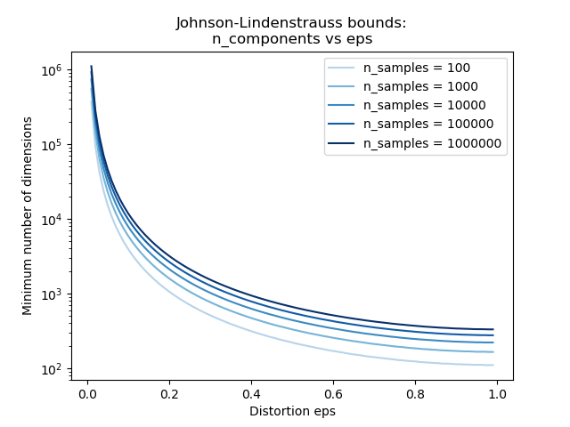

.. _random_projection:

================================
随机投影(Random Projection)
================================
.. currentmodule:: sklearn.random_projection

:mod:`sklearn.random_projection` 模块实现了一种简单、计算效率高的方法来降低数据的维数。
该方法通过交易 准确率的可控量 来换取 更快的处理时间和更小的模型规模。
这个模块实现了两种类型的无结构化的随机矩阵(unstructured random matrix):
:ref:`Gaussian random matrix <gaussian_random_matrix>` 和
:ref:`sparse random matrix <sparse_random_matrix>`.

控制随机投影矩阵的维数和分布，以保持数据集中任意两个样本之间的配对距离。因此，随机投影是一种适合于基于距离的近似方法。

.. topic:: 参考文献:

 * Sanjoy Dasgupta. 2000.
   `Experiments with random projection. <http://cseweb.ucsd.edu/~dasgupta/papers/randomf.pdf>`_
   In Proceedings of the Sixteenth conference on Uncertainty in artificial
   intelligence (UAI'00), Craig Boutilier and Moisés Goldszmidt (Eds.). Morgan
   Kaufmann Publishers Inc., San Francisco, CA, USA, 143-151.

 * Ella Bingham and Heikki Mannila. 2001.
   `Random projection in dimensionality reduction: applications to image and text data. <http://citeseerx.ist.psu.edu/viewdoc/download?doi=10.1.1.24.5135&rep=rep1&type=pdf>`_
   In Proceedings of the seventh ACM SIGKDD international conference on
   Knowledge discovery and data mining (KDD '01). ACM, New York, NY, USA,
   245-250.

.. _johnson_lindenstrauss:

Johnson-Lindenstrauss 引理
===============================

随机投影效率背后的主要理论结果 是 
`Johnson-Lindenstrauss lemma (引用自维基百科)
<https://en.wikipedia.org/wiki/Johnson%E2%80%93Lindenstrauss_lemma>`_:

  在数学上, Johnson-Lindenstrauss 引理是一个关于点从高维到低维欧氏空间的低失真嵌入(low-distortion embeddings)的结果。
  引理指出，高维空间中的一小部分点可以嵌入到较低维的空间中，这样就几乎保持了点之间的距离。
  用于嵌入的映射至少是Lipschitz的，甚至可以看作是正交投影(orthogonal projection)。

仅仅只知道样本的数量, 函数 :func:`sklearn.random_projection.johnson_lindenstrauss_min_dim` 保守估计随机子空间的最小
size 以便保证随机投影引入的是一个有界的失真(bounded distortion)。

  >>> from sklearn.random_projection import johnson_lindenstrauss_min_dim
  >>> johnson_lindenstrauss_min_dim(n_samples=1e6, eps=0.5)
  663
  >>> johnson_lindenstrauss_min_dim(n_samples=1e6, eps=[0.5, 0.1, 0.01])
  array([    663,   11841, 1112658])
  >>> johnson_lindenstrauss_min_dim(n_samples=[1e4, 1e5, 1e6], eps=0.1)
  array([ 7894,  9868, 11841])

.. figure:: ../auto_examples/images/sphx_glr_plot_johnson_lindenstrauss_bound_001.png
   :target: ../auto_examples/plot_johnson_lindenstrauss_bound.html
   :scale: 75
   :align: center

.. topic:: 案例:

  * See :ref:`sphx_glr_auto_examples_plot_johnson_lindenstrauss_bound.py`
    for a theoretical explication on the Johnson-Lindenstrauss lemma and an
    empirical validation using sparse random matrices.

.. topic:: 参考文献:

  * Sanjoy Dasgupta and Anupam Gupta, 1999.
    `An elementary proof of the Johnson-Lindenstrauss Lemma.
    <http://citeseerx.ist.psu.edu/viewdoc/download?doi=10.1.1.39.3334&rep=rep1&type=pdf>`_

.. _gaussian_random_matrix:

高斯随机投影
==========================
:class:`sklearn.random_projection.GaussianRandomProjection` 类 通过把原始输入空间投影(projecting)到
一个随机产生的矩阵(矩阵的components是从 :math:`N(0, \frac{1}{n_{components}})` 分布中抽取的)进行维数约减。

下面的小例子展示了如何使用高斯随机投影 ::

  >>> import numpy as np
  >>> from sklearn import random_projection
  >>> X = np.random.rand(100, 10000)
  >>> transformer = random_projection.GaussianRandomProjection()
  >>> X_new = transformer.fit_transform(X)
  >>> X_new.shape
  (100, 3947)

.. _sparse_random_matrix:

稀疏随机投影
========================
:class:`sklearn.random_projection.SparseRandomProjection` 类 通过把原始输入空间投影(projecting)到
一个稀疏随机矩阵进行维数约减。

稀疏随机矩阵是稠密高斯随机投影矩阵的一个替代方案，它既保证了相似的嵌入质量同时有很高的存储效率和更快速的投影数据的计算。

如果我们定义 ``s = 1 / density``, 那么随机矩阵的元素可以从下面的分布中抽取:

.. math::

  \left\{
  \begin{array}{c c l}
  -\sqrt{\frac{s}{n_{\text{components}}}} & & 1 / 2s\\
  0 &\text{with probability}  & 1 - 1 / s \\
  +\sqrt{\frac{s}{n_{\text{components}}}} & & 1 / 2s\\
  \end{array}
  \right.

其中 :math:`n_{\text{components}}` 是投影子空间的size。默认情况下，Ping Li 等人推荐把非零元素的密度被设置为最小密度:
:math:`1 / \sqrt{n_{\text{features}}}` 。

下面的小例子展示了如何使用 稀疏随机投影变换器::

  >>> import numpy as np
  >>> from sklearn import random_projection
  >>> X = np.random.rand(100, 10000)
  >>> transformer = random_projection.SparseRandomProjection()
  >>> X_new = transformer.fit_transform(X)
  >>> X_new.shape
  (100, 3947)

.. topic:: 参考文献:

 * D. Achlioptas. 2003.
   `Database-friendly random projections: Johnson-Lindenstrauss  with binary
   coins <http://www.cs.ucsc.edu/~optas/papers/jl.pdf>`_.
   Journal of Computer and System Sciences 66 (2003) 671–687

 * Ping Li, Trevor J. Hastie, and Kenneth W. Church. 2006.
   `Very sparse random projections. <https://web.stanford.edu/~hastie/Papers/Ping/KDD06_rp.pdf>`_
   In Proceedings of the 12th ACM SIGKDD international conference on
   Knowledge discovery and data mining (KDD '06). ACM, New York, NY, USA,
   287-296.
