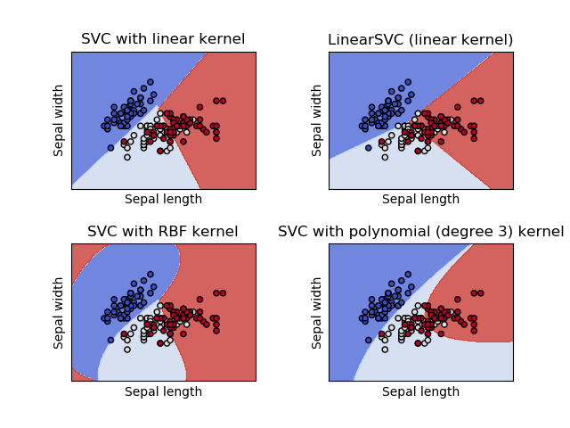
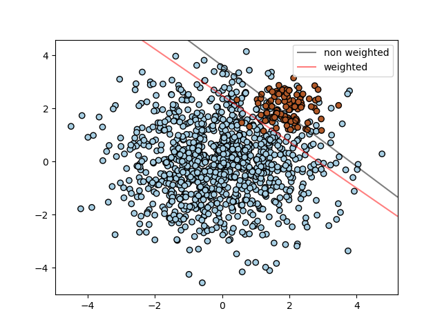
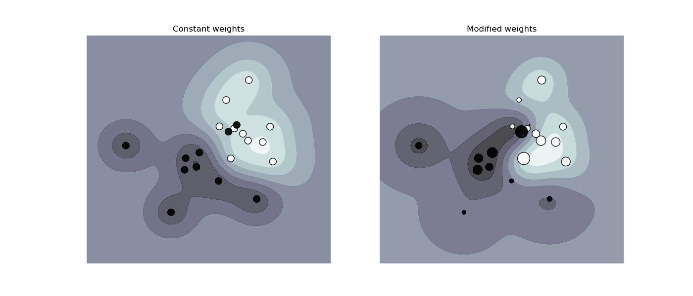
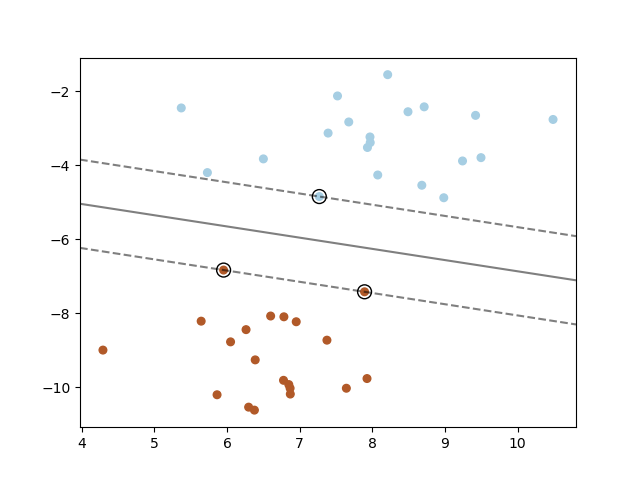

.. _svm:

========================================
支持向量机(Support Vector Machines)
========================================

.. currentmodule:: sklearn.svm

**Support vector machines (SVMs)** 是一类监督学习算法，常被用于：:ref:`classification <svm_classification>`,
:ref:`regression <svm_regression>` 和 :ref:`outliers detection <svm_outlier_detection>`.

支持向量机的优点:

    - 在高维空间中非常高效。

    - 即使在数据维度比样本数量大的情况下仍然有效。

    - 在决策函数（称为支持向量）中使用训练集的子集,因此它也是高效利用内存的.

    - 通用性: 不同的核函数与特定的决策函数一一对应.常见的 kernel 已经提供,也可以指定定制的内核.

支持向量机的缺点:

    - 如果特征数量比样本数量大得多, 选择核函数 :ref:`svm_kernels` 和 正则化项以避免过拟合是很关键的。

    - 支持向量机不直接提供概率估计,这些都是使用昂贵的五次交叉验算计算的。 (详情见 :ref:`Scores and probabilities <scores_probabilities>`, 在下文中)

在 scikit-learn 中,支持向量机 支持 稠密样本向量 ( ``numpy.ndarray`` ,可以通过 ``numpy.asarray`` 进行转换) 和 
稀疏样本向量 (任何 ``scipy.sparse`` ) 作为输入。 然而,要使用支持向量机来对稀疏数据作预测,它必须已经在这样的数据上拟合过了。
为了优化性能，使用了 C-ordered ``numpy.ndarray`` (稠密输入) 或者带有 ``dtype=float64`` 的 ``scipy.sparse.csr_matrix`` (稀疏输入) 。

.. _svm_classification:

分类
==============

:class:`SVC`, :class:`NuSVC` 和 :class:`LinearSVC` 能够在指定的数据集上进行多类分类任务的类。

:class:`SVC` 和 :class:`NuSVC` 是相似的方法, 但是它们接受的参数集合稍微不同并且数学形式也有所区别
(see section :ref:`svm_mathematical_formulation`)。另一方面， :class:`LinearSVC` 是支持向量机的另一种实现方式，主要用于线性核函数的情况。
注意到 :class:`LinearSVC` 不接受关键参数 ``kernel``, 因为 核函数 已经被假定为线性核啦。它也缺少 :class:`SVC` 和 :class:`NuSVC` 才有的
一些类成员属性, 比如 ``support_``。

和其他分类器一样, :class:`SVC`, :class:`NuSVC` 和 :class:`LinearSVC` 将两个数组作为输入: shape为 ``[n_samples, n_features]`` 的数组 X 作为训练样本,
shape为 ``[n_samples]`` 的数组 y 作为类别标签(字符串或者整数)::

    >>> from sklearn import svm
    >>> X = [[0, 0], [1, 1]]
    >>> y = [0, 1]
    >>> clf = svm.SVC(gamma='scale')
    >>> clf.fit(X, y)  # doctest: +NORMALIZE_WHITESPACE
    SVC(C=1.0, cache_size=200, class_weight=None, coef0=0.0,
        decision_function_shape='ovr', degree=3, gamma='scale', kernel='rbf',
        max_iter=-1, probability=False, random_state=None, shrinking=True,
        tol=0.001, verbose=False)

在模型拟合好后, 就可以用来预测新的值::

    >>> clf.predict([[2., 2.]])
    array([1])

SVMs的决策函数依赖于训练数据的某些子集，称之为支持向量(support vectors)。这些支持向量的一部分属性可以在成员
``support_vectors_``, ``support_`` 和 ``n_support`` 中找到 ::

    >>> # get support vectors
    >>> clf.support_vectors_
    array([[0., 0.],
           [1., 1.]])
    >>> # get indices of support vectors
    >>> clf.support_ # doctest: +ELLIPSIS
    array([0, 1]...)
    >>> # get number of support vectors for each class
    >>> clf.n_support_ # doctest: +ELLIPSIS
    array([1, 1]...)

.. _svm_multi_class:

多类别分类
--------------------------

:class:`SVC` 和 :class:`NuSVC` 实现了 "one-against-one" 方法 (Knerr et al., 1990) 用于解决多类别分类问题。
如果 ``n_class`` 是类的数量，那么总共需要构建 ``n_class * (n_class - 1) / 2`` 个分类器，其中每一个分类器都是在数据上训练得到的两类分类器。
为了和其他分类器的接口保持一致，``decision_function_shape`` 选项允许把多个"one-against-one"分类器的结果聚集到一个
shape为 ``(n_samples,n_classes)`` 决策函数里边 ::

    >>> X = [[0], [1], [2], [3]]
    >>> Y = [0, 1, 2, 3]
    >>> clf = svm.SVC(gamma='scale', decision_function_shape='ovo')
    >>> clf.fit(X, Y) # doctest: +NORMALIZE_WHITESPACE
    SVC(C=1.0, cache_size=200, class_weight=None, coef0=0.0,
        decision_function_shape='ovo', degree=3, gamma='scale', kernel='rbf',
        max_iter=-1, probability=False, random_state=None, shrinking=True,
        tol=0.001, verbose=False)
    >>> dec = clf.decision_function([[1]])
    >>> dec.shape[1] # 4 classes: 4*3/2 = 6
    6
    >>> clf.decision_function_shape = "ovr"
    >>> dec = clf.decision_function([[1]])
    >>> dec.shape[1] # 4 classes
    4

另一方面, :class:`LinearSVC` 实现了 "one-vs-the-rest" 多类分类策略, 因此会训练出 n_class 个 模型。 
如果只有两个类，那么就只训练一个模型 ::

    >>> lin_clf = svm.LinearSVC()
    >>> lin_clf.fit(X, Y) # doctest: +NORMALIZE_WHITESPACE
    LinearSVC(C=1.0, class_weight=None, dual=True, fit_intercept=True,
         intercept_scaling=1, loss='squared_hinge', max_iter=1000,
         multi_class='ovr', penalty='l2', random_state=None, tol=0.0001,
         verbose=0)
    >>> dec = lin_clf.decision_function([[1]])
    >>> dec.shape[1]
    4

请参考 :ref:`svm_mathematical_formulation` 小节关于决策函数(decision function)的完整描述。

需要注意的是 :class:`LinearSVC` 也实现了另外一种替代的多类分类策略，称之为 multi-class SVM(由Crammer和Singer提出), 
通过指定参数选项  ``multi_class='crammer_singer'`` 来使用这种策略。
'crammer_singer'多类分类策略的结果具有一致性，而 'one-vs-rest' 多类分类策略的结果却不具有一致性。
但是在实践中，我们通常比较偏爱使用 'one-vs-rest' 策略，因为这两种策略的结果总是非常相似的但是
'one-vs-rest' 策略的执行时间显著少于'crammer_singer'策略。

对于采用 "one-vs-rest" 分类策略的 :class:`LinearSVC` , 属性 ``coef_`` 和 ``intercept_``
的shape分别为 ``[n_class, n_features]`` 和 ``[n_class]`` 。
系数(coefficients)的每一行对应于 ``n_class`` 个 "one-vs-rest" 诸多分类器中的一个。截距(intercepts)的对应规则也是一样的。

对于采用 "one-vs-one" 分类策略的 :class:`SVC`, 属性的布局(the layout of the attributes)更复杂一些。
如果采用了线性内核, 属性 ``coef_`` 和 ``intercept_`` 的shape分别为 ``[n_class * (n_class - 1) / 2, n_features]`` 
和 ``[n_class * (n_class - 1) / 2]`` 。 这与上面描述的 :class:`LinearSVC` 类的布局结构有些相似之处：每一行对应于一个二分类器(binary classifier)。
另一方面， 从 第0类 到 第n类 的顺序为 "0 vs 1", "0 vs 2" , ... "0 vs n", "1 vs 2", "1 vs 3", "1 vs n", . . . "n-1 vs n"。

这段内容说了对偶系数(``dual_coef_``)的shape以及它的含义，这个布局结构有点难以掌握。 ``dual_coef_`` 的shape是 ``[n_class-1, n_SV]`` 。
The columns correspond to the support vectors involved in any
of the ``n_class * (n_class - 1) / 2`` "one-vs-one" classifiers.
Each of the support vectors is used in ``n_class - 1`` classifiers.
The ``n_class - 1`` entries in each row correspond to the dual coefficients
for these classifiers.

我们可以通过一个例子说清楚上面的问题:

Consider a three class problem with class 0 having three support vectors
:math:`v^{0}_0, v^{1}_0, v^{2}_0` and class 1 and 2 having two support vectors
:math:`v^{0}_1, v^{1}_1` and :math:`v^{0}_2, v^{1}_2` respectively.  For each
support vector :math:`v^{j}_i`, there are two dual coefficients.  Let's call
the coefficient of support vector :math:`v^{j}_i` in the classifier between
classes :math:`i` and :math:`k` :math:`\alpha^{j}_{i,k}`.
Then ``dual_coef_`` looks like this:

+------------------------+------------------------+------------------+
|:math:`\alpha^{0}_{0,1}`|:math:`\alpha^{0}_{0,2}`|Coefficients      |
+------------------------+------------------------+for SVs of class 0|
|:math:`\alpha^{1}_{0,1}`|:math:`\alpha^{1}_{0,2}`|                  |
+------------------------+------------------------+                  |
|:math:`\alpha^{2}_{0,1}`|:math:`\alpha^{2}_{0,2}`|                  |
+------------------------+------------------------+------------------+
|:math:`\alpha^{0}_{1,0}`|:math:`\alpha^{0}_{1,2}`|Coefficients      |
+------------------------+------------------------+for SVs of class 1|
|:math:`\alpha^{1}_{1,0}`|:math:`\alpha^{1}_{1,2}`|                  |
+------------------------+------------------------+------------------+
|:math:`\alpha^{0}_{2,0}`|:math:`\alpha^{0}_{2,1}`|Coefficients      |
+------------------------+------------------------+for SVs of class 2|
|:math:`\alpha^{1}_{2,0}`|:math:`\alpha^{1}_{2,1}`|                  |
+------------------------+------------------------+------------------+

.. _scores_probabilities:

得分与概率
------------------------

:class:`SVC` 和 :class:`NuSVC` 的 ``decision_function`` 方法给出了每个样本属于每个类的得分(在二分类问题中每个样本只有一个得分)。
当构造函数选项 ``probability`` 被设置为 ``True``, 类成员概率(class membership probability)估计就被开启了,估计方法 ``predict_proba`` 
和 ``predict_log_proba`` 就会被调用。在二分类问题中，概率以"Platt scaling"的方法被校准(calibrated): logistic regression on the SVM's scores,
fit by an additional cross-validation on the training data.
在多分类情况下, Wu et al. (2004) 对上述方法做出了扩展.

都不用说, 对于大数据集，Platt scaling 方法中使用交叉验证是一个昂贵操作。而且，使用SVM的得分进行概率估计得到的结果是不一致的(inconsistent),
从这个意义上说，得分的最大化并不等价于概率的最大化(the "argmax" of the scores may not be the argmax of the probabilities)。
(比如说, 在二分类问题中, 一个样本可能会被 ``predict`` 标记为属于其中一个根据 ``predict_proba`` 估计出的概率<½的类(a sample may be labeled 
by ``predict`` as belonging to a class that has probability <½ according to ``predict_proba``.)。
Platt的方法还被认为存在一些理论问题。
如果我们需要信任得分(confidence scores), 但是这些信任得分不一定是概率性得分，那么建议设置 ``probability=False`` 并使用 ``decision_function``
而不是 ``predict_proba``。

.. topic:: 参考文献:

 * Wu, Lin and Weng,
   `"Probability estimates for multi-class classification by pairwise coupling"
   <https://www.csie.ntu.edu.tw/~cjlin/papers/svmprob/svmprob.pdf>`_,
   JMLR 5:975-1005, 2004.
 
 
 * Platt
   `"Probabilistic outputs for SVMs and comparisons to regularized likelihood methods"
   <https://www.cs.colorado.edu/~mozer/Teaching/syllabi/6622/papers/Platt1999.pdf>`_.

不均衡问题
--------------------

在某些问题中，我们需要给某些类或个别样本更大的重要性，这时候就要使用关键参数 ``class_weight`` 和 ``sample_weight`` 。

:class:`SVC` (but not :class:`NuSVC`) 在 ``fit`` 方法中实现了关键字参数 ``class_weight``，是一个形式为 ``{class_label : value}`` 的字典,
其中 value 是一个大于0的浮点数，把 ``class_label`` 对应的类的参数 ``C`` 设置为 ``C * value``.

:class:`SVC`, :class:`NuSVC`, :class:`SVR`, :class:`NuSVR` 和 :class:`OneClassSVM` 在 ``fit`` 方法中
通过关键字参数 ``sample_weight`` 实现了对个别样本进行加权的功能。与关键字参数 ``class_weight`` 类似，``sample_weight`` 
将会为第i个样本把参数 ``C`` 设置成 ``C * sample_weight[i]`` 。

.. topic:: 案例:

 * :ref:`sphx_glr_auto_examples_svm_plot_iris.py`,
 * :ref:`sphx_glr_auto_examples_svm_plot_separating_hyperplane.py`,
 * :ref:`sphx_glr_auto_examples_svm_plot_separating_hyperplane_unbalanced.py`
 * :ref:`sphx_glr_auto_examples_svm_plot_svm_anova.py`,
 * :ref:`sphx_glr_auto_examples_svm_plot_svm_nonlinear.py`
 * :ref:`sphx_glr_auto_examples_svm_plot_weighted_samples.py`,

.. _svm_regression:

回归
==========

支持向量分类方法(The method of Support Vector Classification)可以推广到解决回归问题。
这种方法称为支持向量回归(Support Vector Regression)。

支持向量分类(如上所述)生成的模型仅依赖于训练数据的子集，因为建立模型的代价函数(cost function)不关心超出边际的训练点。
类似地，支持向量回归生成的模型只依赖于训练数据的一个子集，因为用于建立模型的代价函数忽略了任何接近模型预测的训练数据。

Support Vector Regression有三种不同的实现: :class:`SVR`, :class:`NuSVR` 和 :class:`LinearSVR`。 
:class:`LinearSVR` 提供了比 :class:`SVR` 更快的实现但是只能使用 线性核 , 而 :class:`NuSVR` 则实现了一个与 
:class:`SVR` 和 :class:`LinearSVR` 的数学形式稍微不一样的版本， 关于数学形式，请参考 :ref:`svm_implementation_details` 。

与支持向量分类器一样, 在回归问题中，``fit`` 方法也接受向量 X, y 作为参数, 只是这时候 y 是浮点数而不是整数值 ::

    >>> from sklearn import svm
    >>> X = [[0, 0], [2, 2]]
    >>> y = [0.5, 2.5]
    >>> clf = svm.SVR()
    >>> clf.fit(X, y) # doctest: +NORMALIZE_WHITESPACE
    SVR(C=1.0, cache_size=200, coef0=0.0, degree=3, epsilon=0.1,
        gamma='auto_deprecated', kernel='rbf', max_iter=-1, shrinking=True,
        tol=0.001, verbose=False)
    >>> clf.predict([[1, 1]])
    array([1.5])

.. topic:: 案列:

 * :ref:`sphx_glr_auto_examples_svm_plot_svm_regression.py`

.. _svm_outlier_detection:

密度估计, 奇异值检测
=======================================

:class:`OneClassSVM` 类实现了一个 One-Class SVM ，它被用来进行离群点检测(outlier detection)。 

请参考 :ref:`outlier_detection` 获得 OneClassSVM 的详细用法。

复杂度
==========

支持向量机是一种强大的工具，但是它们的计算和存储需求随着训练向量的增加而迅速增加。
支持向量机的核心是二次规划问题（quadratic programming problem (QP)）：从训练数据点中剥离出支撑向量(support vectors)。
基于 `libsvm`_ 实现的 QP 求解器 在
:math:`O(n_{features} \times n_{samples}^2)` 和
:math:`O(n_{features} \times n_{samples}^3)` 之间变动，这依赖于在实际计算中如何高效利用 `libsvm`_ 缓存(这是与数据集无关的)。
如果数据非常稀疏， :math:`n_{features}` 应该用样本向量中非零特征的平均数量替换。

值得注意的是，在线性情况下，:class:`LinearSVC` 使用的算法是由 `liblinear`_ 实现的，它比基于 `libsvm`_ 实现的对应的线性 :class:`SVC` 效率更高，而且
其伸缩性在百万级样本和特征下几乎是线性的。

实用小建议
=====================

  * **避免数据拷贝**: 对 :class:`SVC`, :class:`SVR`, :class:`NuSVC` 和
    :class:`NuSVR`, 如果传递到这些类中的数据不是 C-ordered contiguous 的, 并且是双精度的, 
    这些数据将会在调用SVM的C语言实现之前被复制。你可以通过检查它的 ``flags`` 属性判断一个给定的numpy数组是否是 C-contiguous的。
    
    对于 :class:`LinearSVC` (还有 :class:`LogisticRegression <sklearn.linear_model.LogisticRegression>`)，
    任何以numpy array形式传入的数据都会被拷贝并且转换成 `liblinear`_ 内部的稀疏数据表达形式(double precision floats and int32 indices of non-zero
    components)。 如果你想训练一个大规模线性分类器而不愿意拷贝稠密的numpy C-contiguous 类型的双精度数组，我们建议使用 
    :class:`SGDClassifier <sklearn.linear_model.SGDClassifier>` 类作为替代方案， 并且SGD分类器中使用的目标函数可以配置的和 :class:`LinearSVC` 
    模型几乎一样。 

  * **核缓存大小(Kernel cache size)**: 对于 :class:`SVC`, :class:`SVR`, :class:`NuSVC` 和 :class:`NuSVR` 类来说, 
    核缓存的大小对规模比较大的问题的运行时间有很大的影响。  如果你有足够的RAM可用，建议将 ``cache_size`` 
    设定为一个比默认值(200MB)较高的值,比如500MB或1000MB。

  * **Setting C**: 默认情况下 ``C`` 等于 ``1`` 而且这是一个合理的默认值。如果你的观测数据带有很大噪声，应该减小 ``C`` 的值，这对应于正则化比估计值更大(
    译者注：数据噪声比较大时，源于数据的模型估计就不那么令人信服了，所以对模型的正则化程度就更强一点以避免模型的拟合被有问题的数据带偏)。
    
    当 ``C`` 的值变大以后, :class:`LinearSVC` 和 :class:`LinearSVR` 对其取值就不敏感了。
    并且超过某个阈值以后，预测结果就不会再有改进了。 同时，越大的 ``C`` 值需要的训练时间会越多, 
    有些时候甚至会多出10倍, 就像 Fan et al. (2008) 所展示的那样。

  * SVM 算法都不具备 尺度不变性(scale invariant), 所以 **强烈建议缩放数据**。
    比如，把输入向量 X 中每个特征分量的值缩放到[0,1] or [-1,+1], 或者将其标准化(standardize)成具有零均值单位方差的数据。
    请注意对测试数据也要使用**相同的缩放操作**进行变换以获得有意义的结果。关于数据缩放和归一化请查看 :ref:`preprocessing` 。

  * :class:`NuSVC`/:class:`OneClassSVM`/:class:`NuSVR` 类中的参数 ``nu`` 近似了训练误差和支持向量的比值
    (approximates the fraction of training errors and support vectors)。 

  * 在 :class:`SVC` 类中, 如果用于分类的数据是不均衡的(unbalanced) (比如 很多的正样本但是负样本很少), 请设置 ``class_weight='balanced'`` 
    and/or 尝试不同的惩罚参数(正则化) ``C`` 。

  * **底层实现的随机性**:  :class:`SVC` 和 :class:`NuSVC` 类的底层实现仅仅在随机打乱数据和概率估计(``probability`` 被设置为 ``True``)
    的时候用到了随机数发生器。这种随机性可以由参数 ``random_state`` 进行控制。如果 ``probability`` 被设置为 ``False``，那么这两个estimators
    就不是随机的，参数 ``random_state`` 对结果没有影响。 :class:`OneClassSVM` 类的底层实现与 :class:`SVC` 和 :class:`NuSVC` 是类似的。
    由于 :class:`OneClassSVM` 类压根儿没提供概率估计, 所以它不是随机的。

    :class:`LinearSVC` 的底层实现： 当使用对偶坐标下降法(dual coordinate descent)拟合模型的时候(``dual`` 被设置为 ``True``)，
    该类的底层实现使用了一个随机数发生器进行特征选择。这时候对相同的输入数据可能会产生稍微不同的结果。如果这种情况确实发生了，请使用一个较小的
    tol 参数。 此处的随机性也可以用参数 ``random_state`` 进行控制。当参数 ``dual`` 被设置为 ``False`` 的时候， :class:`LinearSVC` 类的底层实现不是随机的
    因此参数 ``random_state`` 对最终的结果也就没啥影响啦。

  * 使用由 ``LinearSVC(loss='l2', penalty='l1', dual=False)`` 提供的L1惩罚项会产生稀疏解， 
    也就是说 全部特征的只有一个特征子集的权重不等于0并对决策函数有贡献(only a subset of feature weights is different from zero 
    and contribute to the decision function)。增加 ``C`` 的值会产生一个更加复杂的模型 (有更多的特征被用于决策函数)。
    用于产生空模型 ("null" model: 所有权重等于0) 的``C`` 的值 可以使用 :func:`l1_min_c` 计算得到。

.. topic:: 参考文献:

 * Fan, Rong-En, et al.,
   `"LIBLINEAR: A library for large linear classification."
   <https://www.csie.ntu.edu.tw/~cjlin/papers/liblinear.pdf>`_,
   Journal of machine learning research 9.Aug (2008): 1871-1874.

.. _svm_kernels:

核函数
================

SVMs中可用的核函数(*kernel function*)如下所示：

  * 线性核(linear): :math:`\langle x, x'\rangle`.

  * 多项式核(polynomial): :math:`(\gamma \langle x, x'\rangle + r)^d`.
    :math:`d` is specified by keyword ``degree``, :math:`r` by ``coef0``.

  * 径向基核(rbf): :math:`\exp(-\gamma \|x-x'\|^2)`. :math:`\gamma` is
    specified by keyword ``gamma``, must be greater than 0.

  * sigmoid (:math:`\tanh(\gamma \langle x,x'\rangle + r)`),
    where :math:`r` is specified by ``coef0``.

在估计器被初始化的时候，可以通过关键字参数 ``kernel`` 指定你想使用的核函数  ::

    >>> linear_svc = svm.SVC(kernel='linear')
    >>> linear_svc.kernel
    'linear'
    >>> rbf_svc = svm.SVC(kernel='rbf')
    >>> rbf_svc.kernel
    'rbf'

自定义核函数
--------------

你可以用两种方式定义自己的核函数：一是以某个Python函数作为核函数，二是预先计算出 Gram 矩阵。

带有自定义核函数的SVM分类器与其他分类器的行为是一样的，除了以下几点：

    * 属性域 ``support_vectors_`` 现在是空的, 只有 support vectors 的索引被存储在 ``support_`` 中。

    * ``fit()`` 方法的第一个参数的引用(not a copy)将会被保存下来方便后续使用。如果那个数组在使用 ``fit()`` 和 ``predict()`` 
      之间被修改了，那么你会得到无法预料的结果。

使用Python函数作为核
~~~~~~~~~~~~~~~~~~~~~~~~~~~~~~~~~

你可以在构造器中传入一个python函数给关键字参数 ``kernel`` 来使用自己的核函数。

你的核函数必须接受两个shape为 ``(n_samples_1, n_features)`` 和 ``(n_samples_2, n_features)`` 的矩阵作为参数，
然后返回一个shape为 ``(n_samples_1, n_samples_2)`` 的核矩阵。

下面的代码定义了一个线性核函数，然后创建了一个分类器实例并使用了自定义的线性核函数::

    >>> import numpy as np
    >>> from sklearn import svm
    >>> def my_kernel(X, Y):
    ...     return np.dot(X, Y.T)
    ...
    >>> clf = svm.SVC(kernel=my_kernel)

.. topic:: 案例:

 * :ref:`sphx_glr_auto_examples_svm_plot_custom_kernel.py`.

使用 Gram matrix
~~~~~~~~~~~~~~~~~~~~~

设置 ``kernel='precomputed'`` 并且把 Gram 矩阵而不是 X 传递到 fit 方法中。目前，在所有训练向量和测试向量之间的核函数取值都必须提供。

    >>> import numpy as np
    >>> from sklearn import svm
    >>> X = np.array([[0, 0], [1, 1]])
    >>> y = [0, 1]
    >>> clf = svm.SVC(kernel='precomputed')
    >>> # linear kernel computation
    >>> gram = np.dot(X, X.T)
    >>> clf.fit(gram, y) # doctest: +NORMALIZE_WHITESPACE
    SVC(C=1.0, cache_size=200, class_weight=None, coef0=0.0,
        decision_function_shape='ovr', degree=3, gamma='auto_deprecated',
        kernel='precomputed', max_iter=-1, probability=False,
        random_state=None, shrinking=True, tol=0.001, verbose=False)
    >>> # predict on training examples
    >>> clf.predict(gram)
    array([0, 1])

RBF核函数的参数
~~~~~~~~~~~~~~~~~~~~~~~~~~~~

当使用径向基核函数(*Radial Basis Function* (RBF))训练SVM的时候，有两个参数必须被考虑： ``C`` 和 ``gamma``。  
参数 ``C``, 与其他所有SVM核函数一样，都是为了在训练样例的误分类和决策面的简单性之间做折中(trades off)的一个量。
小的 ``C`` 值能够使决策面(decision surface)变得光滑, 而 大的 ``C`` 值的目标是把所有的训练样例都正确分类。
``gamma`` 定义了单个训练样本的影响有多大。``gamma`` 的取值越大, the closer other examples must be to be affected.

合理选择 ``C`` 和 ``gamma`` 的值对 SVM 的性能至关重要。建议使用 :class:`sklearn.model_selection.GridSearchCV` 
对参数 ``C`` 和 ``gamma`` 的指数距离间隔上搜索以选择比较好的值。

.. topic:: 案例:

 * :ref:`sphx_glr_auto_examples_svm_plot_rbf_parameters.py`

.. _svm_mathematical_formulation:

数学表达式
========================

支持向量机在高维或无限维空间中构造超平面或超平面集，然后用它们进行分类，回归，或其他学习任务。
直观地说，使得超平面与任意一类的最近的训练数据点(所谓的函数边缘)的距离最大就可以得到一个很好的分离，因为一般来说，边缘间隔越大，分类器的泛化误差就越小。

SVC
---

给定两个类的训练向量集 :math:`x_i \in \mathbb{R}^p`, i=1,..., n, 和一个向量 :math:`y \in \{1, -1\}^n`, 
SVC 要 求解 的是下面这样一个原问题(primal problem)

.. math::

    \min_ {w, b, \zeta} \frac{1}{2} w^T w + C \sum_{i=1}^{n} \zeta_i

    \textrm {subject to } & y_i (w^T \phi (x_i) + b) \geq 1 - \zeta_i,\\
    & \zeta_i \geq 0, i=1, ..., n

它的对偶问题(dual problem)是:

.. math::

   \min_{\alpha} \frac{1}{2} \alpha^T Q \alpha - e^T \alpha

   \textrm {subject to } & y^T \alpha = 0\\
   & 0 \leq \alpha_i \leq C, i=1, ..., n

其中 :math:`e` 是全1的向量， :math:`C > 0` 是上界, :math:`Q` 是 :math:`n` by :math:`n` 的半正定矩阵(positive semidefinite matrix),
:math:`Q_{ij} \equiv y_i y_j K(x_i, x_j)`, 其中 :math:`K(x_i, x_j) = \phi (x_i)^T \phi (x_j)` 是核函数。在这里，训练向量通过函数 :math:`\phi` 
被隐式映射到一个更高(也许是无限)维空间中。

决策函数(decision function)是:

.. math:: \operatorname{sgn}(\sum_{i=1}^n y_i \alpha_i K(x_i, x) + \rho)

.. note::

    从 `libsvm`_ 和 `liblinear`_ 导出的SVM模型都采用 ``C`` 作为正则化参数，而其他估计器则大多采用 ``alpha`` 作为正则化参数。
    两个模型的正则化量之间的精确等价取决于模型所优化的精确目标函数。比如，这个 :class:`sklearn.linear_model.Ridge <ridge>` 估计器被使用的话,
    那么它的正则化参数 ``alpha`` 与 SVM 的 正则化参数 ``C`` 的关系是这样的：:math:`C = \frac{1}{alpha}`.

.. TODO multiclass case ?/

上面决策函数表达式的计算可以通过获取成员变量的取值得到： ``dual_coef_`` 保存着乘积 :math:`y_i \alpha_i`, 
``support_vectors_`` 保存着 support vectors, 以及 ``intercept_`` 保存着独立项 :math:`\rho` :

.. topic:: 参考文献:

 * `"Automatic Capacity Tuning of Very Large VC-dimension Classifiers"
   <http://citeseerx.ist.psu.edu/viewdoc/summary?doi=10.1.1.17.7215>`_,
   I. Guyon, B. Boser, V. Vapnik - Advances in neural information
   processing 1993.

 * `"Support-vector networks"
   <https://link.springer.com/article/10.1007%2FBF00994018>`_,
   C. Cortes, V. Vapnik - Machine Learning, 20, 273-297 (1995).

NuSVC
-----

我们引入一个新的参数 :math:`\nu` 用来控制支持向量的数量和训练错误。参数 :math:`\nu \in (0, 1]` 
is an upper bound on the fraction of training errors and a lower bound of the fraction of support vectors.

It can be shown that the :math:`\nu`-SVC formulation is a reparameterization of the :math:`C`-SVC and therefore mathematically equivalent.

SVR
---

给定训练样本向量 :math:`x_i \in \mathbb{R}^p`, i=1,..., n, 和 向量 :math:`y \in \mathbb{R}^n` 
:math:`\varepsilon`-SVR 求解下面的原问题(primal problem):

.. math::

    \min_ {w, b, \zeta, \zeta^*} \frac{1}{2} w^T w + C \sum_{i=1}^{n} (\zeta_i + \zeta_i^*)

    \textrm {subject to } & y_i - w^T \phi (x_i) - b \leq \varepsilon + \zeta_i,\\
                          & w^T \phi (x_i) + b - y_i \leq \varepsilon + \zeta_i^*,\\
                          & \zeta_i, \zeta_i^* \geq 0, i=1, ..., n

它的对偶如下：

.. math::

   \min_{\alpha, \alpha^*} \frac{1}{2} (\alpha - \alpha^*)^T Q (\alpha - \alpha^*) + \varepsilon e^T (\alpha + \alpha^*) - y^T (\alpha - \alpha^*)

   \textrm {subject to } & e^T (\alpha - \alpha^*) = 0\\
   & 0 \leq \alpha_i, \alpha_i^* \leq C, i=1, ..., n

其中 :math:`e` 是全1的向量， :math:`C > 0` 是上界, :math:`Q` 是 :math:`n` by :math:`n` 的半正定矩阵(positive semidefinite matrix),
:math:`Q_{ij} \equiv y_i y_j K(x_i, x_j)`, 其中 :math:`K(x_i, x_j) = \phi (x_i)^T \phi (x_j)` 是核函数。在这里，训练向量通过函数 :math:`\phi` 
被隐式映射到一个更高(也许是无限)维空间中。

决策函数是:

.. math:: \sum_{i=1}^n (\alpha_i - \alpha_i^*) K(x_i, x) + \rho

上面决策函数表达式的计算可以通过获取成员变量的取值得到： ``dual_coef_`` 保存着差值 :math:`\alpha_i - \alpha_i^*`, 
``support_vectors_`` 保存着 support vectors, 以及 ``intercept_`` 保存着独立项 :math:`\rho` :

.. topic:: 参考文献:

 * `"A Tutorial on Support Vector Regression"
   <http://citeseerx.ist.psu.edu/viewdoc/summary?doi=10.1.1.114.4288>`_,
   Alex J. Smola, Bernhard Schölkopf - Statistics and Computing archive
   Volume 14 Issue 3, August 2004, p. 199-222. 

.. _svm_implementation_details:

算法实现细节
======================

在内部, 我们使用 `libsvm`_ 和 `liblinear`_ 来处理所有的计算问题。这些库使用C和Cython封装的。

.. _`libsvm`: https://www.csie.ntu.edu.tw/~cjlin/libsvm/
.. _`liblinear`: https://www.csie.ntu.edu.tw/~cjlin/liblinear/

.. topic:: 参考文献:

  关于SVM算法的实现请参考下面的介绍：

    - `LIBSVM: A Library for Support Vector Machines
      <https://www.csie.ntu.edu.tw/~cjlin/papers/libsvm.pdf>`_.

    - `LIBLINEAR -- A Library for Large Linear Classification
      <https://www.csie.ntu.edu.tw/~cjlin/liblinear/>`_.

