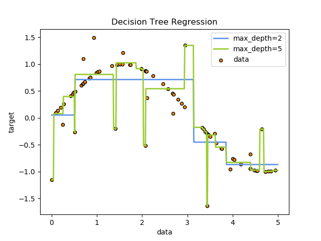
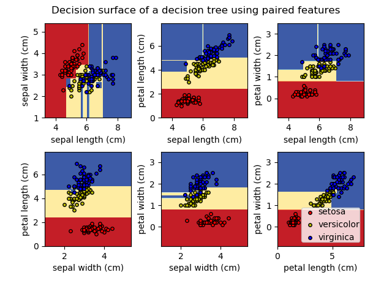
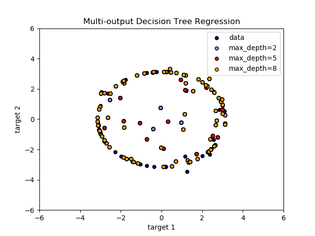
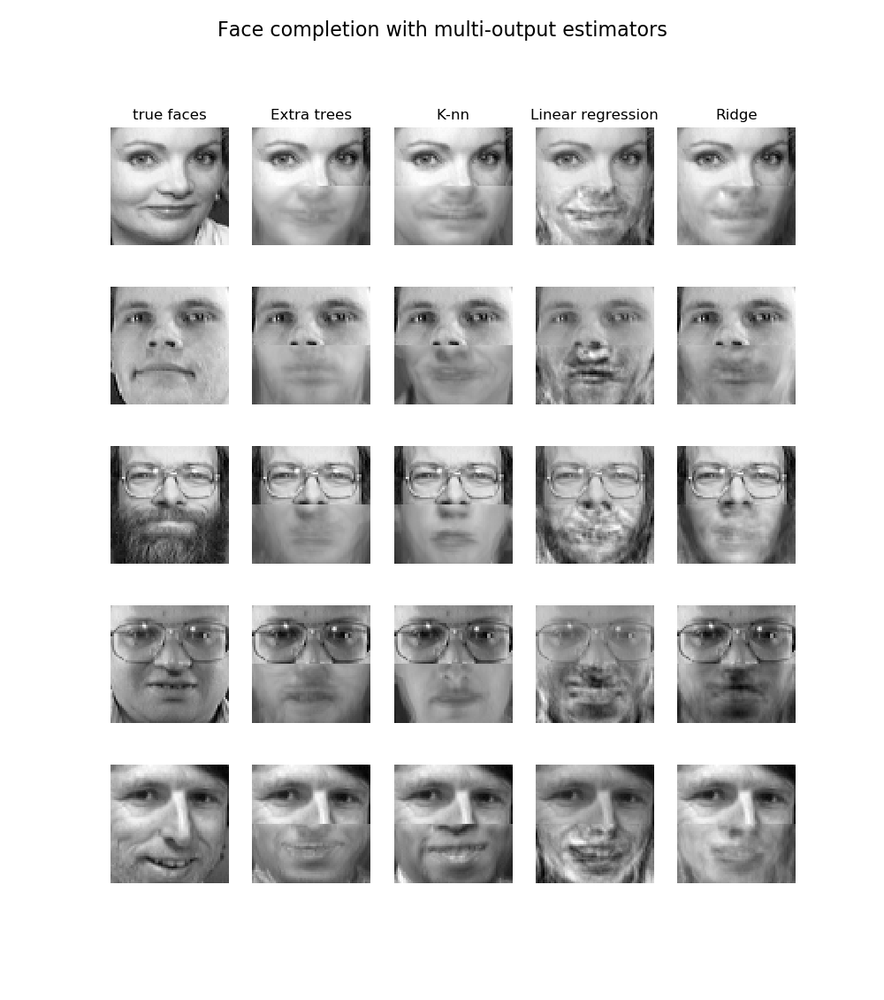

.. _tree:

==========================
决策树(Decision Trees)
==========================

.. currentmodule:: sklearn.tree

**Decision Trees (DTs)** 是一种用来 :ref:`classification <tree_classification>` 和 :ref:`regression <tree_regression>` 的无参数监督学习方法。
其目的是创建一种模型从数据特征中学习简单的决策规则来预测一个目标变量的值。

例如，在下面的图片中，决策树通过if-then-else的决策规则来学习数据从而估测数一个正弦图像。决策树越深入，
决策规则就越复杂并且模型对数据的拟合越好。

决策树的优势:

    - 便于理解和解释。树的结构可以可视化。

    - 需要很少的数据预备工作。而其他机器学习模型通常需要数据规范化，比如构建虚拟变量和移除缺失值。不过请注意，这种决策树模型不支持缺失值。

    - 训练树模型的时间复杂度是参与训练数据点的对数值。

    - 能够处理数值型数据和标称型数据。其他的技术通常只能用来专门分析某一种变量类型的数据集。详情请参阅 :ref:`algorithms <tree_algorithms>` 。

    - 能够处理多路输出的问题。

    - 使用白盒模型。如果某种给定的情况在该模型中是可观的，那么就可以轻易的通过布尔逻辑来解释这种情况。
      相比之下，在黑盒模型(比如神经网络)中的结果就是很难说明清楚地。

    - 可以通过数值统计测试来验证该模型。这对解释验证该模型的可靠性成为可能。

    - 即使该模型假设的结果与真实模型所提供的数据有些违反，其表现依旧良好。

决策树的缺点包括:

    - 决策树模型容易产生一个过于复杂的模型,这样的模型对数据的泛化性能会很差。这就是所谓的过拟合。
      一些策略像剪枝、设置叶节点所需的最小样本数或设置数的最大深度是避免出现 该问题最为有效地方法。

    - 决策树可能是不稳定的，因为数据中的微小变化可能会导致生成完全不同的树。这个问题可以通过决策树的集成来得到缓解。

    - 在多方面性能最优和简单化概念的要求下，学习一棵最优决策树通常是一个NP难问题。因此，实际的决策树学习算法是基于启发式算法，
      例如在每个节点进行局部最优决策的贪心算法。这样的算法不能保证返回全局最优决策树。
      这个问题可以通过集成学习来训练多棵决策树来缓解,这多棵决策树一般通过对特征和样本有放回的随机采样来生成。
    
    - 有些概念很难被决策树学习到,因为决策树很难清楚的表述这些概念。例如XOR，奇偶或者复用器的问题。

    - 如果某些类在问题中占主导地位会使得创建的决策树有偏差。因此，我们建议在拟合前先对数据集进行平衡。

.. _tree_classification:

分类
==============

:class:`DecisionTreeClassifier` 是能够在数据集上执行多分类的类。

与其他分类器一样，:class:`DecisionTreeClassifier` 需要输入两个数组：数组X，或稀疏或稠密，shape为 ``[n_samples, n_features]`` ，用来存放训练样本。
整数值数组 Y，shape为 ``[n_samples]`` 用来保存训练样本的类标签::

    >>> from sklearn import tree
    >>> X = [[0, 0], [1, 1]]
    >>> Y = [0, 1]
    >>> clf = tree.DecisionTreeClassifier()
    >>> clf = clf.fit(X, Y)

当模型拟合好以后，就可以拿来预测未知样本的类标签啦：::

    >>> clf.predict([[2., 2.]])
    array([1])

另外, 每个类的概率也可以预测出来, 它是在一个叶子中相同类的训练样本所占比例(the fraction of training samples of the same class in a leaf)::

    >>> clf.predict_proba([[2., 2.]])
    array([[0., 1.]])

:class:`DecisionTreeClassifier` 既能用于二分类（其中标签为 [-1,1] ）也能用于多分类（其中标签为 [0, ..., K-1] ）。

使用Lris数据集，我们可以构造一个决策树，如下所示 ::

    >>> from sklearn.datasets import load_iris
    >>> from sklearn import tree
    >>> iris = load_iris()
    >>> clf = tree.DecisionTreeClassifier()
    >>> clf = clf.fit(iris.data, iris.target)

一旦训练好后，我们可以使用 :func:`export_graphviz` 导出器以 `Graphviz <http://www.graphviz.org/>`_ 格式导出决策树. 
如果你是用 `conda <http://conda.io>`_ 来管理包，那么安装 graphviz 二进制文件和 python 包可以用以下指令安装

    conda install python-graphviz
   
或者，可以从 graphviz 项目主页下载 graphviz 的二进制文件，并从 pypi 安装 Python 包装器，并安装 `pip install graphviz` 。

以下是在整个 iris 数据集上训练的上述树的 graphviz 导出示例; 其结果被保存在 ·iris.pdf· 中::

    >>> import graphviz # doctest: +SKIP
    >>> dot_data = tree.export_graphviz(clf, out_file=None) # doctest: +SKIP
    >>> graph = graphviz.Source(dot_data) # doctest: +SKIP
    >>> graph.render("iris") # doctest: +SKIP

:func:`export_graphviz` exporter 支持各种美化，包括通过他们的类着色节点（或回归值），如果需要，使用显式变量和类名。
Jupyter notebook也可以自动内联式渲染这些绘制节点::

    >>> dot_data = tree.export_graphviz(clf, out_file=None, # doctest: +SKIP
    ...                      feature_names=iris.feature_names,  # doctest: +SKIP
    ...                      class_names=iris.target_names,  # doctest: +SKIP
    ...                      filled=True, rounded=True,  # doctest: +SKIP
    ...                      special_characters=True)  # doctest: +SKIP
    >>> graph = graphviz.Source(dot_data)  # doctest: +SKIP
    >>> graph # doctest: +SKIP

.. only:: html

    .. figure:: ../images/iris.svg
       :align: center

.. only:: latex

    .. figure:: ../images/iris.pdf
       :align: center

.. topic:: 案例:

 * :ref:`sphx_glr_auto_examples_tree_plot_iris.py`

.. _tree_regression:

回归
==========

决策树也可用于解决回归问题, 使用 :class:`DecisionTreeRegressor` 类。

与在分类中的设置是一样的, fit 方法依然接受数组 X 和 y 作为参数, 但是在回归中，目标变量 y 是浮点数而不是整型数值 ::

    >>> from sklearn import tree
    >>> X = [[0, 0], [2, 2]]
    >>> y = [0.5, 2.5]
    >>> clf = tree.DecisionTreeRegressor()
    >>> clf = clf.fit(X, y)
    >>> clf.predict([[1, 1]])
    array([0.5])

.. topic:: 案例:

 * :ref:`sphx_glr_auto_examples_tree_plot_tree_regression.py`

.. _tree_multioutput:

多输出问题
=====================

一个多值输出问题(multi-output problem)是一个类似当 Y 是大小为 ``[n_samples, n_outputs]`` 的2d数组时，有多个输出值需要预测的监督学习问题。

当输出值之间没有关联时，一个很简单的处理该类型的方法是建立n个独立模型，即每个模型对应一个输出，然后使用这些模型来独立地预测n个输出中的每一个。
然而，由于可能与相同输入相关的输出值本身是相关的，所以通常更好的方法是构建能够同时预测所有n个输出的单个模型。
首先，因为仅仅是建立了一个模型所以训练时间会更短。第二，最终模型的泛化性能也会有所提升。

对于决策树，这一策略可以很容易地用于支持多输出问题。这需要以下更改：

  - 在叶子中存储n个输出值，而不是一个; 
  - 通过计算所有n个输出的平均减少量来作为分裂标准。

该模块通过在 :class:`DecisionTreeClassifier` 和 :class:`DecisionTreeRegressor` 中实现该策略来支持多输出问题。
如果决策树在shape为 ``[n_samples, n_outputs]`` 的输出数组 Y 上拟合，则得到的估计器将:

  * 在 ``predict`` 中 输出 n_outputs 个值 ;

  * 在 ``predict_proba`` 上输出 n_outputs 个数组的列表。

用多输出决策树进行回归分析的例子 :ref:`sphx_glr_auto_examples_tree_plot_tree_regression_multioutput.py` 。 
在该示例中，输入X是单个实数值，输出 Y 是 X 的正弦值和余弦值。

使用多输出树进行分类，在 :ref:`sphx_glr_auto_examples_plot_multioutput_face_completion.py` 例子中进行了演示。 
在该示例中，输入 X 是人脸的上半部分的像素，并且输出 Y 是这些脸的下半部分的像素。

.. topic:: 案例:

 * :ref:`sphx_glr_auto_examples_tree_plot_tree_regression_multioutput.py`
 * :ref:`sphx_glr_auto_examples_plot_multioutput_face_completion.py`

.. topic:: 参考文献:

 * M. Dumont et al,  `Fast multi-class image annotation with random subwindows
   and multiple output randomized trees
   <http://www.montefiore.ulg.ac.be/services/stochastic/pubs/2009/DMWG09/dumont-visapp09-shortpaper.pdf>`_, International Conference on
   Computer Vision Theory and Applications 2009

.. _tree_complexity:

复杂度
==========

总体来说，用来构建平衡二叉树的运行时间为 :math:`O(n_{samples}n_{features}\log(n_{samples}))` ，查询时间为 :math:`O(\log(n_{samples}))` 。
尽管树的构造算法尝试生成平衡树，但它们并不总能保持平衡。假设子树能大概保持平衡，每个节点的成本包括通过 :math:`O(n_{features})` 
时间复杂度来搜索找到提供熵减小最大的特征。每个节点的花费为 :math:`O(n_{features}n_{samples}\log(n_{samples}))` ，
从而使得整个决策树的构造成本为 :math:`O(n_{features}n_{samples}^{2}\log(n_{samples}))` 。

Scikit-learn提供了更多有效的方法来创建决策树。初始实现（如上所述）将重新计算沿着给定特征的
每个新分割点的类标签直方图（用于分类）或平均值（用于回归）。与分类所有的样本特征，
然后再次训练时运行标签计数，可将每个节点的复杂度降低为 :math:`O(n_{features}\log(n_{samples}))` ，
则总的成本花费为 :math:`O(n_{features}n_{samples}\log(n_{samples}))` 。这是一种对所有基于树的算法的改进选项。
默认情况下，对于梯度提升模型该算法是打开的，一般来说它会让训练速度更快。但对于所有其他算法默认是关闭的，
当训练深度很深的树时往往会减慢训练速度。

实用小建议
=====================

  * 在拥有大量特征的数据上拟合模型的时候，决策树会倾向于出现过拟合的现象。
    获得一个合适的样本比例和特征数量十分重要，因为在高维空间中只有少量的样本上训练出的树是十分容易过拟合的。

  * 考虑事先对数据进行降维( :ref:`PCA <PCA>`, :ref:`ICA <ICA>`) ，使您的树能更好地找到具有分辨性的特征。

  * 当训练树的时候，通过 ``export`` 功能可以可视化您的决策树。使用 ``max_depth=3`` 作为初始树深度，
    让决策树知道如何适应您的数据，然后再增加树的深度。

  * 请记住，填充树的样本数量会增加树的每个附加级别。使用 ``max_depth`` 来控制树的大小防止过拟合。

  * 通过使用 ``min_samples_split`` 或 ``min_samples_leaf`` 来保证多个样本通知树中的每个决策，通过控制这两个参数决定执行什么划分。
    当这个值很小时意味着生成的决策树将会过拟合，然而当这个值很大时将会不利于决策树对样本的学习。所以尝试 ``min_samples_leaf=5`` 作为初始值。
    如果样本量的变化很大，可以使用浮点数作为百分比传给这两个参数。 ``min_samples_split`` 可以创建任意小的叶子， ``min_samples_leaf`` 
    保证了每个叶结点中的最小样本量，在回归问题中可以避免低方差过拟合的叶节点。对于只有少量类的分类问题，``min_samples_leaf=1`` 通常是最好的选择。

  * 在训练之前平衡数据集，以防止决策树偏向于主导类。可以通过从每个类中抽取相等数量的样本来进行类平衡，或者优选地通过将每个类的样本权重 (``sample_weight``)
    之和归一化为相同的值。还要注意的是，基于权重的预修剪标准(比如 ``min_weight_fraction_leaf``) 对于主导类别的偏倚比不使用样本权重的标准更少，
    如 ``min_samples_leaf`` 。

  * 如果样本被加权的话, 使用基于权重的预修剪标准(比如 ``min_weight_fraction_leaf``) 能够更轻易的优化树结构。
    ``min_weight_fraction_leaf`` 保证了叶节点至少包含样本权重的总和的一部分。

  * 所有决策树内部使用 ``np.float32`` 数组。如果训练数据不是这种格式，将会发生数据集的拷贝。

  * 如果输入矩阵 X 非常稀疏， 在调用 ``fit`` 和 ``predict`` 之前建议将其转成格式为 ``csc_matrix`` 的稀疏矩阵。
    当大多数样本的特征向量有很多0值的时候，相比用稠密矩阵，用稀疏矩阵作为输入，可以是训练时间快好几倍。

.. _tree_algorithms:

树算法: ID3, C4.5, C5.0 和 CART
==========================================

决策树算法有哪些以及它们之间的区别？scikit-learn 中实现何种算法呢？ 

ID3_ (Iterative Dichotomiser 3) 由 Ross Quinlan 在1986年提出。该算法创建一个多路树(multiway tree)，
为每个节点（以贪心的方式）找到一个能够产生分类目标的最大信息增益的分类特征(categorical feature)。决策树增长到其最大尺寸，
然后通常利用剪枝来提高树对未知数据的泛化能力。

C4.5 是 ID3 的后继者，它去除了特征必须是标称型(categorical)特征的限制条件，动态的定义了一个(基于数值型的)离散属性,
这个属性可以把连续属性值划分成离散的区间集合。 C4.5 可以把训练好的树(ID3 算法的输出)转换成if-then规则的集合。
然后每个规则的准确率会被评估来决定这些规则被使用的顺序。 剪枝操作通过移除一个规则的前提条件来完成。
如果去掉某个前提条件后这个规则的准确率得到了提升那么这个前提条件就会被剪掉。

C5.0 是 Quinlan 最近发布的新版本(带有知识产权的喔)。 它相比 C4.5 使用更少的内存并且构建更小的规则集,而且准确率更高。

CART_ (Classification and Regression Trees) 与 C4.5 非常相似, 不同之处是它支持数值型目标变量(所以可用于回归) 
并且不计算规则集合。 CART 在每个节点使用能够产生最大信息增益的特征和阈值来构建二叉树(binary trees)。

scikit-learn 使用 CART 算法的优化版本; 然而, scikit-learn 的实现现在还不支持标称型变量(categorical variables) 。

.. _ID3: https://en.wikipedia.org/wiki/ID3_algorithm
.. _CART: https://en.wikipedia.org/wiki/Predictive_analytics#Classification_and_regression_trees_.28CART.29

.. _tree_mathematical_formulation:

数学表达式
========================

给定训练向量 :math:`x_i \in R^n`, i=1,..., l 和 标签向量 :math:`y \in R^l`, 一个决策树通过递归(recursively)的划分空间
使得具有相同标签的样本被划分到同一个组中。

我们把在节点 :math:`m` 的数据表示为 :math:`Q` 。 对每一个由特征 :math:`j` 和阈值 :math:`t_m` 构成的候选划分，把数据划分成两个子集： 
:math:`Q_{left}(\theta)` 和 :math:`Q_{right}(\theta)` ，

.. math::

    Q_{left}(\theta) = {(x, y) | x_j <= t_m}

    Q_{right}(\theta) = Q \setminus Q_{left}(\theta)

那么，节点 :math:`m` 处的不纯度(impurity) 就可以使用不纯度函数 :math:`H()` 来计算, 
到底选择哪个不纯度准则依赖于要解决的问题(classification or regression)

.. math::

   G(Q, \theta) = \frac{n_{left}}{N_m} H(Q_{left}(\theta))
   + \frac{n_{right}}{N_m} H(Q_{right}(\theta))

选择能够最小化不纯度(impurity)的参数:

.. math::

    \theta^* = \operatorname{argmin}_\theta  G(Q, \theta)

在 :math:`Q_{left}(\theta^*)` 和 :math:`Q_{right}(\theta^*)` 子集上递归直到达到最大允许深度，:math:`N_m < \min_{samples}` 或 :math:`N_m = 1`.

分类准则
-----------------------

如果目标是取值为 0,1,...,K-1 的分类输出，对节点 :math:`m` ，表示一个带有 :math:`N_m` 个观测值的区域 :math:`R_m`， 
让

.. math::

    p_{mk} = 1/ N_m \sum_{x_i \in R_m} I(y_i = k)

成为在节点 :math:`m` 上类k的观测值的比例。

不纯度(impurity)的常用度量是 Gini

.. math::

    H(X_m) = \sum_k p_{mk} (1 - p_{mk})

熵(Entropy)

.. math::

    H(X_m) = - \sum_k p_{mk} \log(p_{mk})

误分类(Misclassification)

.. math::

    H(X_m) = 1 - \max(p_{mk})

其中 :math:`X_m` 是 节点 :math:`m` 上的训练数据。

回归准则
-------------------
如果目标是连续值，那么，对 节点 :math:`m` ，表示一个有 :math:`N_m` 个观测值的区域 :math:`R_m` ，
用于决定未来划分的位置的常用最小化准则是：Mean Squared Error 和 Mean Absolute Error； 其中，
Mean Squared Error 使用 终结点的平均值 最小化 L2 误差；
Mean Absolute Error 使用 终结点的中值 最小化 L1 误差。

Mean Squared Error:

.. math::

    \bar{y}_m = \frac{1}{N_m} \sum_{i \in N_m} y_i

    H(X_m) = \frac{1}{N_m} \sum_{i \in N_m} (y_i - \bar{y}_m)^2

Mean Absolute Error:

.. math::

    \bar{y}_m = \frac{1}{N_m} \sum_{i \in N_m} y_i

    H(X_m) = \frac{1}{N_m} \sum_{i \in N_m} |y_i - \bar{y}_m|

其中 :math:`X_m` 是 节点 :math:`m` 上的训练数据。

.. topic:: 参考文献:

    * https://en.wikipedia.org/wiki/Decision_tree_learning

    * https://en.wikipedia.org/wiki/Predictive_analytics

    * L. Breiman, J. Friedman, R. Olshen, and C. Stone. Classification and
      Regression Trees. Wadsworth, Belmont, CA, 1984.

    * J.R. Quinlan. C4. 5: programs for machine learning. Morgan Kaufmann, 1993.

    * T. Hastie, R. Tibshirani and J. Friedman.
      Elements of Statistical Learning, Springer, 2009.
